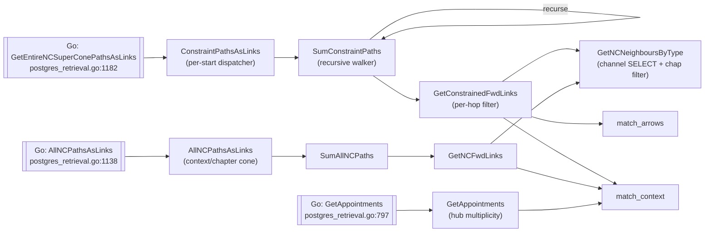

# Stored functions

SSTorytime installs **35 PL/pgSQL functions** into the database at
`Configure()` time. They are the workhorses of every traversal, constrained
cone search, idempotent insertion, and activity-logging round-trip. The Go
retrieval layer is a thin wrapper: it builds a `SELECT FooFn(...)` string,
ships it over `lib/pq`, and unpacks the result.

## Why a PL/pgSQL layer?

Three reasons the library pushes so much logic into the database rather than
keeping it in Go:

1. **Push filters to the data.** Cone searches eliminate candidates by
   context, arrow, chapter, and STtype on every hop. Doing that filtering
   next to the row avoids shipping millions of candidate edges back to Go
   just to discard most of them.
2. **Avoid round-trips on recursion.** A wave-front path search that does 8
   hops × 100 branches would be 800 network round-trips from Go. The
   `SumConstraintPaths` recursive function keeps the whole walk inside one
   query, concatenating the result into a newline-separated text stream that
   Go parses once.
3. **Keep the Go layer thin.** The idempotent insert path, the context
   factor, and the hub-query grouping can all be expressed as a single
   `SELECT` call. The Go code that invokes them reads like the paper's
   algorithm, not like a transaction manager.

All functions are declared `LANGUAGE plpgsql` — they look SQL-adjacent but
use loops, local variables, and exception handling. They are defined
together in `DefineStoredFunctions()` at
[`postgres_types_functions.go:143-1765`](https://github.com/markburgess/SSTorytime/blob/main/pkg/SSTorytime/postgres_types_functions.go#L143-L1765).

## Call graph (high-level traversal paths)

The most interesting traversal — chapter/context/arrow/STtype constrained
paths — composes like this:



The pattern is: a Go helper calls a **per-start dispatcher**, which calls a
**recursive walker**, which calls a **per-hop filter**, which calls the
**channel SELECT + chapter filter** (a `CASE sttype WHEN ... SELECT Im3...`
at leaf level). Context and arrow filters live in `match_context` and
`match_arrows` respectively.

## Reference

### Insertion and idempotency

Write-side functions. Called from the Go upload path
([`db_insertion.go`](https://github.com/markburgess/SSTorytime/blob/main/pkg/SSTorytime/db_insertion.go)
and
[`db_upload.go`](https://github.com/markburgess/SSTorytime/blob/main/pkg/SSTorytime/db_upload.go)).

#### `IdempInsertNode`

```sql
IdempInsertNode(iLi INT, iszchani INT, icptri INT, iSi TEXT, ichapi TEXT)
  RETURNS TABLE (ret_cptr INTEGER, ret_channel INTEGER)
```

Inserts a node only if no row with `lower(s) = lower(iSi)` already exists,
then returns the resulting `NPtr`. The gate is case-insensitive, so an
author who writes "Alice" and later "alice" gets one row, not two.
[`postgres_types_functions.go:154`](https://github.com/markburgess/SSTorytime/blob/main/pkg/SSTorytime/postgres_types_functions.go#L154).

#### `InsertNode`

```sql
InsertNode(iLi, iszchani, icptri, iSi, ichapi, sequence boolean) RETURNS bool
```

Unchecked insertion with an explicit `NPtr.Chan/CPtr` pair and a `Seq` flag
— used when the Go caller has already resolved the pointer and only needs
the raw row write. Called from
[`db_insertion.go:39`](https://github.com/markburgess/SSTorytime/blob/main/pkg/SSTorytime/db_insertion.go#L39).
[`postgres_types_functions.go:178`](https://github.com/markburgess/SSTorytime/blob/main/pkg/SSTorytime/postgres_types_functions.go#L178).

#### `IdempAppendNode`

```sql
IdempAppendNode(iLi, iszchani, iSi, ichapi)
  RETURNS TABLE (ret_cptr INTEGER, ret_channel INTEGER)
```

Like `IdempInsertNode`, but auto-allocates the next `CPtr` within the chosen
bucket via `SELECT max((Nptr).CPtr) ... FROM Node WHERE (Nptr).Chan=iszchani`.
Used by the higher-level `Vertex()` API path that does not care what numeric
id it gets. Called from
[`db_insertion.go:63`](https://github.com/markburgess/SSTorytime/blob/main/pkg/SSTorytime/db_insertion.go#L63).
[`postgres_types_functions.go:197`](https://github.com/markburgess/SSTorytime/blob/main/pkg/SSTorytime/postgres_types_functions.go#L197).

#### `IdempInsertContext`

```sql
IdempInsertContext(constr text, conptr int) RETURNS int
```

Interns a context string into `ContextDirectory`. If `conptr = -1` it
allocates the next free pointer; otherwise it reuses `conptr` if neither the
string nor the pointer is already taken. Returns the final `CtxPtr`. Called
from `UploadContextToDB` at
[`db_upload.go:225`](https://github.com/markburgess/SSTorytime/blob/main/pkg/SSTorytime/db_upload.go#L225).
[`postgres_types_functions.go:226`](https://github.com/markburgess/SSTorytime/blob/main/pkg/SSTorytime/postgres_types_functions.go#L226).

### Basic traversal primitives

The atomic one-hop operations. Every higher-level cone/path function builds
on these.

| Function | Signature | Purpose | Defined at |
|---|---|---|---|
| `GetSingletonAsLinkArray` | `(start NodePtr) → Link[]` | Wrap a `NodePtr` as a singleton `Link[]` so the cone helpers can use a uniform input shape. | [:314](https://github.com/markburgess/SSTorytime/blob/main/pkg/SSTorytime/postgres_types_functions.go#L314) |
| `GetSingletonAsLink` | `(start NodePtr) → Link` | Same, single-`Link` form. Used by path functions that carry a chain-start `Link`. | [:336](https://github.com/markburgess/SSTorytime/blob/main/pkg/SSTorytime/postgres_types_functions.go#L336) |
| `GetNeighboursByType` | `(start NodePtr, sttype int, maxlimit int) → Link[]` | `CASE sttype WHEN ... SELECT Im3/Im2/.../Ie3 FROM Node WHERE Nptr=start LIMIT maxlimit` — the channel-select primitive every traversal depends on. | [:356](https://github.com/markburgess/SSTorytime/blob/main/pkg/SSTorytime/postgres_types_functions.go#L356) |
| `GetFwdNodes` | `(start, exclude, sttype, maxlimit) → NodePtr[]` | One-hop neighbour set as bare `NodePtr`s, honouring an exclusion list and skipping self-loops (`lnk.Arr = 0`). | [:384](https://github.com/markburgess/SSTorytime/blob/main/pkg/SSTorytime/postgres_types_functions.go#L384) |
| `GetFwdLinks` | `(start, exclude, sttype, maxlimit) → Link[]` | Same, returning full `Link` records (with weight/context/arrow). | [:424](https://github.com/markburgess/SSTorytime/blob/main/pkg/SSTorytime/postgres_types_functions.go#L424) |

### Cone and path search (unconstrained)

Unconstrained cone walks — **no** chapter/context filter. Fast, but return
every reachable node up to `maxdepth`/`maxlimit`.

#### `FwdConeAsNodes`

```sql
FwdConeAsNodes(start NodePtr, sttype INT, maxdepth INT, maxlimit int)
  RETURNS NodePtr[]
```

Breadth-first forward cone, each frontier expanded via `GetFwdNodes`. Loops
until `counter = maxdepth+1` or `level` empties. Called from Go as
`GetFwdConeAsNodes` at
[`postgres_retrieval.go:1003`](https://github.com/markburgess/SSTorytime/blob/main/pkg/SSTorytime/postgres_retrieval.go#L1003).
[`postgres_types_functions.go:461`](https://github.com/markburgess/SSTorytime/blob/main/pkg/SSTorytime/postgres_types_functions.go#L461).

#### `FwdConeAsLinks`

```sql
FwdConeAsLinks(start NodePtr, sttype INT, maxdepth INT, maxlimit int)
  RETURNS Link[]
```

Same cone, returning full `Link`s (so edge metadata — arrow, context,
weight — survives). Called from
[`postgres_retrieval.go:1036`](https://github.com/markburgess/SSTorytime/blob/main/pkg/SSTorytime/postgres_retrieval.go#L1036).
[`postgres_types_functions.go:520`](https://github.com/markburgess/SSTorytime/blob/main/pkg/SSTorytime/postgres_types_functions.go#L520).

#### `FwdPathsAsLinks`

```sql
FwdPathsAsLinks(start NodePtr, sttype INT, maxdepth INT, maxlimit INT)
  RETURNS Text
```

Depth-first orthogonal paths from origin. Wraps the start in a singleton
`Link` and calls `SumFwdPaths` recursively; the return is a newline-separated
concatenation of all discovered paths, each path itself `;`-separated `Link`
literals. Called from
[`postgres_retrieval.go:1064`](https://github.com/markburgess/SSTorytime/blob/main/pkg/SSTorytime/postgres_retrieval.go#L1064).
[`postgres_types_functions.go:582`](https://github.com/markburgess/SSTorytime/blob/main/pkg/SSTorytime/postgres_types_functions.go#L582).

#### `SumFwdPaths`

```sql
SumFwdPaths(start Link, path TEXT, sttype INT, depth int, maxdepth INT,
            exclude NodePtr[], maxlimit INT) RETURNS Text
```

Recursive walker for `FwdPathsAsLinks`. Key trick: uses `horizon = maxlimit
- array_length(fwdlinks,1)` to dynamically lower the remaining budget before
recursing, so an exponential fan-out is cut off deterministically.
[`postgres_types_functions.go:612`](https://github.com/markburgess/SSTorytime/blob/main/pkg/SSTorytime/postgres_types_functions.go#L612).

#### `AllPathsAsLinks`

```sql
AllPathsAsLinks(start NodePtr, orientation text, maxdepth INT, maxlimit INT)
  RETURNS Text
```

Multi-directional variant: follows `fwd`, `bwd`, or **all 7 STtype channels**
depending on `orientation`. Called from `GetEntireConePathsAsLinks` at
[`postgres_retrieval.go:1095`](https://github.com/markburgess/SSTorytime/blob/main/pkg/SSTorytime/postgres_retrieval.go#L1095).
[`postgres_types_functions.go:679`](https://github.com/markburgess/SSTorytime/blob/main/pkg/SSTorytime/postgres_types_functions.go#L679).

#### `SumAllPaths`

```sql
SumAllPaths(start Link, path TEXT, orientation text, depth int, maxdepth INT,
            exclude NodePtr[], maxlimit int) RETURNS Text
```

Recursive walker for `AllPathsAsLinks`. Per-orientation, it concatenates
`GetFwdLinks` calls for the selected STtype range before recursing.
[`postgres_types_functions.go:711`](https://github.com/markburgess/SSTorytime/blob/main/pkg/SSTorytime/postgres_types_functions.go#L711).

### Constrained cone and path search (chapter + context + arrow)

The filtering versions — slower but essential once a corpus grows past
trivial. Every function here accepts chapter (`text LIKE`), context (`text[]`
AND/OR-set), optional arrow list (`int[]`), and `rm_acc` (accent-stripping
toggle).

#### `SumAllNCPaths`

```sql
SumAllNCPaths(start Link, path TEXT, orientation text, depth, maxdepth,
              chapter text, rm_acc bool, context text[],
              exclude NodePtr[], maxlimit int) RETURNS Text
```

Chapter/context-filtering version of `SumAllPaths`. Per-hop it calls
`GetNCFwdLinks` for each STtype in the orientation set; links whose context
pointer doesn't overlap with the user's `context` set are skipped via
`match_context`.
[`postgres_types_functions.go:1056`](https://github.com/markburgess/SSTorytime/blob/main/pkg/SSTorytime/postgres_types_functions.go#L1056).

#### `AllNCPathsAsLinks`

```sql
AllNCPathsAsLinks(start NodePtr[], chapter text, rm_acc bool, context text[],
                  orientation text, maxdepth, maxlimit) RETURNS Text
```

Multi-start dispatcher: calls `SumAllNCPaths` once per starting node. Lets a
client ask "all paths from any of these 5 starts within chapter X with
context Y". Called from
[`postgres_retrieval.go:1138`](https://github.com/markburgess/SSTorytime/blob/main/pkg/SSTorytime/postgres_retrieval.go#L1138).
[`postgres_types_functions.go:1166`](https://github.com/markburgess/SSTorytime/blob/main/pkg/SSTorytime/postgres_types_functions.go#L1166).

#### `ConstraintPathsAsLinks`

```sql
ConstraintPathsAsLinks(start NodePtr[], chapter, rm_acc, context, arrows int[],
                       sttypes int[], maxdepth, maxlimit) RETURNS Text
```

The most expressive search: adds **arrow-id and STtype whitelists** on top
of chapter+context. If `sttypes` is NULL it expands to all 7 channels
(`-3..3`). This is the function backing the public `pathsolve` CLI and the
HTTP server's constraint queries. Called from
`GetEntireNCSuperConePathsAsLinks` at
[`postgres_retrieval.go:1182`](https://github.com/markburgess/SSTorytime/blob/main/pkg/SSTorytime/postgres_retrieval.go#L1182).
[`postgres_types_functions.go:1205`](https://github.com/markburgess/SSTorytime/blob/main/pkg/SSTorytime/postgres_types_functions.go#L1205).

#### `SumConstraintPaths`

```sql
SumConstraintPaths(start Link, path TEXT, depth, maxdepth, chapter,
                   rm_acc, context, arrows, sttypes, exclude, maxlimit)
  RETURNS Text
```

Recursive walker for `ConstraintPathsAsLinks`. Concatenates per-STtype
`GetConstrainedFwdLinks` calls, applies `match_context`, and recurses with
a dynamically-shrunk `horizon` to cap fan-out.
[`postgres_types_functions.go:1249`](https://github.com/markburgess/SSTorytime/blob/main/pkg/SSTorytime/postgres_types_functions.go#L1249).

#### `GetConstrainedFwdLinks`

```sql
GetConstrainedFwdLinks(start NodePtr, chapter, rm_acc, context text[],
                       exclude NodePtr[], sttype int, arrows int[], maxlimit)
  RETURNS Link[]
```

The per-hop workhorse for `SumConstraintPaths`. Calls
`GetNCNeighboursByType` to fetch the channel array, then filters each link
by arrow-id, context membership, and exclusion set. Skips self-loops
(`lnk.Arr = 0`).
[`postgres_types_functions.go:1322`](https://github.com/markburgess/SSTorytime/blob/main/pkg/SSTorytime/postgres_types_functions.go#L1322).

#### `GetNCFwdLinks`

```sql
GetNCFwdLinks(start NodePtr, chapter, rm_acc, context text[],
              exclude NodePtr[], sttype int, maxlimit) RETURNS Link[]
```

Same as `GetConstrainedFwdLinks` but without the arrow whitelist — used by
the non-arrow-constrained NC path functions.
[`postgres_types_functions.go:1375`](https://github.com/markburgess/SSTorytime/blob/main/pkg/SSTorytime/postgres_types_functions.go#L1375).

#### `GetNCCLinks`

```sql
GetNCCLinks(start NodePtr, exclude NodePtr[], sttype int,
            chapter text, rm_acc bool, context text[], maxlimit) RETURNS Link[]
```

Context-including variant: unlike `GetNCFwdLinks`, this one does **not**
skip `lnk.Arr = 0` (self-loops), so context attachments on the node itself
are visible.
[`postgres_types_functions.go:1417`](https://github.com/markburgess/SSTorytime/blob/main/pkg/SSTorytime/postgres_types_functions.go#L1417).

#### `GetNCNeighboursByType`

```sql
GetNCNeighboursByType(start NodePtr, chapter text, rm_acc bool,
                      sttype int, maxlimit int) RETURNS Link[]
```

The chapter-filtered channel SELECT. Same `CASE sttype WHEN ...` shape as
`GetNeighboursByType`, but with `AND UnCmp(Chap, rm_acc) LIKE lower(chapter)`
on every channel. Feeds both `GetConstrainedFwdLinks` and `GetNCFwdLinks`.
[`postgres_types_functions.go:1447`](https://github.com/markburgess/SSTorytime/blob/main/pkg/SSTorytime/postgres_types_functions.go#L1447).

### Query matching and helpers

Pure predicate functions used inside the filters above.

| Function | Signature | Purpose | Defined at |
|---|---|---|---|
| `NCC_match` | `(NodePtr, context, arrows, sttypes, 7×Link[]) → bool` | Central matching predicate: given a node's 7 channel arrays, say whether any link satisfies the full (context ∩ arrows ∩ sttypes) filter. Also handles the empty-arrow case by looking for a context-only tag in channel `lp1`. | [:257](https://github.com/markburgess/SSTorytime/blob/main/pkg/SSTorytime/postgres_types_functions.go#L257) |
| `empty_path` | `(path text) → bool` | Cheap check for "is this a single-hop path?" (the path text contains no `;`). Used as an early-exit in traversal code. | [:803](https://github.com/markburgess/SSTorytime/blob/main/pkg/SSTorytime/postgres_types_functions.go#L803) |
| `match_context` | `(thisctxptr int, user_set text[]) → bool` | Test whether a node's context set overlaps the user's query context. Implements the **OR + AND** semantic: items separated by `.` in DB form an AND-clause (all must match), bare items form OR-alternatives. Accent-normalises both sides before comparing. | [:825](https://github.com/markburgess/SSTorytime/blob/main/pkg/SSTorytime/postgres_types_functions.go#L825) |
| `match_arrows` | `(arr int, user_set int[]) → bool` | Integer-set membership. Returns true if `user_set` is empty (no constraint) or if `arr = ANY(user_set)`. | [:950](https://github.com/markburgess/SSTorytime/blob/main/pkg/SSTorytime/postgres_types_functions.go#L950) |
| `ArrowInList` | `(arrow int, links Link[]) → bool` | Helper: does any `Link` in the array carry this arrow id? | [:973](https://github.com/markburgess/SSTorytime/blob/main/pkg/SSTorytime/postgres_types_functions.go#L973) |
| `ArrowInContextList` | `(arrow int, links Link[], context text[]) → bool` | Same, but the matching link must also satisfy `match_context`. | [:1000](https://github.com/markburgess/SSTorytime/blob/main/pkg/SSTorytime/postgres_types_functions.go#L1000) |

### Text and search utilities

| Function | Signature | Purpose | Defined at |
|---|---|---|---|
| `UnCmp` | `(value text, unacc bool) → text` | Lower-case the input, optionally strip accents via `unaccent()`. Used inside `GetNCNeighboursByType` so chapter-matching can be case- and accent-insensitive or exact at caller's choice. | [:1027](https://github.com/markburgess/SSTorytime/blob/main/pkg/SSTorytime/postgres_types_functions.go#L1027) |
| `sst_unaccent` | `(this text) → text` | **Immutable** wrapper around `unaccent()`. Must be immutable because it is used in a `GENERATED ALWAYS AS STORED` column expression for `Node.UnSearch` — Postgres refuses volatile functions in that position. See [Performance](Performance.md#the-unaccent-dependency). | [:1747](https://github.com/markburgess/SSTorytime/blob/main/pkg/SSTorytime/postgres_types_functions.go#L1747) |

### Specialized queries

#### `GetAppointments`

```sql
GetAppointments(arrow int, sttype int, min int, chaptxt text,
                context text[], with_accents bool) RETURNS Appointment[]
```

Hub/matroid query: find every node with **at least `min`** incoming links of
the given `arrow` and `sttype`, optionally restricted to chapter and
context. Returns `Appointment[]`, which packages the hub node (`NTo`) with
its inbound set (`NFrom[]`). When `arrow > 0` it checks arrow-id equality;
when `arrow < 0` it matches any arrow (context-only query).

This powers story-start discovery and the "who points at me" side of the
library. Called from Go as `GetAppointmentsByArrow` and variants at
[`postgres_retrieval.go:797`](https://github.com/markburgess/SSTorytime/blob/main/pkg/SSTorytime/postgres_retrieval.go#L797)
and
[`:846`](https://github.com/markburgess/SSTorytime/blob/main/pkg/SSTorytime/postgres_retrieval.go#L846).
[`postgres_types_functions.go:1477`](https://github.com/markburgess/SSTorytime/blob/main/pkg/SSTorytime/postgres_types_functions.go#L1477).

#### `DeleteChapter`

```sql
DeleteChapter(chapter text) RETURNS bool
```

The atomic chapter-removal transaction behind the `removeN4L` CLI. Collects
all `NPtr`s whose `Chap` matches, separates those that appear **only** in
this chapter from those whose `Chap` also names other chapters, edits the
latter's `Chap` strings to remove just this chapter, strips outbound links
whose `Dst` is a to-be-deleted node (per channel, all 7 STtypes), then
finally deletes the rows. Without this function, chapter deletion would
need an orchestrated multi-round-trip dance from Go.
[`postgres_types_functions.go:1579`](https://github.com/markburgess/SSTorytime/blob/main/pkg/SSTorytime/postgres_types_functions.go#L1579).

### Activity logging

Two thin twins that maintain the `LastSeen` table — one keyed by
human-readable section name, the other by `NodePtr`. Both apply a 60-second
dead-zone and use an exponential moving average to maintain the `Delta`
(average inter-observation gap) column.

#### `LastSawSection`

```sql
LastSawSection(this text) RETURNS bool
```

Called by the Go wrapper
[`lastseen.go`](https://github.com/markburgess/SSTorytime/blob/main/pkg/SSTorytime/lastseen.go)
every time a named section (search tab, browse page) is visited. Returns
`true` if the sighting was recorded, `false` if the 60-second dead-zone
silently absorbed it — letting the caller decide whether to count it as a
new interaction.
[`postgres_types_functions.go:1674`](https://github.com/markburgess/SSTorytime/blob/main/pkg/SSTorytime/postgres_types_functions.go#L1674).

#### `LastSawNPtr`

```sql
LastSawNPtr(this NodePtr, name text) RETURNS bool
```

Node-pointer variant. Same 60-second rule. Also writes the node's display
name on first observation so later analytic reads don't need to join back
to `Node`.
[`postgres_types_functions.go:1709`](https://github.com/markburgess/SSTorytime/blob/main/pkg/SSTorytime/postgres_types_functions.go#L1709).

## See also

- [Schema](Schema.md) — the tables and custom types these functions operate on.
- [Indexes](Indexes.md) — GIN indexes that back the `Search`, `UnSearch`, and
  raw-text queries.
- [Performance](Performance.md) — cardinality caps, the `unaccent`
  dependency, and the 60-second `LastSeen` threshold.
