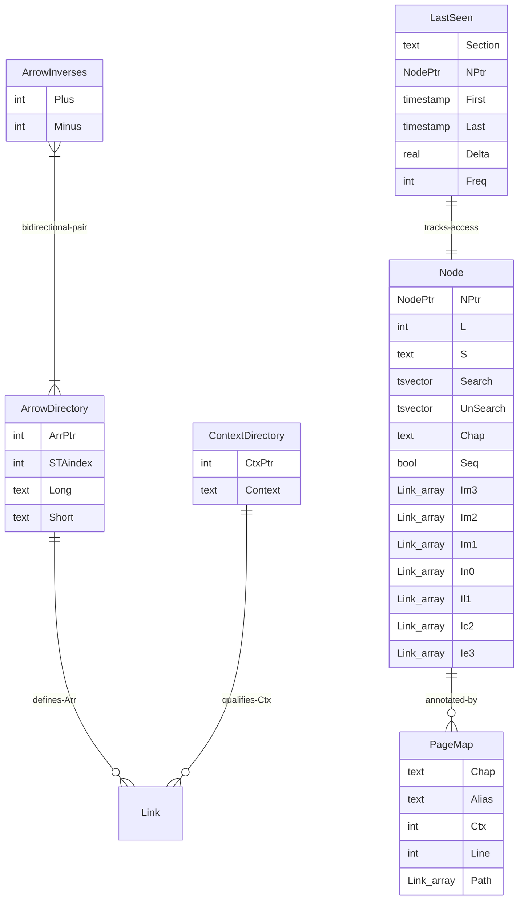
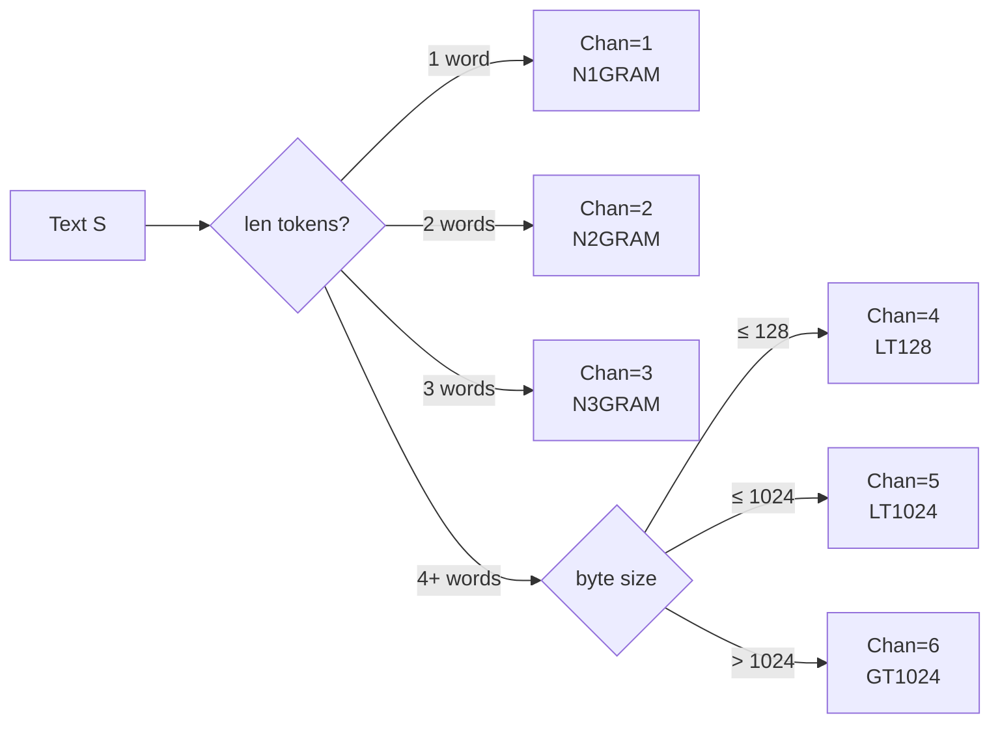
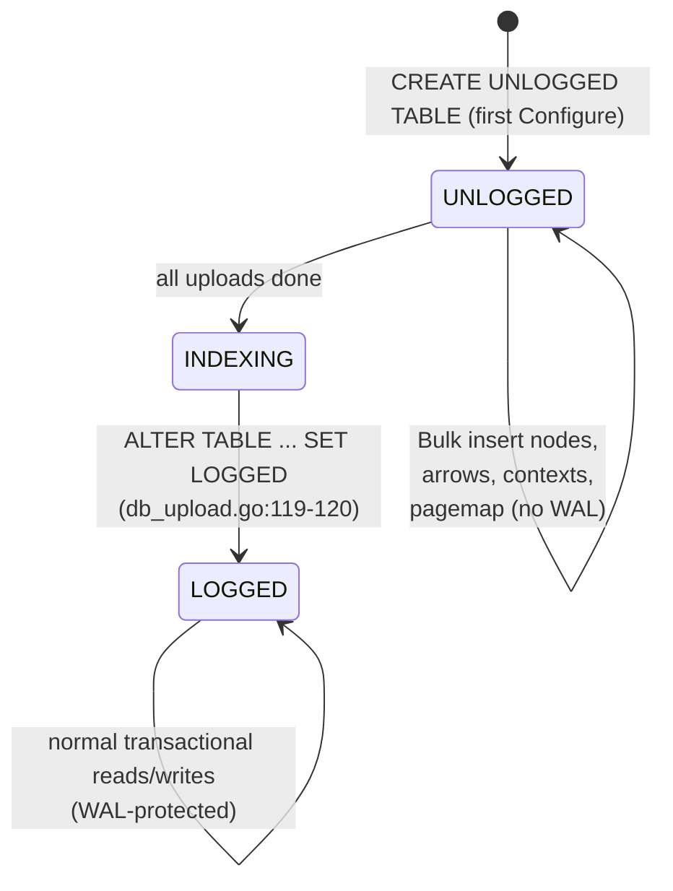

# Database schema

SSTorytime's physical schema consists of **6 tables** and **3 custom PostgreSQL
types**, all defined in
[`pkg/SSTorytime/postgres_types_functions.go`](https://github.com/markburgess/SSTorytime/blob/main/pkg/SSTorytime/postgres_types_functions.go).
The bulk of the graph lives in the `Node` table: links are not stored in a
separate edge table — they live embedded in `Node` as arrays of the custom
`Link` type, one array per signed arrow channel (`Im3`…`Ie3`).

!!! info "Why a node-embedded link array instead of a separate edge table?"
    A classical graph schema uses a three-column edge table (`src`, `arrow`,
    `dst`). That design forces a join on every traversal, the planner's index
    choice depends on query direction, and constraint checks (context, arrow
    kind, STtype) happen row-by-row. SSTorytime instead keeps all outgoing
    links of a given signed STtype **inside the source node row** as a
    `Link[]`. One heap lookup yields everything needed for a one-step
    traversal; the PL/pgSQL cone functions iterate these arrays with
    `FOREACH lnk IN ARRAY fwdlinks` rather than joining. The trade-off is
    that storage per row is variable and very wide nodes can exceed
    PostgreSQL's TOAST threshold — acceptable for the graph sizes SSTorytime
    targets, and offset by the 5 GIN indexes created
    [post-bulk-load](Indexes.md).

## Entity-relationship diagram



## Custom types

Three composite types underpin the schema
([`postgres_types_functions.go:18-30`](https://github.com/markburgess/SSTorytime/blob/main/pkg/SSTorytime/postgres_types_functions.go#L18-L30),
[`:90-98`](https://github.com/markburgess/SSTorytime/blob/main/pkg/SSTorytime/postgres_types_functions.go#L90-L98)):

### `NodePtr`

```sql title="postgres_types_functions.go:18-22"
CREATE TYPE NodePtr AS (
  Chan int,
  CPtr int
)
```

A composite pointer into the `Node` table. `Chan` picks one of 6 size-class
buckets (see [NodePtr addressing](#nodeptr-addressing) below); `CPtr` is the
dense index within that bucket. Used everywhere a node is referenced — in
`Link.Dst`, in exclusion arrays during cone search, in `LastSeen.NPtr`.

### `Link`

```sql title="postgres_types_functions.go:24-30"
CREATE TYPE Link AS (
  Arr int,       -- arrow pointer (foreign key to ArrowDirectory.ArrPtr)
  Wgt real,      -- edge weight
  Ctx int,       -- context pointer (foreign key to ContextDirectory.CtxPtr)
  Dst NodePtr    -- destination node
)
```

A single directed edge. Every `Node.{Im3..Ie3}` column is a `Link[]`. The
composite lets PL/pgSQL iterate an entire channel with `FOREACH lnk IN ARRAY
fwdlinks LOOP ... lnk.Arr, lnk.Ctx, lnk.Dst ...` — no join required.

### `Appointment`

```sql title="postgres_types_functions.go:90-98"
CREATE TYPE Appointment AS (
  Arr    int,
  STType int,
  Chap   text,
  Ctx    int,
  NTo    NodePtr,
  NFrom  NodePtr[]
)
```

A 1-to-many result grouping returned by `GetAppointments()`. `NTo` is the
hub node; `NFrom` is the array of nodes pointing at it with the given arrow
and minimum multiplicity. Used for hub/matroid-style queries — e.g. "find
every node with at least 5 incoming `part-of` links".

## Tables

### `Node`

The primary table — one row per text-addressed node in the graph.

```sql title="postgres_types_functions.go:32-48"
CREATE UNLOGGED TABLE IF NOT EXISTS Node (
  NPtr     NodePtr,
  L        int,
  S        text,
  Search   TSVECTOR GENERATED ALWAYS AS
             (to_tsvector('english', S)) STORED,
  UnSearch TSVECTOR GENERATED ALWAYS AS
             (to_tsvector('english', sst_unaccent(S))) STORED,
  Chap     text,
  Seq      boolean,
  Im3  Link[],   -- -EXPRESS
  Im2  Link[],   -- -CONTAINS
  Im1  Link[],   -- -LEADSTO
  In0  Link[],   --  NEAR (symmetric)
  Il1  Link[],   -- +LEADSTO
  Ic2  Link[],   -- +CONTAINS
  Ie3  Link[]    -- +EXPRESS
)
```

| Column | Purpose |
|---|---|
| `NPtr` | This node's composite address (class bucket + index). Not a primary key — uniqueness is enforced at insert time by `IdempInsertNode()` via a `lower(s)` existence check. |
| `L` | Text length of `S` (in characters). Used by the ordering heuristic in `NodeWhereString` ([`postgres_retrieval.go:81`](https://github.com/markburgess/SSTorytime/blob/main/pkg/SSTorytime/postgres_retrieval.go#L81)). |
| `S` | The node's canonical text. Any length; the class bucket chosen in `NPtr.Chan` reflects it. |
| `Search`, `UnSearch` | Generated `tsvector`s for full-text search. `Search` is accent-aware; `UnSearch` routes `S` through `sst_unaccent` first. See [Performance](Performance.md#dual-tsvector-strategy). |
| `Chap` | Chapter label(s), comma-separated if the same node appears in multiple chapters. Used for `LIKE` filtering in every constrained traversal (`GetNCNeighboursByType`, `GetAppointments`, `DeleteChapter`). |
| `Seq` | True if this node was inserted inside a sequence (`+:: _sequence_ ::`) block. Used to reconstruct the original narrative order at query time. |
| `Im3…Ie3` | The **7 signed link channels**. See below. |

No table-level primary key is declared. Uniqueness is maintained by the
insertion PL/pgSQL code path, which checks `WHERE lower(s) = lower(iSi)`
before inserting — see
[`postgres_types_functions.go:161`](https://github.com/markburgess/SSTorytime/blob/main/pkg/SSTorytime/postgres_types_functions.go#L161).

The `UNLOGGED` qualifier is part of the
[bulk-load lifecycle](#unlogged-logged-bulk-load-lifecycle).

### `PageMap`

Preserves the original line-by-line narrative ordering of an N4L source.
Defined at [`postgres_types_functions.go:50-57`](https://github.com/markburgess/SSTorytime/blob/main/pkg/SSTorytime/postgres_types_functions.go#L50-L57):

```sql
CREATE UNLOGGED TABLE IF NOT EXISTS PageMap (
  Chap   text,
  Alias  text,
  Ctx    int,
  Line   int,
  Path   Link[]
)
```

| Column | Purpose |
|---|---|
| `Chap` | Chapter this line belongs to. |
| `Alias` | Optional human name for an anchor (from N4L `@name` syntax). |
| `Ctx`  | Context pointer active at this line. |
| `Line` | Monotonic line number within the chapter — the order the author wrote. |
| `Path` | Array of `Link`s forming one narrative step. Re-traversed at read time to rebuild the story. |

Rebuilt end-to-end by `UploadPageMapEvent()` at
[`db_upload.go:247-275`](https://github.com/markburgess/SSTorytime/blob/main/pkg/SSTorytime/db_upload.go#L247-L275),
once per source line.

### `ArrowDirectory`

The arrow name catalogue — every user-declared relation (long + short form)
gets a numeric `ArrPtr` here.

```sql title="postgres_types_functions.go:59-65"
CREATE UNLOGGED TABLE IF NOT EXISTS ArrowDirectory (
  STAindex int,
  Long     text,
  Short    text,
  ArrPtr   int primary key
)
```

| Column | Purpose |
|---|---|
| `STAindex` | Signed STtype (−3…+3) — which channel this arrow lives in. |
| `Long`, `Short` | The human forms; both are matched case-insensitively by `UploadArrowToDB` ([`db_upload.go:161-182`](https://github.com/markburgess/SSTorytime/blob/main/pkg/SSTorytime/db_upload.go#L161-L182)). |
| `ArrPtr` | Primary key. Used as `Link.Arr` throughout the graph. |

### `ArrowInverses`

Pairs every forward arrow with its backward counterpart so traversals can
follow an inverse without re-declaring it.

```sql title="postgres_types_functions.go:67-72"
CREATE UNLOGGED TABLE IF NOT EXISTS ArrowInverses (
  Plus    int,
  Minus   int,
  PRIMARY KEY (Plus, Minus)
)
```

Populated by `UploadInverseArrowToDB()`
([`db_upload.go:186-205`](https://github.com/markburgess/SSTorytime/blob/main/pkg/SSTorytime/db_upload.go#L186-L205)).

### `ContextDirectory`

The context pointer factory. Every unique context string used anywhere in
the graph is interned here and addressed by integer `CtxPtr`.

```sql title="postgres_types_functions.go:84-88"
CREATE TABLE IF NOT EXISTS ContextDirectory (
  Context text,
  CtxPtr  int primary key
)
```

Populated idempotently by the `IdempInsertContext()` PL/pgSQL function
([`postgres_types_functions.go:226-245`](https://github.com/markburgess/SSTorytime/blob/main/pkg/SSTorytime/postgres_types_functions.go#L226-L245)).
Looked up inside `match_context()` on every constrained traversal.

### `LastSeen`

A lightweight activity log — one row per distinct section or node ever
accessed. Powers session analytics and optional recency-weighted ranking.

```sql title="postgres_types_functions.go:74-82"
CREATE TABLE IF NOT EXISTS LastSeen (
  Section text,
  NPtr    NodePtr,
  First   timestamp,
  Last    timestamp,
  Delta   real,
  Freq    int
)
```

| Column | Purpose |
|---|---|
| `Section` | Free-form section/tab name (used by `LastSawSection`). |
| `NPtr`    | Node pointer (used by `LastSawNPtr`). |
| `First`   | Timestamp of first observation. |
| `Last`    | Timestamp of most recent observation. |
| `Delta`   | Exponentially weighted moving average of inter-observation gap (seconds). |
| `Freq`    | Monotonic hit counter. |

Updated by the twin functions
[`LastSawSection`](https://github.com/markburgess/SSTorytime/blob/main/pkg/SSTorytime/postgres_types_functions.go#L1674)
and
[`LastSawNPtr`](https://github.com/markburgess/SSTorytime/blob/main/pkg/SSTorytime/postgres_types_functions.go#L1709),
each of which applies a 60-second dead-zone before counting a new
observation — see [Performance](Performance.md#lastseen-60-second-sampling-threshold).

## The 7 signed channels

Each `Node` row carries **seven `Link[]` columns**, one per signed arrow
type. The column-to-constant mapping
([`globals.go:23-44`](https://github.com/markburgess/SSTorytime/blob/main/pkg/SSTorytime/globals.go#L23-L44)):

| Column | Constant | Meaning |
|---|---|---|
| `Im3` | `-EXPRESS` | expressed-by (inverse of EXPRESS) |
| `Im2` | `-CONTAINS` | part-of (inverse of CONTAINS) |
| `Im1` | `-LEADSTO` | arriving-from (inverse of LEADSTO) |
| `In0` | `NEAR` | symmetric similarity |
| `Il1` | `+LEADSTO` | leads-to |
| `Ic2` | `+CONTAINS` | contains |
| `Ie3` | `+EXPRESS` | expresses |

See [`arrows.md`](../arrows.md) for the conceptual explanation of why 4 named
arrow types become 7 storage channels, and
[`STtype.go:82-109`](https://github.com/markburgess/SSTorytime/blob/main/pkg/SSTorytime/STtype.go#L82-L109)
for the `STTypeDBChannel` mapping function.

**Why embed rather than join?** Every PL/pgSQL cone walk iterates
`FOREACH lnk IN ARRAY fwdlinks LOOP` over the channel array of the current
row (see `GetFwdLinks` at
[`postgres_types_functions.go:424`](https://github.com/markburgess/SSTorytime/blob/main/pkg/SSTorytime/postgres_types_functions.go#L424)).
That's one heap lookup per hop, with no index on an edge table, no join
planner gymnastics, and no locking contention against edge inserts. The cost
is that very wide nodes exceed the TOAST threshold and get out-of-line
storage; in practice the SSTorytime workload keeps this well below a problem.

## NodePtr addressing

The `Chan` field of `NodePtr` is not arbitrary — it encodes a **size class
bucket** based on the text length of `S`. Defined in
[`globals.go:48-53`](https://github.com/markburgess/SSTorytime/blob/main/pkg/SSTorytime/globals.go#L48-L53):

| `Chan` | Constant | Text range |
|---|---|---|
| 1 | `N1GRAM` | Single word (1-gram) |
| 2 | `N2GRAM` | Two-word phrase (2-gram) |
| 3 | `N3GRAM` | Three-word phrase (3-gram) |
| 4 | `LT128`  | 4+ words, ≤ 128 bytes |
| 5 | `LT1024` | ≤ 1024 bytes |
| 6 | `GT1024` | > 1024 bytes (long-form passages) |



Why bucket? Short n-grams vastly outnumber long passages; segregating them
lets lookups on short strings never compete for cache lines with multi-KB
passages. The Go-side equivalent lives in `NODE_DIRECTORY` (see
[`types_structures.go`](https://github.com/markburgess/SSTorytime/blob/main/pkg/SSTorytime/types_structures.go))
with one slice per bucket; `BASE_DB_CHANNEL_STATE` tracks how many rows per
bucket have been pushed to DB so re-uploads only append new tail entries
(see
[`db_upload.go:27`](https://github.com/markburgess/SSTorytime/blob/main/pkg/SSTorytime/db_upload.go#L27)).

## UNLOGGED → LOGGED bulk-load lifecycle

The `Node`, `PageMap`, `ArrowDirectory`, and `ArrowInverses` tables are
created `UNLOGGED` — PostgreSQL skips WAL writes for them, making bulk inserts
2-3× faster but leaving them **vulnerable to data loss on crash**. After
the upload is complete, `GraphToDB()` flips `Node` and `PageMap` to `LOGGED`
so subsequent reads/writes are durable:

```sql title="db_upload.go:119-120"
ALTER TABLE Node SET LOGGED;
ALTER TABLE PageMap SET LOGGED;
```



!!! warning "If the uploader crashes mid-run"
    Tables remain `UNLOGGED`, so any subsequent unclean PostgreSQL restart
    will truncate them to zero. The recovery procedure is to re-run
    `N4L -wipe -u` from the canonical `.n4l` sources — trivial when the N4L
    is version-controlled, catastrophic otherwise. See also
    [Performance](Performance.md#unlogged-logged-lifecycle).

The 5 GIN indexes are created **between** bulk insert and the SET LOGGED
calls — see [Indexes](Indexes.md) for why.

## See also

- [Setup](Setup.md) — how to bring a database online.
- [Stored functions](Functions.md) — reference for all ~35 PL/pgSQL procedures.
- [Indexes](Indexes.md) — the 5 GIN indexes and their timing.
- [Performance](Performance.md) — operational notes and hardcoded thresholds.
