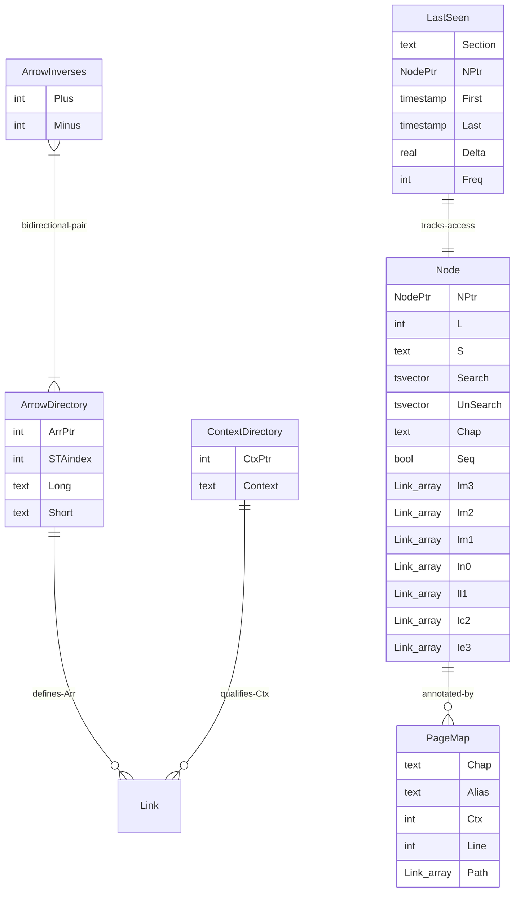

# Database Schema

SSTorytime's physical schema consists of **6 tables** and **3 custom PostgreSQL
types**, all defined in
[`pkg/SSTorytime/postgres_types_functions.go`](https://github.com/markburgess/SSTorytime/blob/main/pkg/SSTorytime/postgres_types_functions.go).
The bulk of the graph lives in the `Node` table: links are not stored in a
separate edge table — they live embedded in `Node` as arrays of the custom
`Link` type, one array per signed arrow channel (`Im3`…`Ie3`).

!!! info "Stub — will be expanded in Phase 4 of the [documentation upleveling plan](../plans/2026-04-20-documentation-upleveling.md)"
    This page is currently just the entity-relationship diagram. The full
    reference (column-by-column breakdown, custom-type field semantics, GIN index
    strategy, UNLOGGED→LOGGED bulk-load lifecycle) lands in a follow-up PR.

## Entity-relationship diagram

## Custom types

Three composite types underpin the schema
([`postgres_types_functions.go:18-30`](https://github.com/markburgess/SSTorytime/blob/main/pkg/SSTorytime/postgres_types_functions.go#L18-L30),
[`:90-98`](https://github.com/markburgess/SSTorytime/blob/main/pkg/SSTorytime/postgres_types_functions.go#L90-L98)):

- **`NodePtr`** — `(Chan int, CPtr int)`. A composite pointer into the 6
  size-class buckets of the `Node` table. `Chan` picks the bucket (1-gram,
  2-gram, 3-gram, <128B, <1KB, >1KB); `CPtr` indexes within it.
- **`Link`** — `(Arr int, Wgt real, Ctx int, Dst NodePtr)`. A directed edge:
  arrow type index, weight, context pointer, destination node.
- **`Appointment`** — `(Arr int, STType int, Chap text, Ctx int, NTo NodePtr, NFrom NodePtr[])`.
  A grouping result type returned by `GetAppointments` for 1-to-many
  arrow/type queries.

## The 7 signed channels

Each `Node` row carries **seven `Link[]` columns**, one per signed arrow type
(`-EXPRESS`, `-CONTAINS`, `-LEADSTO`, `NEAR`, `+LEADSTO`, `+CONTAINS`,
`+EXPRESS`). The column-to-constant mapping is:

| Column | Constant | Meaning |
|---|---|---|
| `Im3` | `-EXPRESS` | expressed-by (inverse of EXPRESS) |
| `Im2` | `-CONTAINS` | part-of (inverse of CONTAINS) |
| `Im1` | `-LEADSTO` | arriving-from (inverse of LEADSTO) |
| `In0` | `NEAR` | symmetric similarity |
| `Il1` | `+LEADSTO` | leads-to |
| `Ic2` | `+CONTAINS` | contains |
| `Ie3` | `+EXPRESS` | expresses |

See [`arrows.md`](../arrows.md) for the conceptual explanation of why 4 named
arrow types become 7 storage channels, and
[`STtype.go:82-109`](https://github.com/markburgess/SSTorytime/blob/main/pkg/SSTorytime/STtype.go#L82-L109)
for the `STTypeDBChannel` mapping function.
