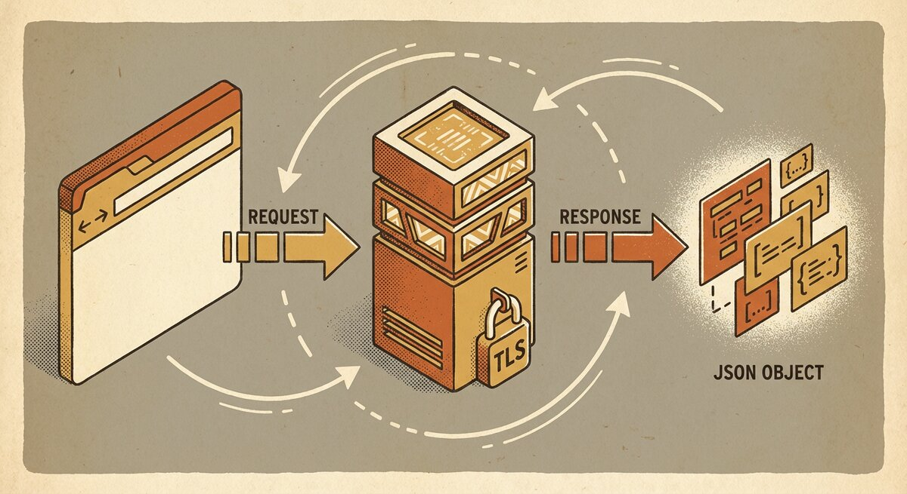

# Web JSON API

{ align=center }

The SSTorytime HTTP server is a thin JSON-speaking wrapper around the
library's search and upload primitives. It is deliberately opinionated — a
single response envelope, a single query language, a small set of endpoints —
so that any client (a browser, a command-line tool, an MCP proxy) sees the
same graph through the same keyhole.

This page is the complete protocol reference. For operator concerns
(starting the process, rotating certificates, graceful shutdown) see
[`http_server`](http_server.md). For LLM-side integration see
[`MCP-SST`](http-api/mcp-sst.md).

## Server lifecycle

The server is a single Go binary, `src/bin/http_server`, that opens a
persistent PostgreSQL connection on startup and binds two TCP listeners:

- **HTTPS on `:8443`** — the primary endpoint. Every real request lands here.
  See the mux construction at
  [`src/server/http_server.go:100-113`](https://github.com/markburgess/SSTorytime/blob/main/src/server/http_server.go#L100-L113).
- **HTTP on `:8080`** — issues an unconditional `301 Moved Permanently`
  to `https://<host>:8443<path>` for any client that arrives over
  plaintext. Handler at
  [`src/server/http_server.go:123-130`](https://github.com/markburgess/SSTorytime/blob/main/src/server/http_server.go#L123-L130).

TLS certificates are generated by
[`src/server/make_certificate`](https://github.com/markburgess/SSTorytime/blob/main/src/server/make_certificate)
on first build of the `src/server/` subdirectory. The script produces a
self-signed RSA-4096 X.509 certificate valid for 365 days, using
`src/server/localhost.conf` for subject-alternative-name entries. The
running server reads `../server/cert.pem` and `../server/key.pem` relative
to the binary — see
[`src/server/http_server.go:161`](https://github.com/markburgess/SSTorytime/blob/main/src/server/http_server.go#L161).

Graceful shutdown is wired to `SIGINT` and `SIGTERM` at
[`src/server/http_server.go:136-152`](https://github.com/markburgess/SSTorytime/blob/main/src/server/http_server.go#L136-L152):
both listeners are given a **10-second** context to drain in-flight requests
before the process exits.

## Endpoint catalogue

| Method | Path             | Purpose                                         |
|--------|------------------|-------------------------------------------------|
| POST   | `/searchN4L`     | Run a query in the N4L DSL; returns JSON.       |
| POST   | `/Upload`        | Cache an asset file under a chapter/context.    |
| POST   | `/SearchAssets`  | List previously uploaded assets for a node.     |
| GET    | `/Resources/*`   | Serve read-only files from the `-resources` root. |
| GET    | `/Assets/*`      | Serve cached upload artefacts.                  |
| GET    | `/`              | Serve embedded HTML/CSS/JS UI.                  |

The mux registrations live at
[`src/server/http_server.go:108-113`](https://github.com/markburgess/SSTorytime/blob/main/src/server/http_server.go#L108-L113).

### `POST /searchN4L`

The workhorse endpoint. The request is `application/x-www-form-urlencoded`
with the following fields (all optional except `name`):

| Field         | Type    | Meaning                                                    |
|---------------|---------|------------------------------------------------------------|
| `name`        | string  | N4L DSL query string (see below).                          |
| `nclass`      | integer | `NodePtr.Class` for direct pointer lookup.                 |
| `ncptr`       | integer | `NodePtr.CPtr` for direct pointer lookup.                  |
| `chapcontext` | string  | Current chapter/context label, used by `\lastnptr` telemetry. |

The handler lives at
[`src/server/http_server.go:206-238`](https://github.com/markburgess/SSTorytime/blob/main/src/server/http_server.go#L206-L238).
The `name` string is parsed by
[`DecodeSearchField`](https://github.com/markburgess/SSTorytime/blob/main/pkg/SSTorytime/service_search_cmd.go#L113)
into a `SearchParameters` record, which is then dispatched to one of nine
specialist handlers by
[`HandleSearch`](https://github.com/markburgess/SSTorytime/blob/main/src/server/http_server.go#L468).

### `POST /Upload`

Caches an asset (image, audio, document) under a node. The endpoint
accepts two modes, selected by the `uri` form value:

- If `uri == "none"`, the request body is `multipart/form-data` with a
  `filedata` part — the server reads the file inline
  ([`UploadInline`](https://github.com/markburgess/SSTorytime/blob/main/src/server/http_server.go#L334-L410)).
- Otherwise, the server treats `uri` as a remote URL and fetches it
  via [`SST.GetURIFile`](https://github.com/markburgess/SSTorytime/blob/main/src/server/http_server.go#L263-L330).

Either way, the form must include the routing fields:

| Field        | Meaning                                             |
|--------------|-----------------------------------------------------|
| `name`       | Node text the asset belongs to.                     |
| `chapter`    | Chapter string (sanitised for the filesystem).      |
| `context`    | Context keyword (sanitised for the filesystem).     |
| `extension`  | File extension, used in the cached filename.        |
| `filedata`   | (inline mode only) the file contents.               |
| `uri`        | Either `"none"` or an HTTP(S) URL to fetch.         |

The multipart parser caps the body at **32 MB** — see the
`r.ParseMultipartForm(32 << 20)` call at
[`src/server/http_server.go:249`](https://github.com/markburgess/SSTorytime/blob/main/src/server/http_server.go#L249).

The cached file is written under

```
./cacheroot/<chapter>/<context>/<item>/<timestamp>.<ext>
```

where `<item>` is the sanitised node name for short n-grams, or a
three-word-plus-MD5 fingerprint for longer texts — see
[`FileCacheLocation`](https://github.com/markburgess/SSTorytime/blob/main/src/server/http_server.go#L1124-L1152).

A successful upload returns:

```json
{ "Response": "Uploaded", "Content": "wrote 12345 bytes to ./cacheroot/..." }
```

A failed upload returns `{ "Response": "Failed", "Content": "Error: ..." }`
with an HTTP 5xx status.

### `POST /SearchAssets`

Lists the files currently cached against a node. Request is
`application/x-www-form-urlencoded`:

| Field     | Meaning                         |
|-----------|---------------------------------|
| `name`    | Node text.                      |
| `chapter` | Chapter.                        |
| `context` | Context keyword.                |

Response is an `AssetList`:

```json
{ "Response": "Assets",
  "Content": [ "/Assets/cacheroot/Ch/ctx/item/20260420.jpg", "..." ] }
```

Handler at
[`src/server/http_server.go:414-428`](https://github.com/markburgess/SSTorytime/blob/main/src/server/http_server.go#L414-L428);
the list itself is produced by
[`ListCacheAssets`](https://github.com/markburgess/SSTorytime/blob/main/src/server/http_server.go#L1156-L1178).
If the directory does not exist, `Content` is `[]`.

### Static file routes

| Prefix        | Backed by                                       | Purpose |
|---------------|-------------------------------------------------|---------|
| `/`           | `embed.FS` of `src/server/public/`              | UI assets baked into the binary. |
| `/Resources/` | `-resources` flag directory (default `/mnt`)    | Read-only serving of operator-chosen files. |
| `/Assets/`    | `./cacheroot/` (relative to the binary's cwd)   | Re-serves files previously written by `/Upload`. |

These are `http.FileServer` instances — no authentication, no range
controls beyond the Go defaults. See the setup at
[`src/server/http_server.go:102-110`](https://github.com/markburgess/SSTorytime/blob/main/src/server/http_server.go#L102-L110).

## Response envelope

Every `/searchN4L` response is wrapped by
[`PackageResponse`](https://github.com/markburgess/SSTorytime/blob/main/src/server/http_server.go#L1093-L1104):

```json
{
  "Response": "<kind>",
  "Content":  <kind-specific payload>,
  "Time":     "<ambient-time key>",
  "Intent":   [ "...intentional keywords..." ],
  "Ambient":  [ "...ambient scene tags..." ]
}
```

`Time`, `Intent`, and `Ambient` are derived from the server's short-term
memory of recent searches — they let a client surface "what the system was
thinking about" alongside the matched content.

The `Response` discriminator drives the client-side dispatch. The full
value set is:

| `Response`   | `Content` shape                                         | Emitted by |
|--------------|---------------------------------------------------------|------------|
| `Orbits`     | Array of [`NodeEvent`](#nodeevent) (each carrying a full `[ST_TOP][]Orbit` satellite field). | `HandleOrbit` |
| `ConePaths`  | Array of [`WebConePaths`](#webconepaths). | `HandleCausalCones` |
| `PathSolve`  | Array of [`WebConePaths`](#webconepaths) (with `BTWC` and `SuperNodes` populated). | `HandlePathSolve` |
| `Sequence`   | Array of `NodeEvent` forming an axial story. | `HandleStories` |
| `PageMap`    | [`PageView`](#pageview) — the literal N4L note layout. | `HandlePageMap` |
| `TOC`        | Array of `ChCtx` — chapter/context table of contents. | `ShowChapterContexts` |
| `Arrows`     | Array of `ArrowList` — arrow directory entries. | `HandleMatchingArrows` |
| `STAT`       | Array of `LastSeen` — recency stats. | `ShowStats` |
| `Error`      | Diagnostic string. | `HandleSearch` fallback. |
| `LastSaw`    | Ack string for `\lastnptr` telemetry pings. | `UpdateLastSawNPtr` |

The upload/asset endpoints use a smaller envelope without `Time` /
`Intent` / `Ambient`:

| `Response` | Emitted by       | `Content`                            |
|------------|------------------|--------------------------------------|
| `Uploaded` | `/Upload`        | Success message with byte count.     |
| `Failed`   | `/Upload`        | `"Error: ..."` diagnostic string.    |
| `Assets`   | `/SearchAssets`  | Array of `/Assets/...` URL strings.  |

### NodeEvent

Single-node record with pre-computed satellite orbits. Defined at
[`pkg/SSTorytime/types_structures.go:196-205`](https://github.com/markburgess/SSTorytime/blob/main/pkg/SSTorytime/types_structures.go#L196-L205):

```go
type NodeEvent struct {
    Text    string
    L       int
    Chap    string
    Context string
    NPtr    NodePtr
    XYZ     Coords
    Orbits  [ST_TOP][]Orbit
}
```

`Orbits` is a seven-channel array (one per signed arrow type) of
`Orbit` elements, each describing a neighbour out to probe-radius 3.

### Orbit

One satellite record, defined at
[`pkg/SSTorytime/types_structures.go:220-231`](https://github.com/markburgess/SSTorytime/blob/main/pkg/SSTorytime/types_structures.go#L220-L231):

```go
type Orbit struct {
    Radius  int
    Arrow   string
    STindex int
    Dst     NodePtr
    Ctx     string
    Wgt     float32
    Text    string
    XYZ     Coords
    OOO     Coords
}
```

`OOO` is the origin coordinate of the body the satellite orbits; `XYZ` is
the satellite's own position.

### WebPath

Go-internal `Link` arrays are flattened into `WebPath` objects with all
pointers expanded. Defined at
[`pkg/SSTorytime/types_structures.go:171-181`](https://github.com/markburgess/SSTorytime/blob/main/pkg/SSTorytime/types_structures.go#L171-L181):

```go
type WebPath struct {
    NPtr    NodePtr
    Arr     ArrowPtr
    STindex int
    Line    int
    Name    string
    Chp     string
    Ctx     string
    XYZ     Coords
    Wgt     float32
}
```

### WebConePaths

Wraps an array of paths plus symmetry analysis. Defined at
[`pkg/SSTorytime/types_structures.go:209-216`](https://github.com/markburgess/SSTorytime/blob/main/pkg/SSTorytime/types_structures.go#L209-L216):

```go
type WebConePaths struct {
    RootNode   NodePtr
    Title      string
    BTWC       []string  // betweenness-centrality scores
    Paths      [][]WebPath
    SuperNodes []string  // symmetrically-equivalent node groups
}
```

### PageView

Produced by `HandlePageMap`. Defined at
[`pkg/SSTorytime/types_structures.go:152-156`](https://github.com/markburgess/SSTorytime/blob/main/pkg/SSTorytime/types_structures.go#L152-L156):

```go
type PageView struct {
    Title   string
    Context string
    Notes   [][]WebPath
}
```

### Coords

Used throughout for pre-computed visual layout. Defined at
[`pkg/SSTorytime/types_structures.go:160-167`](https://github.com/markburgess/SSTorytime/blob/main/pkg/SSTorytime/types_structures.go#L160-L167):

```go
type Coords struct {
    X, Y, Z       float64
    R             float64
    Lat, Lon      float64
}
```

### LastSeen

Activity-log rows returned by `STAT` responses. Defined at
[`pkg/SSTorytime/types_structures.go:254-263`](https://github.com/markburgess/SSTorytime/blob/main/pkg/SSTorytime/types_structures.go#L254-L263):

```go
type LastSeen struct {
    Section  string
    First    int64
    Last     int64
    Pdelta   float64
    Ndelta   float64
    Freq     int
    NPtr     NodePtr
    XYZ      Coords
}
```

## N4L query DSL

The `name` field of a `/searchN4L` request is a small backslash-delimited
DSL. The full keyword list is defined at
[`pkg/SSTorytime/service_search_cmd.go:50-107`](https://github.com/markburgess/SSTorytime/blob/main/pkg/SSTorytime/service_search_cmd.go#L50-L107).
The commands group into a few families.

### Subject selection

| Command                                | Meaning                                             | Example |
|----------------------------------------|-----------------------------------------------------|---------|
| `<bareword>`                           | Orbit lookup around nodes matching the word.        | `alice` |
| `\from <terms>`                        | Start-set for a path solve.                         | `\from maze_a7` |
| `\to <terms>`                          | End-set for a path solve.                           | `\from maze_a7 \to maze_i6` |
| `\path`, `\paths`                      | Alias of `\from` with explicit framing.             | `\path Alice \to rabbit` |
| `\seq <topic>`, `\sequence`, `\story`  | Axial trail following a sequence arrow.             | `\seq astronomy` |

### Filtering

| Command                                | Meaning                                             | Example |
|----------------------------------------|-----------------------------------------------------|---------|
| `\chapter <name>`, `\in`, `\section`   | Restrict matches to a chapter.                      | `alice \chapter tales` |
| `\context <kw,kw>`, `\ctx`, `\as`      | Require these context tokens on matched links.      | `alice \ctx garden, croquet` |
| `\arrow <names>`, `\arrows`            | Restrict to a specific set of arrow types.          | `\from A \to B \arrow causes` |

### Bounding the search

| Command                                | Meaning                                             |
|----------------------------------------|-----------------------------------------------------|
| `\limit <N>`, `\depth <N>`, `\range <N>`, `\distance <N>` | Max path length / orbit radius. |
| `\gt <N>`, `\min <N>`, `\atleast <N>`  | Minimum path length or cardinality.                 |
| `\lt <N>`, `\max <N>`, `\atmost <N>`   | Maximum path length or cardinality.                 |
| `\page <N>`                            | Pagemap page offset.                                |

### Chapter / context browsing

| Command                                | Meaning                                             |
|----------------------------------------|-----------------------------------------------------|
| `\contents`, `\toc`, `\map`            | Table-of-contents: chapters × contexts.             |
| `\notes <chapter>`, `\browse`          | The literal `PageMap` for a chapter.                |

### Housekeeping

| Command                                | Meaning                                             |
|----------------------------------------|-----------------------------------------------------|
| `\stats`                               | Return a `STAT` response rather than content.       |
| `\finds <names>`, `\finding`           | Intersect orbit satellites with a name filter.      |
| `\remind`                              | Reminder-query dispatch.                            |
| `\help`                                | Shortcut for the built-in help chapter.             |

### Dirac bracket form

The parser recognises `<start | context | end>` Dirac notation and rewrites
it into `\from start \to end \context context` — see
[`DiracNotation`](https://github.com/markburgess/SSTorytime/blob/main/pkg/SSTorytime/service_search_cmd.go)
and the rewriter at
[`service_search_cmd.go:178-189`](https://github.com/markburgess/SSTorytime/blob/main/pkg/SSTorytime/service_search_cmd.go#L178-L189).

## Error catalogue

SSTorytime's HTTP surface returns errors in two shapes.

### Transport-level errors

Emitted by `http.Error` with a real HTTP status code:

| Status | Cause                                                      | Emitted at |
|--------|------------------------------------------------------------|------------|
| 405 Method Not Allowed | `/searchN4L` or `/Upload` called with an unsupported method. | `http_server.go:236`, `http_server.go:245` |
| 400 Bad Request        | Inline upload missing `filedata`.                          | `http_server.go:350` |
| 500 Internal Server Error | URI fetch, directory creation, or file write failed.    | `http_server.go:277-325`, `http_server.go:377-407` |

### Application-level errors

Emitted in the envelope with `Response == "Failed"` or `Response == "Error"`:

```json
{ "Response": "Failed", "Content": "Error: <diagnostic>" }
```

- `Failed` — the `/Upload` path encountered a filesystem or network error.
  The server also writes an HTTP 5xx status. See
  [`http_server.go:276-325`](https://github.com/markburgess/SSTorytime/blob/main/src/server/http_server.go#L276-L325).
- `Error` — the search dispatcher found no handler matching the query. See
  [`http_server.go:610-614`](https://github.com/markburgess/SSTorytime/blob/main/src/server/http_server.go#L610-L614).

## Security posture

The default shipping configuration is suitable for **local development and
trusted networks only**. Three things are missing from a
production-acceptable stance:

1. **No API authentication.** Any client that can reach `:8443` can read
   and write the graph. TLS confirms the server's identity to the client,
   not the reverse.
2. **CORS reflects the request's `Origin` verbatim.** See
   [`EnableCORS`](https://github.com/markburgess/SSTorytime/blob/main/src/server/http_server.go#L179-L200)
   — the handler echoes whatever origin the caller sends. This makes
   cross-origin development easy and cross-origin attacks equally easy; do
   not expose the raw port to the public internet.
3. **The TLS certificate is self-signed.** Browsers will warn; MCP-SST and
   other programmatic clients need explicit trust configuration.

For production, terminate TLS at a reverse proxy that enforces
authentication (HTTP Basic, mTLS, or an OIDC side-car), then have the
SSTorytime server listen on a loopback-only HTTP port behind it. Rate
limits and request-body quotas can be enforced at the same layer.

## See also

- [Operator guide for `http_server`](http_server.md) — starting, stopping, rotating certs.
- [MCP-SST integration](http-api/mcp-sst.md) — wiring an LLM through to this API.
- [OpenAPI specification](https://github.com/markburgess/SSTorytime/blob/main/src/server/OpenAPI/OpenAPI.yaml) — machine-readable version of the above.
- [API walkthroughs](API_WALKTHROUGH.md) — annotated Go client examples.
