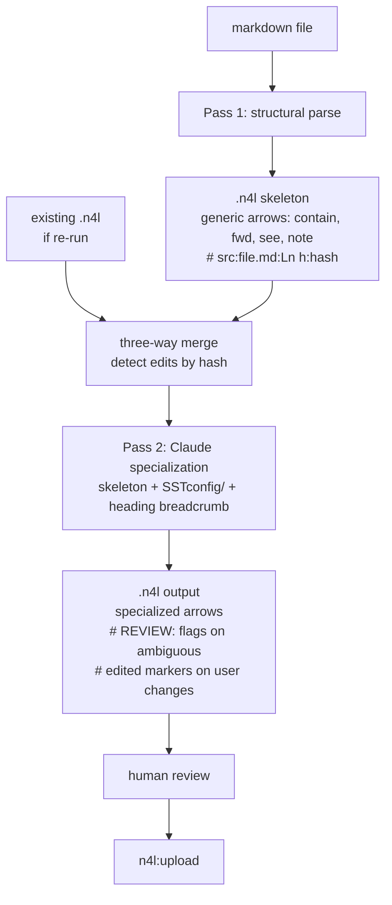

# N4L Markdown Import Skill (n4l:md-import)

## Problem Frame

SSTorytime authors with existing markdown notes (Obsidian vaults, README docs, engineering notebooks, Zettelkasten) currently have no path into the graph short of hand-writing `.n4l`. The existing `n4l:import` skill handles CSV only; `text2N4L` handles prose via statistical sentence fractionation, which is a different job. Structured markdown — headings, lists, tables, links, blockquotes, code fences — is where *most* user knowledge already lives and is the missing converter in the plugin.

A markdown→`.n4l` skill closes this gap. The core design move is **two-pass, structure-first / arrow-second**: Pass 1 parses markdown into a valid `.n4l` skeleton with generic arrow *placeholders* plus stable provenance comments; Pass 2 specializes placeholders into specific `SSTconfig/` arrow codes using Claude judgment over the full skeleton. The skill never blocks on questions; ambiguous calls become `# REVIEW:` comments. Re-runs against edited markdown preserve hand-edits in the `.n4l` via content-hash detection, enabling the markdown vault to act as the canonical edit surface without locking the user out of tuning the graph.

## Architecture

## Requirements

**Invocation and I/O**

- R1. Accept a markdown file path as the skill argument (e.g., `/n4l:md-import notes.md`). Single file in v1.
- R2. Write output to `<source-name>.n4l` in the same directory by default. Override with `--output <path>`.
- R3. If the output file already exists AND begins with this skill's top-of-file marker (R14), run merge (see R16–R18) rather than overwriting. If the existing file lacks the marker (foreign file — e.g., `notes.n4l` produced by hand or by `n4l:import` from a sibling `notes.csv`), abort with an error instructing the user to pass `--output <different-path>` or `--force`. A `--force` flag replaces the file entirely, skipping both the marker check and merge.
- R4. Never prompt the user during conversion. All ambiguity surfaces as inline `# REVIEW:` or `# SUGGEST:` comments in the output.

**Pass 1 — structural parse**

- R5. Parse these markdown features and emit corresponding `.n4l` structure:
    - **YAML frontmatter** — `title:` → chapter name (overrides filename default); `tags: [a, b]` → bare `:: a, b ::` at the top of the file setting the base context state. Heading-opened contexts (see next sub-bullet) use `+:: ::` to add onto this base and `-:: ::` to remove when the heading closes.
    - **Headings H1–H6** — every heading opens a context that closes when the next same-level (or shallower) heading appears. Context stack = all currently open headings from shallowest to deepest. No chapter/sub-chapter distinction.
    - **Unordered lists** — each list item becomes a node. The nearest preceding heading is the source; edges default to the CONTAINS placeholder `contain`. Nested bullets chain CONTAINS from the parent item.
    - **Ordered / numbered lists** — wrapped in `+:: _sequence_ ::` / `-:: _sequence_ ::` so items auto-chain with `(then)`. Source heading still connects to the first item via CONTAINS.
    - **Markdown tables** — each row becomes a node keyed by the first column; remaining columns become edges using the EXPRESS placeholder `note`, with column header preserved as a hint in `# SUGGEST:` comments. Reuses `n4l:import` row-explosion logic conceptually.
    - **Links `[text](url)`** — `text` becomes the target node; edge defaults to NEAR placeholder `see`; url preserved as `# url:<href>` trailing comment.
    - **Blockquotes** — content becomes a node; edge from nearest heading defaults to EXPRESS placeholder `quote`.
    - **Fenced code blocks** — the code block (fence content verbatim, quoted) becomes a node; edge from nearest heading defaults to EXPRESS placeholder `example`. Language tag (e.g., `python`) included in `# SUGGEST:` comment.
- R6. **Skip paragraph prose entirely.** Non-structural text between structural elements is ignored. When ≥50% of a file's byte count is paragraph prose, emit a top-of-file comment: `# NOTE: this file contains substantial prose; consider running text2N4L for sentence-level extraction.`
- R7. **Node naming** — node text is the full structural element's text with inline markdown syntax stripped (`**bold**` → `bold`, `*italic*` → `italic`, `` `code` `` → `code`, `[text](url)` → `text` for node-naming purposes). Values containing parentheses, commas, or leading/trailing whitespace are wrapped in double quotes.
- R8. **Placeholder vocabulary** — Pass 1 emits exactly these four arrow codes as generic defaults pending Pass 2 specialization: `contain` (CONTAINS), `fwd` (LEADSTO), `see` (NEAR), `note` (EXPRESS). These must be real arrow codes in the active SSTconfig/ so that Pass 1 output is valid N4L even if Pass 2 never runs (see load-bearing verification finding in review notes). The term "placeholder" in this doc refers to their role in the two-pass pipeline, not that they are invalid arrow codes outside Pass 2. Default placeholder per feature is specified in R5.
- R9. **Provenance comment** — every edge line carries a trailing comment `# src:<relative-md-path>:L<line> h:<6-char-hash>` where hash is computed over the emitted `.n4l` line contents (node + arrow + target, post-normalization). This comment is load-bearing for re-run detection (R16) and parser-error back-propagation (future skill 6a.4).

**Pass 2 — Claude arrow specialization**

- R10. For each edge whose arrow is still a placeholder (`contain`, `fwd`, `see`, `note`), specialize it to a specific `SSTconfig/arrows-*.sst` code by reading: (a) the full skeleton for surrounding context, (b) the heading breadcrumb the edge lives under, (c) the current context stack, (d) the candidate arrows from the SSTconfig file matching the placeholder's meta-type.
- R11. When multiple candidate arrows are plausible for an edge, pick the single best and append `# REVIEW: or (<alt>)?` with one alternative. When no candidate is confidently better than the placeholder, keep the placeholder and append `# SUGGEST: review against <arrow-file>`.
- R12. **SSTconfig/ lookup order** — current working directory → `$SSTORYTIME_HOME` → none. If none is found, Pass 2 leaves all placeholders in place and emits a top-of-file comment: `# NOTE: SSTconfig/ not found. Placeholders kept. Set $SSTORYTIME_HOME or run from your project root.` Do not prompt the user. (Matches `n4l:import` convention.)
- R13. Specialization preserves the provenance comment and its hash unchanged. A hash is over Pass-1 output, not Pass-2 output, so Pass 2 re-runs produce deterministic input for merge detection.

**Output structure**

- R14. Emit a top-of-file comment block summarizing: md source path, conversion timestamp, Pass 1 / Pass 2 versions (for forward compatibility), and (when applicable) the R6 prose warning and R12 no-SSTconfig warning.
- R15. Group edges under heading-derived `:: context ::` blocks. Chapter header is `- <frontmatter.title or filename-sans-ext>` at the top. Blank line separates each node block. Ditto `"` is aligned so arrow codes line up vertically within a block.

**Three-way merge (re-run)**

- R16. On re-run when output `.n4l` already exists: parse the existing file, extract provenance `# src:… h:…` comments and the rendered n4l line for each edge, compare `h:` against a recomputed hash of the same line's current rendered form.
- R17. Edits are detected and preserved as follows:
    - **Hash matches** — edge is unchanged from skill output; replace with fresh Pass 1 + Pass 2 output.
    - **Hash mismatch** — user hand-edited this edge; preserve the existing line verbatim, update the provenance comment to include ` edited` (e.g., `# src:notes.md:L3 h:a3f edited`), and skip Pass 2 specialization for this edge.
    - **Provenance absent** — edge was added by the user not from markdown; preserve verbatim, tag with `# user-added` on first merge.
    - **Source line no longer in markdown** — emit the edge commented out with `# REMOVED: source no longer in markdown` above it so the user can decide whether to delete or manually preserve. Do not silently drop.
- R18. Merge is always three-way (old md → old n4l → new md). Old md is reconstructed from provenance line numbers in the existing n4l; when that reconstruction is impossible (file reshaped drastically), fall back to preserving the entire old n4l as a sibling `.n4l.backup` and writing fresh output with a `# WARNING: previous file could not be merged; see notes.n4l.backup` comment at the top.

**Integration with existing skills**

- R19. Output is deterministic input for `n4l:upload` (validate→fix→upload). The skill does NOT invoke upload in v1 (pipe-mode is ideation 6a.6, deferred).
- R20. Follow the existing `n4l:*` skill convention of placing copies of `n4l-syntax.md` and `arrow-types.md` in `./references/` **relative to this skill's own directory** (e.g., `n4l-plugin/plugins/n4l/skills/md-import/references/`). SKILL.md imports them via `@./references/...`. These are per-skill copies, not a shared plugin-level location — each `n4l:*` skill carries its own copy by convention.

## Success Criteria

- A user points the skill at a single markdown file with headings, mixed lists, links, and a table and gets a valid `.n4l` that `N4L -v` accepts without syntax errors, with arrow codes drawn from the active SSTconfig/ when present.
- On the Reference Corpus (see Dependencies/Assumptions), REVIEW+SUGGEST density is ≤1 per 10 emitted edges, corresponding to roughly a one-minute human review per 100 lines of markdown.
- Editing an arrow in the `.n4l` and re-running the skill after changing the markdown preserves the human edit (marked `edited` in provenance) and reflects md changes in all other edges.
- Pointing the skill at a prose-heavy file (>50% prose) emits the `consider text2N4L` hint instead of a misleading structural conversion.

## Scope Boundaries

- **Single file only.** Vault bulk import / wikilink resolution / cross-file node identity is ideation 6a.3, deferred.
- **No learning loop.** Per-author arrow profile + correction harvester is ideation 6a.5, deferred. Pass 2 is stateless across runs.
- **No pipeline composition.** `--pipe` to `n4l:upload`/`n4l:interpret` is ideation 6a.6, deferred.
- **No signature recipes.** Pre-tuned patterns like `glossary-list`, `academic-paper` are ideation 6a.7, deferred.
- **No prose fractionation.** Paragraph text is skipped; `text2N4L` remains the tool for prose.
- **No modification of SSTconfig/.** The skill reads arrow definitions only.
- **No database interaction.** The skill produces a file; `n4l:upload` handles PostgreSQL.
- **No emphasis/inline-code as structure.** `**bold**` / `` `code` `` within structural elements are stripped for node naming (R7) but do not create separate nodes or edges. Standalone prose containing only markup is ignored per R6 (paragraph prose).
- **No wikilinks or Obsidian tags.** `[[wikilink]]`, `#inline-tag` are treated as literal text in v1. Deferred to 6a.3 vault importer.
- **No interactive prompts.** Per seed constraint. Ambiguity always surfaces as inline comments.

## Key Decisions

- **Two-pass architecture** — structure first, arrow-specialization second. Pass 1 is deterministic; Pass 2 is LLM judgment. Placeholders between the passes are the stable interface.
- **Claude does Pass 2** — deterministic rule tables (like `n4l:import`'s column-keyword map) were rejected as too coarse for `SSTconfig`'s ~280-arrow catalog. Claude reads the full skeleton + heading breadcrumb + candidate arrows and picks.
- **Every heading opens a context; no chapter/sub-chapter distinction.** Filename (or frontmatter `title`) is the single chapter. Simpler rule, fewer edge cases, predictable context stack.
- **Skip prose entirely, punt to text2N4L.** Mixing structural conversion and sentence fractionation in one skill is scope creep. The hint comment in prose-heavy files routes the user to the right tool.
- **Full-text, markdown-stripped node names.** Treating bold phrases as entities was rejected as unreliable (non-entity bold is common). Stripping all inline markdown keeps node names predictable and preserves information.
- **Provenance hash enables safe re-runs.** Content-hash comments make hand-edits tamper-evident without requiring the user to learn a locking convention. Matches seed's "never block on questions" constraint.
- **No-prompt SSTconfig fallback.** Matches the shipped `n4l:import` convention (CWD → `$SSTORYTIME_HOME` → generic). The earlier brainstorm's prompt-fallback convention has been superseded.
- **Placeholder vocabulary is the four meta-type codes.** Keeps Pass 1 output parseable by N4L — `contain`, `fwd`, `see`, `note` must all be real arrow codes in the active SSTconfig/ so unspecialized output uploads cleanly if the user chooses to skip Pass 2. **Load-bearing: verify during planning** — see outstanding review finding.
- **Skill name is `n4l:md-import`.** Matches the explicit-verbs convention of `n4l:import`, `n4l:upload`. Extending `n4l:import` with md auto-detection was considered and rejected: markdown and CSV workflows have different flag surfaces (`--force` merge, future `--vault`) and different output semantics (placeholder+specialize vs row-explosion). A separate skill keeps each clean.

## Dependencies / Assumptions

- SSTconfig/ format is stable; arrow definition files are human-readable text with short-code parens. (Verified: files in `SSTconfig/` are plain text with `name (code)` or `+ name (code) - name (code)` format.)
- Per-skill copies of `n4l-syntax.md` and `arrow-types.md` live under each skill's `references/` subdirectory (e.g., `n4l-plugin/plugins/n4l/skills/import/references/`). Verified: each `n4l:*` skill imports its own copy via `@./references/...`; there is no shared plugin-level `references/` location.
- **Reference Corpus (for Success Criterion #2)** — a small fixed set of markdown files drawn from `docs/brainstorms/`, `docs/ideation/`, and `n4l_patterns/` at the time v1 is evaluated. Exact file list to be pinned during planning.
- `n4l_patterns/` directory exists in the repo root (untracked per git status) — not used by this skill in v1 (reserved for ideation 6a.5 learning loop).
- Markdown is read as UTF-8; node names may contain non-ASCII (matches existing `c.s.peirce_semiotics.n4l` pattern of mixed-language content).
- Assumption (unverified at brainstorm time): N4L's `+:: _sequence_ ::` / `-:: _sequence_ ::` blocks can be nested under a `:: context ::`. Planning should verify against `n4l-syntax.md`.

## Outstanding Questions

### Resolve Before Planning

(none — the "never block on questions" constraint plus the scope boundaries mean all product decisions are resolved.)

### Deferred to Planning

- [Affects R5][Needs research] Markdown parser choice — hand-rolled vs. goldmark (Go) vs. a portable parser callable from a Claude skill. Planning to resolve.
- [Affects R9][Needs research] Exact hash algorithm and truncation length — 6 hex chars of SHA-256 over normalized line contents is a reasonable starting point; planning to confirm collision rate is acceptable for typical file sizes.
- [Affects R10][Technical] Pass-2 prompt structure — single prompt over the whole skeleton vs. chunked per-chapter. Planning to determine based on context-window considerations.
- [Affects R17][Technical] How "line verbatim" is identified during merge when whitespace/alignment has changed but semantics have not — normalization rules TBD at planning time.
- [Affects R18][Needs research] Detection heuristic for "md reshaped drastically" triggering `.n4l.backup` fallback. Threshold needs empirical tuning.
- [Affects R20][Technical] Whether a new `references/markdown-mapping.md` shared file is worth factoring out for the R5 feature-to-placeholder table, or if it lives inline in the skill. Planning to decide.

## Next Steps

→ `/ce:plan` for structured implementation planning
