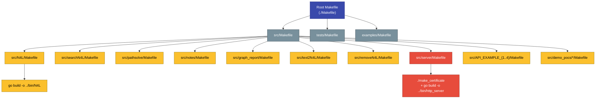

# Build system

SSTorytime uses a deliberately simple two-tier `make`-driven build: the
root [`Makefile`](https://github.com/markburgess/SSTorytime/blob/main/Makefile)
descends into [`src/Makefile`](https://github.com/markburgess/SSTorytime/blob/main/src/Makefile),
which in turn delegates each executable to a per-tool `Makefile` that
shells out to `go build`. There is no Bazel, no mage, no build-graph
system — just Make calling Make calling `go build`. This page documents
the architecture, every target you'll care about, where the output goes,
and how to add a new tool without breaking anything.

## Architecture



Each layer has a single job:

- **Root Makefile** — entry point. Defines user-facing targets (`all`,
  `test`, `clean`, `db`, `ramdb`) and delegates to child Makefiles.
- **`src/Makefile`** — enumerates every binary the project produces and
  has a dependency rule per tool. It's the single source of truth for
  "what do we build?".
- **Per-tool Makefiles** — minimal. Create `../bin/`, invoke
  `go build -o ../bin/<name> ./...`.

## Targets

| Target | What it does |
|---|---|
| `make` / `make all` | Default. Builds `src/bin/N4L` first (via `src/Makefile`), builds all `demo_pocs`, then runs the `test` target. |
| `make test` | Rebuilds everything under `src/` and runs `tests/` (note: does not itself invoke `tests/run_tests` — see [Testing](testing.md)). |
| `make clean` | Removes backup files, all compiled binaries, and cleans `src/`, `src/demo_pocs/`, and `examples/`. |
| `make db` | Runs `contrib/makedb.sh` to create a disk-backed PostgreSQL database + schema. |
| `make ramdb` | Runs `contrib/ramify.sh` (mount a tmpfs) then `contrib/makeramdb.sh` (create the cluster in RAM). Fast and ephemeral — preferred for development. |

!!! warning "`make db` historically broken"
    Until Phase 0 of the documentation upleveling landed, the root
    `Makefile` had `(cd contrib/makedb.sh)` — which is `cd` into a
    *file*, not a directory, and silently fails. The fix replaces it
    with `sh contrib/makedb.sh`. If your checkout still has the old
    line, run `make ramdb` instead or patch the Makefile by hand. See
    [`Makefile:23–24`](https://github.com/markburgess/SSTorytime/blob/main/Makefile#L23-L24).

## Output layout

After `make all`, the repo has these new directories:

```
src/
├── bin/                          ← CLI tools + http_server land here
│   ├── N4L
│   ├── searchN4L
│   ├── pathsolve
│   ├── notes
│   ├── graph_report
│   ├── text2N4L
│   ├── removeN4L
│   ├── http_server
│   └── API_EXAMPLE_{1,2,3,4}
│
└── demo_pocs/
    └── bin/                      ← Integration-test binaries
        ├── postgres_testdb
        ├── dotest_getnodes
        ├── dotest_entirecone
        └── definecontext
```

The root of the repo stays clean — no binaries leak upward. The
[`.gitignore`](https://github.com/markburgess/SSTorytime/blob/main/.gitignore)
keeps `src/bin/` and `src/demo_pocs/bin/` out of version control.

## Per-tool pattern

Every per-tool Makefile is a three-line template:

```make
all:
	mkdir -p ../bin
	go build -o ../bin/<toolname> ./...
```

See
[`src/N4L/Makefile`](https://github.com/markburgess/SSTorytime/blob/main/src/N4L/Makefile)
or
[`src/searchN4L/Makefile`](https://github.com/markburgess/SSTorytime/blob/main/src/searchN4L/Makefile)
for the canonical shape. `go build ./...` picks up every `.go` file in
the current directory, resolves imports via `go.mod`, and produces a
statically-linked binary at the `-o` path.

The `mkdir -p ../bin` is defensive: it lets you invoke a per-tool
Makefile directly without having run the parent first.

## Special cases

### `src/server/Makefile`

The HTTPS server's build is slightly more involved. See
[`src/server/Makefile`](https://github.com/markburgess/SSTorytime/blob/main/src/server/Makefile):

```make
all:
	mkdir -p ../bin
	go run css-builder/css_template.go
	./make_certificate
	go build -o ../bin/http_server ./...
```

Two extra steps before `go build`:

1. **CSS templating** — `css-builder/css_template.go` generates the
   production CSS from a Go template so the served styles stay in sync
   with Go-side theme constants.
2. **Certificate bootstrap** — `./make_certificate` creates a self-signed
   RSA-4096 TLS cert (365-day validity) via `openssl` if `cert.pem`
   doesn't already exist. See [TLS certificates](tls-certificates.md)
   for the full lifecycle.

Neither step re-runs unnecessarily:
[`make_certificate`](https://github.com/markburgess/SSTorytime/blob/main/src/server/make_certificate)
exits early if the cert file exists, and the CSS generator is
idempotent.

### `src/demo_pocs/`

Integration-test binaries live under
[`src/demo_pocs/`](https://github.com/markburgess/SSTorytime/tree/main/src/demo_pocs)
rather than `src/`. The pattern is identical — each subdirectory has a
`Makefile` of the same shape, just with `mkdir -p ../bin` relative to
`src/demo_pocs/`.

## Adding a new tool

Say you want to add `src/mytool/` that prints graph statistics.

1. **Create the directory and source:**
   ```bash
   mkdir src/mytool
   cat > src/mytool/main.go <<'EOF'
   package main

   import "fmt"

   func main() {
       fmt.Println("hello from mytool")
   }
   EOF
   ```

2. **Add a Makefile** copying the per-tool template:
   ```make
   all:
   	mkdir -p ../bin
   	go build -o ../bin/mytool ./...
   ```

3. **Register in `src/Makefile`** — two edits:
   - Add `bin/mytool` to the `OBJ=…` list at the top of
     [`src/Makefile`](https://github.com/markburgess/SSTorytime/blob/main/src/Makefile#L3).
   - Add a per-tool rule alongside the others:
     ```make
     bin/mytool: mytool/mytool.go ../pkg/SSTorytime
     	cd mytool ; make
     ```

4. **Build and verify:**
   ```bash
   make clean
   make all
   ls src/bin/mytool
   ```

5. **If it depends on the library**, import it:
   ```go
   import SST "github.com/markburgess/SSTorytime/pkg/SSTorytime"
   ```
   No changes to `go.mod` are needed — every tool in the repo lives in
   the same module.

6. **Document it.** Add `docs/mytool.md` and list it under the
   appropriate section in
   [`mkdocs.yml`](https://github.com/markburgess/SSTorytime/blob/main/mkdocs.yml)'s
   `nav:` block.

!!! tip "Keep each tool self-contained"
    A CLI tool should compile without references to other tools'
    `main.go` files. Shared logic belongs in `pkg/SSTorytime/`, not
    cross-imported between `src/*` packages.

## Why this layout?

Two-tier Make is old-fashioned on purpose:

- **Transparent.** Every step is visible in text. There's no black-box
  build tool, no `bazel query` incantation.
- **Go-friendly.** `go build ./...` is already a complete build system
  for a single package. Make's only job is orchestration across many
  packages.
- **Minimal dependencies.** No `npm`, no Python, no plugins. A fresh
  Linux box with `go`, `make`, and `openssl` can build the whole
  project.
- **Composable.** You can build one tool (`cd src/N4L && make`) or the
  whole tree (`make all`) with the same mechanism.

The cost is that dependency tracking is coarse: `go build` handles
Go-level dependencies perfectly, but Make itself only knows about the
top-level `.go` file in each tool. A library change in
`pkg/SSTorytime/` is picked up by Go's caching — not by Make's
timestamp logic — so rebuilds are fast without being fragile.
