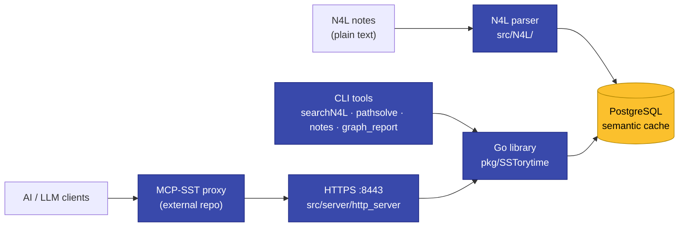
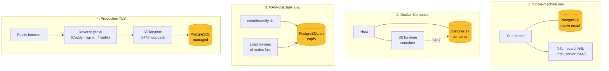

# Architecture

This page is a tour of SSTorytime as a piece of running software — the layers,
the boundaries between them, where decisions are made, and how to deploy the
thing once you understand it. If you are here because the code does not match
the conceptual pitch, the [Concept → Code index](../code-index.md) is the
faster reverse lookup; this page is the connective tissue.

## The layers, from source text to served JSON

SSTorytime has five distinct software layers, stacked vertically. Data flows
up (on write) and down (on read), and every layer has a single responsibility.

### 1. N4L source files — the authoring surface

The human (or LLM) writes `.n4l` files in a plaintext DSL. This is where
**narrative intent** lives: chapters, context declarations, arrow definitions,
node text, sequence markers. The files are the durable record of what someone
thought; everything below is derived.

### 2. The N4L parser — `src/N4L/`

A single-package Go program that tokenizes, classifies, and emits. It turns
text into a stream of nodes, links, and context pointers. The parser's entry
point is
[`src/N4L/N4L.go:228`](https://github.com/markburgess/SSTorytime/blob/main/src/N4L/N4L.go#L228)
(flag parsing) and the upload path runs through
[`src/N4L/N4L.go:220`](https://github.com/markburgess/SSTorytime/blob/main/src/N4L/N4L.go#L220)
into the library's `Upload` routine.

**Key decisions made at parse time:**

- Alias resolution (`@name` / `$name.N` references).
- Ambient context stack bookkeeping (`::`, `+::`, `-::` markers).
- Sequence-mode linking — automatic `(then)` arrows between list items
  when `+:: _sequence_ ::` is active, at
  [`CheckSequenceMode`](https://github.com/markburgess/SSTorytime/blob/main/src/N4L/N4L.go#L2154-L2172)
  and
  [`LinkUpStorySequence`](https://github.com/markburgess/SSTorytime/blob/main/src/N4L/N4L.go#L2176-L2206).
- Text size classification — which `NodePtr.Class` bucket a string belongs in.

Once the parser finishes a file, its output is a set of idempotent database
statements; the same file uploaded twice produces the same graph.

### 3. The Go library — `pkg/SSTorytime/`

Everything that is not text-to-graph conversion lives here. The library is
reused by the parser, the CLI tools, the HTTPS server, and any third-party Go
program. Roughly twenty-six `.go` files grouped by theme:

- **Session lifecycle** — [`session.go`](https://github.com/markburgess/SSTorytime/blob/main/pkg/SSTorytime/session.go):
  `Open(load_arrows bool)`, `Configure`, `Close`. Credentials come from
  `$POSTGRESQL_URI`, `~/.SSTorytime`, or hardcoded defaults, in that order.
- **High-level API** — [`API.go`](https://github.com/markburgess/SSTorytime/blob/main/pkg/SSTorytime/API.go):
  `Vertex`, `Edge`, `HubJoin` — three functions that cover most manual graph
  construction.
- **Idempotent insertion** — [`db_insertion.go`](https://github.com/markburgess/SSTorytime/blob/main/pkg/SSTorytime/db_insertion.go):
  `IdempDBAddNode`, `IdempDBAddLink`, and the `AppendDBLinkToNode` family.
- **Retrieval** — [`postgres_retrieval.go`](https://github.com/markburgess/SSTorytime/blob/main/pkg/SSTorytime/postgres_retrieval.go),
  twenty-plus `Get*` functions returning `Node`, `Link`, `Story`, `PageMap`,
  and `NodePtr` slices.
- **Search** — [`path_wave_search.go`](https://github.com/markburgess/SSTorytime/blob/main/pkg/SSTorytime/path_wave_search.go)
  and [`centrality_clustering.go`](https://github.com/markburgess/SSTorytime/blob/main/pkg/SSTorytime/centrality_clustering.go).
- **Types & globals** — [`types_structures.go`](https://github.com/markburgess/SSTorytime/blob/main/pkg/SSTorytime/types_structures.go),
  [`globals.go`](https://github.com/markburgess/SSTorytime/blob/main/pkg/SSTorytime/globals.go),
  [`STtype.go`](https://github.com/markburgess/SSTorytime/blob/main/pkg/SSTorytime/STtype.go).
- **JSON/web marshalling** — [`json_marshalling.go`](https://github.com/markburgess/SSTorytime/blob/main/pkg/SSTorytime/json_marshalling.go).

### 4. PostgreSQL — the semantic cache

Six tables (`Node`, `PageMap`, `ArrowDirectory`, `ArrowInverses`,
`ContextDirectory`, `LastSeen`), three custom composite types (`NodePtr`,
`Link`, `Appointment`), and thirty-five stored PL/pgSQL functions. The schema
definitions live at
[`postgres_types_functions.go:18-90`](https://github.com/markburgess/SSTorytime/blob/main/pkg/SSTorytime/postgres_types_functions.go#L18-L90).
Five GIN indexes are created *after* bulk load (not before) to keep upload
throughput high.

The library calls Postgres thinking of it as a *cache* of the graph, not the
origin. The origin is the N4L files; if the database is wiped you can always
rebuild by re-running `N4L -u *.n4l` (see [Sequence mode](../concepts/glossary.md#sequence-mode)
and [Idempotence](../concepts/glossary.md#idempotence-insertion)).

### 5. User-facing surfaces

Three ways to *consume* the graph sit above the library:

- **CLI tools** in `src/<tool>/` — `searchN4L`, `pathsolve`, `notes`,
  `graph_report`, `text2N4L`, `removeN4L`. Single binaries, each wrapping a
  small subset of library functions with a user-facing flag interface.
- **HTTPS server** — [`src/server/http_server.go`](https://github.com/markburgess/SSTorytime/blob/main/src/server/http_server.go),
  TLS on `:8443` with a redirect shim on `:8080`. Serves JSON responses for
  programmatic access and also serves embedded static assets for the browser
  UI.
- **LLM proxy** — the external [MCP-SST](https://github.com/markburgess/MCP-SST)
  project translates between Model Context Protocol requests (as spoken by
  Claude, ChatGPT, and other LLM clients) and the HTTPS JSON endpoints above.

## Where decisions happen

Three timing points. Each is a chance for something to go wrong; each is
separately tunable.

**Parse time.** Alias expansion, context stack application, sequence
auto-linking, text size classification. Once the parser writes a row, these
decisions are fixed in storage.

**Query time.** Context intersection scoring, cone depth, arrow filtering,
chapter scoping, path wave-front expansion. These are *not* baked into the
database — they are arguments to every retrieval call. `SearchParameters`
([`postgres_retrieval.go:21-30`](https://github.com/markburgess/SSTorytime/blob/main/pkg/SSTorytime/postgres_retrieval.go#L21-L30))
is where they hang together.

**Render time.** Orbit assembly (one goroutine per STtype channel), betweenness
centrality clustering, JSON shaping for web responses, PageMap weaving. Most
of this lives in [`json_marshalling.go`](https://github.com/markburgess/SSTorytime/blob/main/pkg/SSTorytime/json_marshalling.go)
and is called by the HTTPS server.

## Concurrency boundaries

The Go library is **not** thread-safe at the global-state level. Several large
mutable globals back the in-memory model:

- `ARROW_DIRECTORY`, `ARROW_SHORT_DIR`, `ARROW_LONG_DIR`, `INVERSE_ARROWS` —
  populated on `Open(true)` at
  [`globals.go:96-100`](https://github.com/markburgess/SSTorytime/blob/main/pkg/SSTorytime/globals.go#L96-L100).
- `CONTEXT_DIRECTORY`, `CONTEXT_DIR`, `CONTEXT_TOP` — at
  [`globals.go:106-108`](https://github.com/markburgess/SSTorytime/blob/main/pkg/SSTorytime/globals.go#L106-L108).
- `NODE_CACHE` — at
  [`globals.go:93`](https://github.com/markburgess/SSTorytime/blob/main/pkg/SSTorytime/globals.go#L93).
- `NODE_DIRECTORY` — the size-classed in-memory node store at
  [`globals.go:112`](https://github.com/markburgess/SSTorytime/blob/main/pkg/SSTorytime/globals.go#L112).

The HTTPS server opens a single persistent `PSST` connection
([`src/server/http_server.go:42`](https://github.com/markburgess/SSTorytime/blob/main/src/server/http_server.go#L42))
and serves all requests through it. Goroutines *are* used internally — notably
in
[`GetNodeOrbit`](https://github.com/markburgess/SSTorytime/blob/main/pkg/SSTorytime/json_marshalling.go#L273-L306),
which fans one goroutine per STtype channel and joins on a `sync.WaitGroup`
— but these parallelise read work against the database, not writes against
global state.

If you embed the library in a long-running multi-tenant service, treat the
globals as load-time-immutable: call `Open(true)` once, do not let concurrent
N4L uploads race, and keep `IdempDBAddNode` and `IdempDBAddLink` behind a
single writer lane.

## Deployment topologies

Three shapes see real use, plus a fourth for production TLS.

**1. Single-machine development.** The simplest setup: install PostgreSQL
natively, run `make db` to create the `sstoryline` role and database, `make`
to build binaries into `src/bin/`, then use the tools directly. Credentials
come from `~/.SSTorytime` or the hardcoded defaults.

**2. Docker Compose.** The `contrib/postgres-docker/` directory carries a
ready-to-run `compose` file. Good for users who don't want PostgreSQL on the
host. The Go binaries still build locally and talk to the containerised
database via `$POSTGRESQL_URI`.

**3. RAM-disk bulk load.** For corpora in the millions of nodes,
[`contrib/ramify.sh`](https://github.com/markburgess/SSTorytime/blob/main/contrib/ramify.sh)
mounts the Postgres data directory on `tmpfs`. The `UNLOGGED` table lifecycle
(tables begin unlogged for write throughput and are promoted to logged after
bulk load completes) compounds the win. Do not use this for production — a
power loss discards the graph.

**4. Production TLS.** The built-in `make_certificate` script issues a
self-signed RSA-4096 certificate with 365-day validity, which is fine for
an intranet but will upset browsers on the public Internet. For real
deployment, run `http_server` on loopback only and terminate TLS at a reverse
proxy that handles ACME renewal (Caddy, Traefik, or nginx with certbot).

## Further reading

- [Code index](../code-index.md) — concept-to-line reverse lookup.
- [Database Schema](../Database/Schema.md) — tables, types, and the 7-channel
  link encoding.
- [HTTP API](../WebAPI.md) — the endpoints the reverse proxy in topology 4
  stands in front of.
- [How Context Works](../howdoescontextwork.md) — what the context layer
  actually does at query time.
