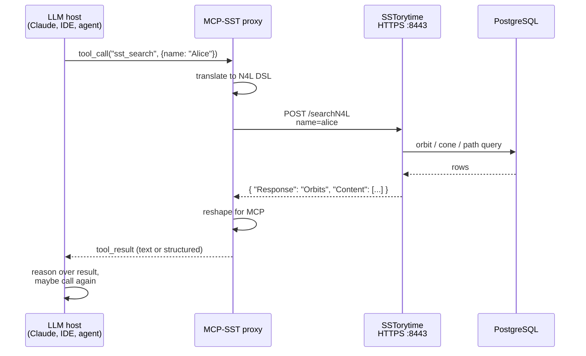

# MCP-SST — LLM integration proxy

SSTorytime is a database. Large language models are text programs. The two
do not speak each other's languages natively. **MCP-SST** is the external
proxy that bridges them: a small service that accepts
[Model Context Protocol](https://modelcontextprotocol.io/) tool-call
messages from an LLM and re-issues them as HTTPS requests to an
SSTorytime server's `/searchN4L` endpoint.

!!! info "Inferred content"
    The MCP-SST project lives in a separate repository at
    [github.com/markburgess/MCP-SST](https://github.com/markburgess/MCP-SST)
    and is not vendored into this one. The architecture and tool mapping
    described on this page are **inferred** from SSTorytime's own API
    surface, the [single-line README reference](https://github.com/markburgess/SSTorytime/blob/main/README.md#L11),
    and the MCP specification. Concrete tool names, configuration keys,
    and install commands should be cross-checked against the MCP-SST
    repository itself. Where a detail is an inference rather than a
    verified fact, it is flagged inline.

## What is the Model Context Protocol?

MCP is an open specification published by Anthropic that standardises how
an LLM host (for example Claude Desktop, an IDE assistant, or a custom
agent runtime) discovers and invokes external *tools* and *resources*. A
tool is, in MCP terms, a named function the model can call with typed
arguments; a resource is a piece of content the model can read. Servers
that speak MCP expose one or both over either stdio or a streamable HTTP
transport.

SSTorytime's HTTP server is **not** an MCP server. It speaks JSON-over-HTTPS
in the shape described in [`WebAPI.md`](../WebAPI.md), not the MCP
envelope. That is why a proxy is needed: MCP-SST runs beside SSTorytime,
terminates the MCP transport, and re-issues each call as a `/searchN4L`
POST on behalf of the model.

## Architecture



Three processes, two network hops, one trust boundary at the MCP-SST
front door. Each piece:

- **LLM host** — any MCP-compatible client (Claude Desktop, an MCP-aware
  editor plugin, a custom agent built on the MCP SDK). Discovers MCP-SST's
  tools at startup and makes tool calls during a conversation.
- **MCP-SST proxy** — the bridge. Owns the LLM-facing MCP endpoint and
  the SSTorytime-facing HTTPS client. Handles N4L DSL construction and
  result shaping.
- **SSTorytime** — the graph database and its HTTPS JSON API, unmodified.
- **PostgreSQL** — the underlying store. The LLM never sees it; all
  traffic is mediated through SSTorytime.

## Installing MCP-SST

!!! info "Inferred content"
    The install steps below are the typical shape for an MCP server. The
    MCP-SST repository README is the authoritative source.

The canonical install flow is:

1. Clone the repository:

    ```
    git clone https://github.com/markburgess/MCP-SST.git
    cd MCP-SST
    ```

2. Follow the build instructions in the repository's README (typically
   `make`, `go build`, or `npm install` depending on the implementation
   language).

3. Ensure the target SSTorytime server is reachable over HTTPS and you
   have its certificate chain (`cert.pem`) available for trust
   configuration.

4. Register MCP-SST with your LLM host. For Claude Desktop this means
   adding an entry to `claude_desktop_config.json` pointing at the
   MCP-SST binary; for other clients consult their MCP configuration
   docs.

## Configuration

The proxy needs, at minimum, two pieces of information:

| Setting                | Purpose                                                       |
|------------------------|---------------------------------------------------------------|
| SSTorytime base URL    | e.g. `https://localhost:8443`. The host the proxy will POST to. |
| TLS trust              | Path to `cert.pem`, or a flag permitting self-signed certs.    |

!!! info "Inferred content"
    Exact environment-variable names and config-file keys are defined by
    MCP-SST itself. Typical shapes are `SST_BASE_URL`, `SST_CA_CERT`, or
    equivalent command-line flags.

### Certificate trust

SSTorytime ships with a self-signed certificate generated by
[`make_certificate`](https://github.com/markburgess/SSTorytime/blob/main/src/server/make_certificate)
on first build. Before the proxy can reach the server, it must trust that
certificate. Options in order of preference:

1. **Put the cert in the proxy's trust store.** On most systems this
   means copying `src/server/cert.pem` into
   `/usr/local/share/ca-certificates/` and re-running `update-ca-certificates`,
   or feeding it into whatever certificate-bundle flag MCP-SST exposes.
2. **Replace the self-signed cert with a real one** from your internal
   CA, then trust that CA instead. Best for team deployments.
3. **Disable TLS verification on the proxy** — works, weakens the
   trust model, do not use in production.

### Authentication

SSTorytime itself has no API authentication (see
[`WebAPI.md`'s security section](../WebAPI.md#security-posture)). TLS
confirms server identity but does not authenticate the caller. In
practice this means:

- The trust boundary is **in front of the proxy**, not behind it. Anyone
  who can talk to MCP-SST can reach the graph.
- For production, put a reverse proxy with HTTP Basic, mTLS, or OIDC in
  front of SSTorytime, and have MCP-SST present those credentials.

## Supported tool calls

!!! info "Inferred mapping"
    The tool names and parameter shapes below are a plausible mapping from
    SSTorytime's verified endpoints and DSL keywords onto MCP's tool
    conventions. The MCP-SST repository defines the actual names.

| MCP tool (likely name)   | SSTorytime operation                    | N4L DSL fragment                 |
|--------------------------|-----------------------------------------|----------------------------------|
| `sst_search`             | Orbit lookup around a topic.            | `<topic>`                        |
| `sst_path`               | Path solve between two nodes.           | `\from <a> \to <b>`              |
| `sst_story`              | Axial story / sequence traversal.       | `\seq <topic>` or `\story <ptr>` |
| `sst_notes`              | PageMap dump for a chapter.             | `\notes <chapter> \page <n>`     |
| `sst_toc`                | Chapter × context table of contents.    | `\contents` / `\toc`             |
| `sst_arrows`             | Introspect arrow directory.             | `\arrow <name>`                  |
| `sst_stats`              | Activity / recency report.              | `\stats`                         |
| `sst_upload`             | Attach an asset to a node.              | `POST /Upload`                   |
| `sst_assets`             | List assets attached to a node.         | `POST /SearchAssets`             |

Each tool call translates to exactly one HTTPS POST. Response shaping on
the MCP side is up to the proxy — the LLM may see either raw JSON or a
reformatted text block. The richer the shaping, the better the model's
reasoning about the result.

## Security posture

The MCP-SST trust model is a stack of weak locks until you harden it:

- The LLM trusts the MCP-SST binary it runs locally or connects to.
- MCP-SST trusts the SSTorytime server by certificate.
- SSTorytime trusts any caller that presents the right form-encoded
  request.

The load-bearing control is **whatever sits in front of MCP-SST** — and,
ideally, between MCP-SST and SSTorytime. Production checklist:

- [ ] Replace the self-signed cert with a real one, or move SSTorytime to
      a loopback-only HTTP port behind a TLS-terminating reverse proxy.
- [ ] Add authentication between MCP-SST and SSTorytime (Basic, mTLS,
      OIDC) at the reverse-proxy layer.
- [ ] Rate-limit the MCP-SST endpoint so a runaway model cannot exhaust
      PostgreSQL.
- [ ] Review what content the graph exposes. MCP-SST makes it available
      to whatever LLM you connect — including, by default, everything
      under the configured `-resources` directory via `/Resources/`.

## Example: an LLM asking a question through MCP-SST

Imagine you have loaded the Alice-in-Wonderland corpus into SSTorytime
and the model has discovered the `sst_search` and `sst_path` tools.

**User prompt:**

> What connects Alice to the Queen of Hearts in this corpus?

**Model reasoning (abbreviated):**

1. Call `sst_path({"from": "Alice", "to": "Queen of Hearts"})`.
2. MCP-SST translates this to `POST /searchN4L` with
   `name="\from alice \to queen of hearts"`.
3. SSTorytime returns a `PathSolve` envelope with one `WebConePaths`
   element containing three candidate paths through the graph.
4. The model summarises: *"Alice reaches the Queen through the
   White Rabbit's garden, via two different sequences — one through
   the croquet ground and one through the tarts."*

The model did not see any SQL, any N4L command syntax, or any `NodePtr`
values. The proxy handled the translation; the graph handled the search;
the model handled the language.

## See also

- [Web API](../WebAPI.md) — the JSON protocol MCP-SST speaks to SSTorytime.
- [`http_server` operator guide](../http_server.md) — how to run the
  server MCP-SST talks to.
- [Model Context Protocol spec](https://modelcontextprotocol.io/) —
  canonical MCP documentation.
- [MCP-SST source](https://github.com/markburgess/MCP-SST) — the actual
  proxy implementation.
