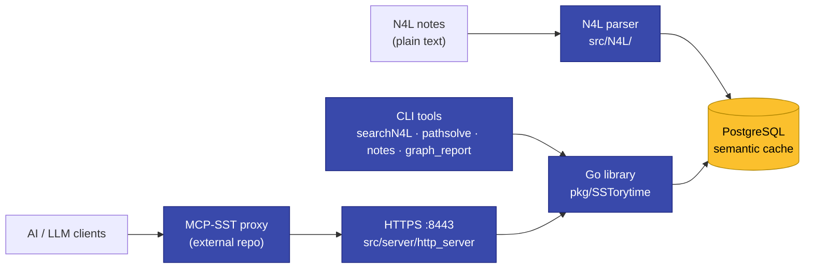
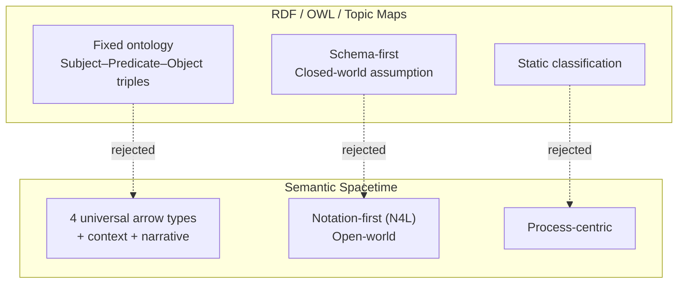

# SSTorytime

{ align=center }

> **A unified graph process for mapping knowledge.**
> Semantic Spacetime Story graph database over PostgreSQL — an
> [NLnet-sponsored](https://nlnet.nl/project/SmartSemanticDataLookup/) project by
> [Mark Burgess](https://markburgess.org) / ChiTek-i.

Imagine a tool that helps you *know your own thinking* — to capture it, visualize it,
and make it searchable for the days when your scatterbrain isn't working on all
cylinders. We might not call it Artificial Intelligence; we might call it a
**cyborg enhancement**. Still, the results are useful for training and teaching, for
human and machine intelligence alike.

**SSTorytime is an independent knowledge graph based on Semantic Spacetime.** It is
not a Topic Map or RDF-based project. It aims to be both easier to use and more
powerful than RDF.

---

## System at a glance

Notes travel from plain-text N4L source → parser → PostgreSQL (the semantic
cache). The Go library sits over the database; CLI tools, the HTTPS server,
and — via the external [MCP-SST proxy](https://github.com/markburgess/MCP-SST) —
LLM clients, all read and write through it.

---

## Start here

-   :material-download:{ .lg .middle } **Install**

    ---

    Spin up PostgreSQL, build the binaries, load your first `.n4l` file, then
    work through the [Tutorial](Tutorial.md).

    [:octicons-arrow-right-24: Getting Started](GettingStarted.md)

-   :material-lightbulb-on:{ .lg .middle } **Why Semantic Spacetime?**

    ---

    Four universal arrow types, open-world, context-first — and what that buys
    you over RDF / OWL / property graphs.

    [:octicons-arrow-right-24: Why Semantic Spacetime](concepts/why-semantic-spacetime.md)

-   :material-school:{ .lg .middle } **Learn the concepts**

    ---

    Knowledge, learning, context, and why Semantic Spacetime is different.

    [:octicons-arrow-right-24: Storytelling](Storytelling.md) ·
    [Knowledge & Learning](KnowledgeAndLearning.md)

-   :material-code-braces:{ .lg .middle } **Write N4L**

    ---

    The notation for capturing notes as a graph — chapters, contexts, arrows.

    [:octicons-arrow-right-24: N4L Reference](N4L.md) ·
    [Arrows](arrows.md)

-   :material-magnify:{ .lg .middle } **Search & path-solve**

    ---

    Query the graph from the CLI or the web API.

    [:octicons-arrow-right-24: searchN4L](searchN4L.md) ·
    [pathsolve](pathsolve.md) ·
    [Examples](search_examples.md)

-   :material-api:{ .lg .middle } **Program against it**

    ---

    Build directly with the Go library, call the HTTP/JSON API, drive it from
    Python, or expose the graph to LLMs through the MCP-SST proxy.

    [:octicons-arrow-right-24: Go API](API.md) ·
    [Web API](WebAPI.md) ·
    [Python](cookbooks/python-integration.md) ·
    [MCP-SST](http-api/mcp-sst.md)

-   :material-hand-heart:{ .lg .middle } **Contribute**

    ---

    Help shape the project — code, docs, examples, discussion.

    [:octicons-arrow-right-24: How to Contribute](howtocontribute.md) ·
    [To-Do](ToDo.md)

---

## Why Semantic Spacetime?

Graphs are the language of spacetime process. They let us model:

- Visualizations of processes.
- Maps of space and time (Gantt charts, itineraries, path integrals).
- Computational devices — a multi-matrix algebra.
- Social networks with centralities and flow patterns.
- Distributed indexes over semantic relationships.

SSTorytime pins relationships to **four universal arrow types** —
*near*, *leads-to*, *contains*, *expresses* — that align with how humans actually
search. No formal ontologies to design upfront. No closed-world schema. Context
and narrative are first-class citizens.

> **Looking for an AI/LLM interface?** See the
> [MCP-SST integration page](http-api/mcp-sst.md) for the hand-off between
> SSTorytime and the external [MCP-SST proxy](https://github.com/markburgess/MCP-SST).
> The server runs HTTPS on port 8443; start `http_server` from `src/bin/` so it
> picks up the default TLS certificates.

---

## Background reading

A book on the conceptual background ("Smart Spacetime", Mark Burgess) is available.
**It is conceptual background, not a tutorial or HOW-TO manual.**

Medium essays for deeper context:

- [Getting To Know Knowledge — How Can Semantic Graphs Actually Help Us?](https://medium.com/@mark-burgess-oslo-mb/getting-to-know-knowledge-how-can-semantic-graphs-actually-help-us-e3afb53fc6af)
- [What is semantic search?](https://medium.com/@mark-burgess-oslo-mb/what-is-semantic-search-4ed4d306ab07)
- [Why Semantic Spacetime (SST) is the answer to rescue property graphs](https://medium.com/@mark-burgess-oslo-mb/why-semantic-spacetime-sst-is-the-answer-to-rescue-property-graphs-2c004fe705b2)
- [From cognition to understanding](https://medium.com/@mark-burgess-oslo-mb/from-cognition-to-understanding-677e3b7485de)
- [Searching in Graphs, Artificial Reasoning, and Quantum Loop Corrections with Semantic Spacetime](https://medium.com/@mark-burgess-oslo-mb/searching-in-graphs-artificial-reasoning-and-quantum-loop-corrections-with-semantics-spacetime-ea8df54ba1c5)
- [The Shape of Knowledge — part 1](https://medium.com/@mark-burgess-oslo-mb/semantic-spacetime-1-the-shape-of-knowledge-86daced424a5) ·
  [part 2](https://medium.com/@mark-burgess-oslo-mb/semantic-spacetime-2-why-you-still-cant-find-what-you-re-looking-for-922d113177e7)
- [Why are we so bad at knowledge graphs?](https://medium.com/@mark-burgess-oslo-mb/why-are-we-so-bad-at-knowledge-graphs-55be5aba6df5)
- [Designing Nodes and Arrows in Knowledge Graphs with Semantic Spacetime](https://medium.com/@mark-burgess-oslo-mb/designing-nodes-and-arrows-in-knowledge-graphs-with-semantic-spacetime-0992b9cae595)
- [Avoiding the Ontology Trap](https://medium.com/@mark-burgess-oslo-mb/avoiding-the-ontology-trap-how-biotech-shows-us-how-to-link-knowledge-spaces-654bcbb9122a)
- [Using Knowledge Maps for Learning Comprehension](https://mark-burgess-oslo-mb.medium.com/using-knowledge-maps-for-learning-comprehension-15e162a251cd)
- [Unifying Data Structures and Knowledge Graphs](https://medium.com/@mark-burgess-oslo-mb/unifying-data-structures-and-knowledge-graphs-5c9fa32e74ea)
- [Using Knowledge Graphs For Inferential Reasoning](https://medium.com/@mark-burgess-oslo-mb/using-knowledge-graphs-for-inferential-reasoning-8a06e583b4d4)

Discussion: [SSTorytime LinkedIn Group](https://www.linkedin.com/groups/15875004/).
