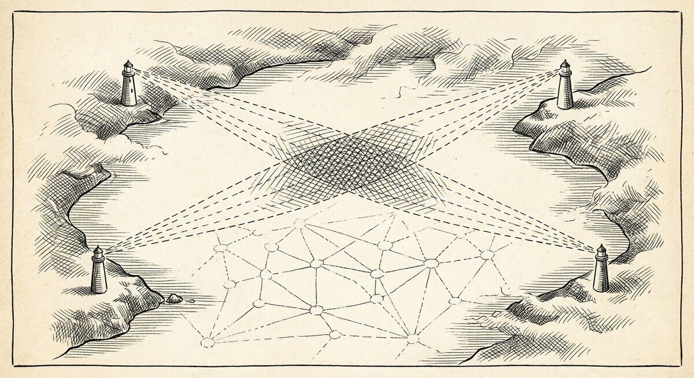

# pathsolve

{ align=center }

`pathsolve` is an experimental tool for finding contiguous paths between node sets.
It can also be accessed through the web browser.

<!-- TODO(visuals): Before/after diagram of path expansion — left side shows two boundary sets (begin / end) as dotted outlines; right side shows the converged wave-fronts meeting in the middle, with the winning path highlighted. Style A (pen-and-ink). Place after the intro, before the Flags section. -->


`pathsolve` also reports about two deeper analyses of the paths:

* *Betweenness centrality*:  a score for how many times each path passes through each node in the path sets.
The hiighest scoring nodes are 'most central' in the sense of flow throughput.

* *Supernodes*: these are nodes that form equivalence sets. The members of a supernode are interchangeable as far
as the path process is concerned. The map to and from the same locations, so they are symmetrical.

## Flags

```
pathsolve [-v] -begin <string> -end <string> [-chapter string] [-bwd] [subject] [context]
```

Flag declarations live at [`src/pathsolve/pathsolve.go:59-63`](https://github.com/markburgess/SSTorytime/blob/main/src/pathsolve/pathsolve.go#L59-L63).

- `-v` — verbose mode. Prints the boundary condition match sets and internal wave-front state.
- `-begin <string>` — text for the **start** set. Matches by substring via `GetDBNodePtrMatchingName`.
- `-end <string>` — text for the **end** set.
- `-chapter <string>` — **optional** substring filter. Restricts the start/end node lookups and the path search to nodes tagged with this chapter. Default: empty (search the whole graph).
- `-bwd` — **reverse** the search direction. Internally swaps the forward/backward wave-front labels (`FWD` and `BWD` in the source). Use this when you want paths from `end` to `begin` along reverse-arrow semantics.

The single positional argument, if present, is checked against `DiracNotation` (see below). If it is a Dirac-form string, the boundary conditions parsed from it override `-begin` / `-end`.

## Hardcoded search depth

`pathsolve` searches paths of length **2 to 20** hops. These are `const` values in the source:

```go
const mindepth = 2
const maxdepth = 20
```

See [`src/pathsolve/pathsolve.go:121-122`](https://github.com/markburgess/SSTorytime/blob/main/src/pathsolve/pathsolve.go#L121-L122).

- **`mindepth = 2`** — skips the trivial "start and end are the same node" result. If your search is entirely scoped to one node (common when the start/end strings overlap), you need at least 2 hops for the result to be a genuine path.
- **`maxdepth = 20`** — caps the wave-front expansion. Graphs with very long paths may exceed this; paths longer than 20 hops simply will not be found. Edit the source and rebuild if your use case needs a larger horizon.

## Dirac `<end|start>` notation

`pathsolve` accepts a single positional argument in Dirac bra-ket form:

```
pathsolve "<end|start>"
pathsolve "<B6|A1>"
pathsolve "<target|start>"
```

The **end set comes first** (the bra `<end|`) and the **start set comes second** (the ket `|start>`). This mirrors quantum-mechanical transition-matrix notation: you read `<end|start>` as "amplitude for the system to evolve into `end`, given it starts in `start`."

Parsing is done by `DiracNotation` (see [`pkg/SSTorytime/service_search_cmd.go`](https://github.com/markburgess/SSTorytime/blob/main/pkg/SSTorytime/service_search_cmd.go) and [`src/pathsolve/pathsolve.go:102-110`](https://github.com/markburgess/SSTorytime/blob/main/src/pathsolve/pathsolve.go#L102-L110)), which also extracts an optional trailing context string.

When Dirac notation is used, the `-begin`/`-end` flags are overridden.

## Command line

For now, you can get started by trying the examples, e.g.
<pre>
$ cd examples
$ make
$ ../src/pathsolve -begin A1 -end B6 

mark% go run pathsolve.go -begin a1 -end b6 

 Paths < end_set= {B6, b6, } | {A1, } = start set>

     - story path: 1 * A1  -(forwards)->  A3  -(forwards)->  A5  -(forwards)->  S1
      -(forwards)->  B1  -(forwards)->  B4  -(forwards)->  B6

    Linkage process: -(+leads to)->  -(+leads to)->  -(+leads to)->  -(+leads to)->  -(+leads to)->  -(+leads to)-> . 


     - story path: 2 * A1  -(forwards)->  A3  -(forwards)->  A5  -(forwards)->  S2
      -(forwards)->  B2  -(forwards)->  B4  -(forwards)->  B6

    Linkage process: -(+leads to)->  -(+leads to)->  -(+leads to)->  -(+leads to)->  -(+leads to)->  -(+leads to)-> . 


     - story path: 3 * A1  -(forwards)->  A3  -(forwards)->  A6  -(forwards)->  S2
      -(forwards)->  B2  -(forwards)->  B4  -(forwards)->  B6

    Linkage process: -(+leads to)->  -(+leads to)->  -(+leads to)->  -(+leads to)->  -(+leads to)->  -(+leads to)-> . 


     - story path: 4 * A1  -(forwards)->  A2  -(forwards)->  A5  -(forwards)->  S1
      -(forwards)->  B1  -(forwards)->  B4  -(forwards)->  B6

    Linkage process: -(+leads to)->  -(+leads to)->  -(+leads to)->  -(+leads to)->  -(+leads to)->  -(+leads to)-> . 


     - story path: 5 * A1  -(forwards)->  A2  -(forwards)->  A5  -(forwards)->  S2
      -(forwards)->  B2  -(forwards)->  B4  -(forwards)->  B6

    Linkage process: -(+leads to)->  -(+leads to)->  -(+leads to)->  -(+leads to)->  -(+leads to)->  -(+leads to)-> . 

 *
 *
 * PATH ANALYSIS: into node flow equivalence groups
 *
 *

    - Super node 0 = {A1,}

    - Super node 1 = {A3,A2,}

    - Super node 2 = {A5,A6,}

    - Super node 3 = {S1,}

    - Super node 4 = {S2,}

    - Super node 5 = {B1,}

    - Super node 6 = {B2,}

    - Super node 7 = {B4,}

    - Super node 8 = {B6,}
 *
 *
 * FLOW IMPORTANCE:
 *
 *

    -Rank (betweenness centrality): 1.00 - B4,A1,B6,

    -Rank (betweenness centrality): 0.80 - A5,

    -Rank (betweenness centrality): 0.60 - S2,B2,A3,

    -Rank (betweenness centrality): 0.40 - A2,B1,S1,

    -Rank (betweenness centrality): 0.20 - A6,

</pre>

Or the adjoint path search:

<pre>

$ go run pathsolve.go -begin B6 -end A1 -bwd

</pre>
You can also use Dirac transition matrix notation like this:
<pre>

$ go run pathsolve.go "<B6|A1>"
$ go run pathsolve.go "<end|start>"
$ go run pathsolve.go "<target|start>"

</pre>
Notice the order of the start and end sets.

## Using in the web browser

In the search field, enter the Dirac notation, e.g. `<target|start>` and relevant chapter `interference`, then click on `geometry`.


Notice the reporting about supernodes and betweenness centrality scores. 

## Notes about path searching

When we search for a path, we have to supply boundary conditions for the start and the end of a path.
Obviously if we reverse start and end (the adjoint path), the direction of arrows along the path will
also bve reverse, but we should be able to find a meaningful solution in both directions.

The way we select boundary conditions on semantic data may lead to side-effects that we don't expect.
From the history of computing, the "shortest path" problem has become the "go to" answer for many,
but we need to be careful. It assumes that the boundary conditions are already chosen to lead to meaningful
paths  of a certain length.

Paths need to be bounded by minimum and maximum lengths:
- Maximum because we don't know whether there is actually a meaningful solution linked start and end, so we have to give up searching at some point, assuming that the search doesn't end because we've already reached the end of the graph.
- Minimum because there might be cases in which our start and end criteria contain the same nodes (so a single node already satisfies the path criteria), e.g. in the default data there is a "door.n4l" example of paths from a node called "start" to nodes "target 1", "target 2", and "target 3", so we might search:
<pre>
\from start \to target
</pre>
However, in another chapter part of the graph, there are other nodes in which the strings "start" and "target" are partial matches, including the very example text of this search. Since the search itself is featured as a node, it represents a single node that matches the search criteria, so the shortest path is a single node. By  specifying a minimum length of 2, we skip that premature end condition.

In other cases, we might simply be interested in paths that are non-trivial. However, now we have a new issue. Longer (non-trivial) paths might also contain arrows of mixed causality (i.e. nodes that go forwards and backwards along arrows).
In a "quantum style mixed boundary condition" view of the graph, it's possible to find paths that actually embrace
steps backwards. These correspond to "higher perturbations" is the quantum loop expansion (see the article [Searching in Graphs, Artificial Reasoning, and Quantum Loop Corrections with Semantics Spacetime](https://medium.com/@mark-burgess-oslo-mb/searching-in-graphs-artificial-reasoning-and-quantum-loop-corrections-with-semantics-spacetime-ea8df54ba1c5)).


## Speeding up path searches with restricted arrows

When searching for paths, the most powerful searches involve free association. However, searching with few constraints
is expensive, because the graph branches at every step, and therefore the number of possible paths grows exponentially.
One way to reduce this complexity is to specify the kinds of arrrows that are allowed. 
Arrows complicate searches, without necessarily offering much value, but--if your graph has consistent and simple link
types--this can greatly reduce the complexity of searches.

The directed nature of arrows makes this complicated too. When specifying arrows, you need to give both the forward and backwards arrows, because the search is made from start and end. The start sees outgoing forward links and the end sees outgoing backwards links. The general tool for path searching is the `GetConstraintConePathsAsLinks()` function, with or without arrows. This will, no doubt. improve with future versions, as there is still a lot to do to make graph searches smarter, but for now this is the most powerful approach.

Remember: the power of SST becomes more apparent when using the STTypes 0,1,2,3 for matching arrows by general type rather than by specific name.

### How?

Path searches grow exponentially with the length of the path, so they get slower and slower as the distance between nodes
increases. If you know the type of arrow along the whole path, you can speed up the search by specifying the arrow types, or the sttypes, e.g. using the STtypes:
<pre>
./searchN4L -v \\from \!gun\! \\to scarlet \\arrow +3,-3,0
</pre>
And using the arrows:
<pre>
./searchN4L -v \\from \!a1\! \\to b6 \\arrow 20,21
</pre>
Remember to always give pairs of arrow,inverse since the FROM and the TO match opposite arrow directions.

## Exit codes & environment

- **Exit `0`** — at least one path found and printed.
- **Exit `-1`** — no paths satisfy the constraints, or any library/DB error (see [`src/pathsolve/pathsolve.go:164-167`](https://github.com/markburgess/SSTorytime/blob/main/src/pathsolve/pathsolve.go#L164-L167)).
- **Exit `2`** — invalid flag.

Environment variables:

- `POSTGRESQL_URI` — overrides the hardcoded DSN in [`pkg/SSTorytime/session.go:41`](https://github.com/markburgess/SSTorytime/blob/main/pkg/SSTorytime/session.go#L41).
- `SST_CONFIG_PATH` — location of `SSTconfig/`. Arrows are actually loaded from the DB via `Open(true)`, so this is usually not needed.

If the database is unreachable, `pathsolve` prints a connection error and exits `-1` before any wave-front work runs.