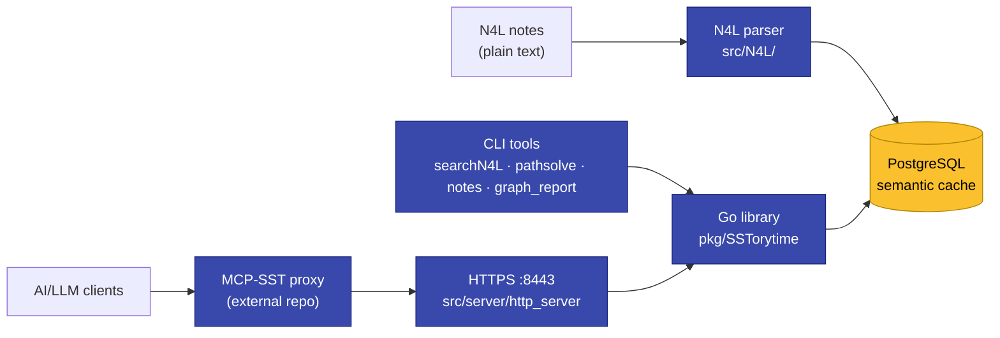
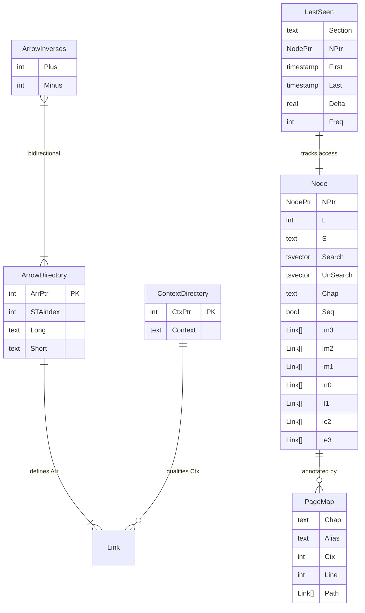
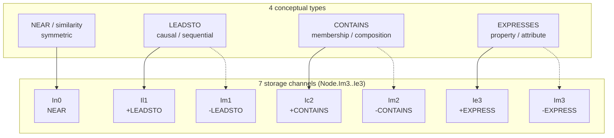
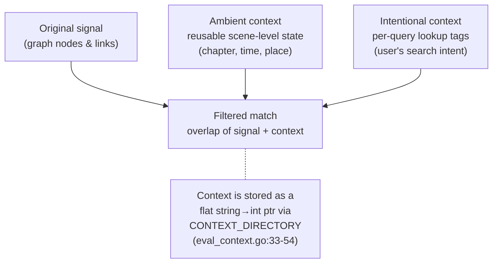
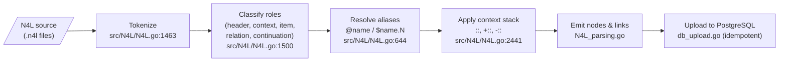
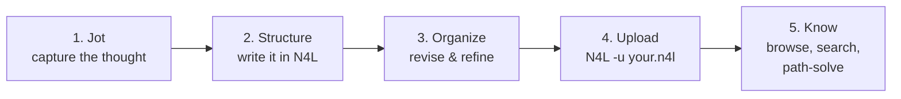
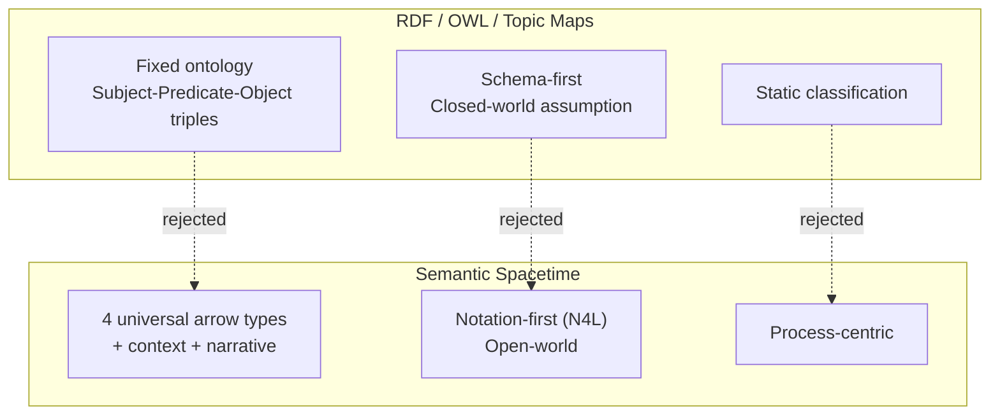
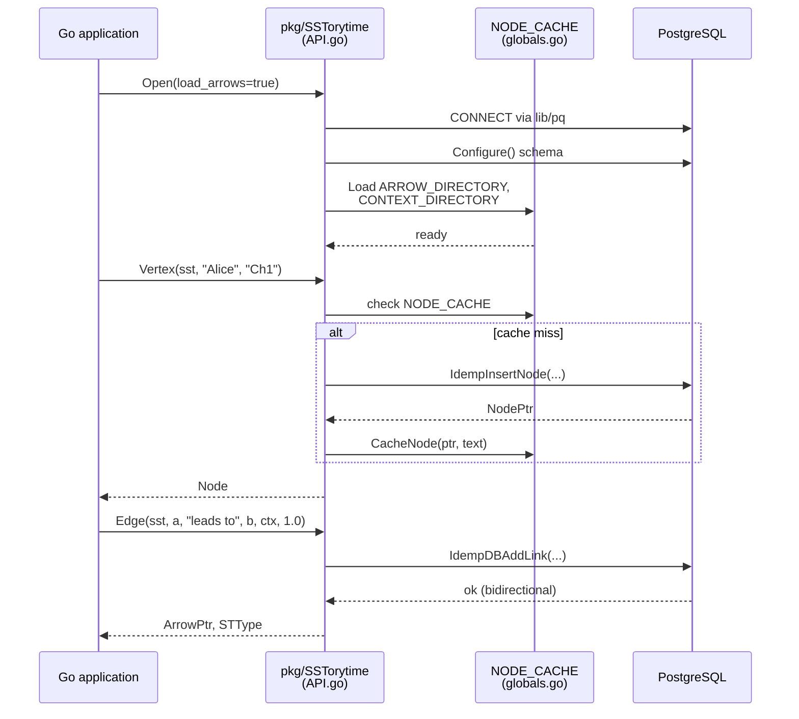

# SSTorytime Documentation Upleveling Plan

> **For Claude:** REQUIRED SUB-SKILL: Use `superpowers:executing-plans` to implement this plan task-by-task.

**Goal:** Transform SSTorytime's existing flat `docs/` tree into a published, navigable, code-grounded MkDocs Material site on GitHub Pages — fixing active doc-vs-code drift, filling coverage gaps (35 undocumented PL/pgSQL functions, 230+ undocumented Go exports, missing concept glossary), adding a unified visual layer (mermaid + AI imagery), and bringing the whole site up to a "remarkable" standard worth pointing newcomers and AI tooling at.

**Architecture:** Eight sequential phases, each shipping as its own PR to upstream `markburgess/SSTorytime` (PRs filed from fork `mikesvoboda/SSTorytime`). Phase 0 is the already-scaffolded MkDocs site plus critical drift fixes. Subsequent phases add diagrams, AI imagery, new reference pages, cookbooks, contributing rewrite, and codebase hygiene. Every new doc page cites code via `[file:line](GitHub-deep-link)` and is renderable locally via `mkdocs serve`. Every phase ends with `mkdocs build --strict` passing clean.

**Tech Stack:**
- MkDocs 1.6.1 + `mkdocs-material` 9.5.44 + `pymdown-extensions` 10.12 + `Pygments<2.20` (see `docs/requirements.txt`)
- Mermaid 10 (via `pymdownx.superfences`)
- Image generation via `nvidia-image-gen` skill (Gemini image models on NVIDIA LLM Gateway) — `NVIDIA_API_KEY` must be in env
- GitHub Actions: `.github/workflows/docs.yml` (build on PR, deploy to GH Pages on push to `main`)
- Commit identity: `Mike Svoboda <michael.s.svoboda@gmail.com>` (one-shot `-c user.name=... -c user.email=...`; never modify global git config)

**Source-of-truth audit** that produced this plan lives in conversation context (8-agent parallel audit, 2026-04-20). Key inputs:
- Library: `pkg/SSTorytime/` (26 `.go` files, 251 exported symbols, ~8% documented)
- CLIs: `src/N4L`, `src/searchN4L`, `src/text2N4L`, `src/notes`, `src/pathsolve`, `src/removeN4L`, `src/graph_report`
- Server: `src/server/http_server.go` (HTTPS :8443, 3 endpoints + static)
- DB: `pkg/SSTorytime/postgres_types_functions.go` (6 tables, 3 custom types, 35 PL/pgSQL functions, 5 GIN indexes)

---

## Design decisions locked by Mike (2026-04-20)

1. **Critical doc-drift fixes land in Phase 0** (same PR as MkDocs scaffold).
2. **Arrow types**: preserve "4 types" pedagogy, add callout explaining the 7-channel ±3 signed encoding in code.
3. **`namespaces.md`**: label as "Planned" (not yet implemented in code).
4. **Visual style**: Style A (hand-drawn pen-and-ink, 1970s academic journal) as primary; Style B (warm retro editorial, ochre/rust/cream) for tool section heroes only.
5. **AI images**: generate all 18 up front.
6. **Scope includes non-doc findings** from the audits (broken `Makefile` target, TLS cert lifecycle, testing harness, versioning hygiene).
7. **Plan location**: `docs/plans/2026-04-20-documentation-upleveling.md` (this file).

---

## Phase structure overview

| Phase | PR | Scope | Est. effort |
|---|---|---|---|
| **Phase 0** | PR #1 | MkDocs scaffold (already built) + 7 critical drift fixes + namespaces "Planned" banner + arrow types callout | 1–2 hrs |
| **Phase 1** | PR #2 | 8 P0 mermaid diagrams | 2–3 days |
| **Phase 2** | PR #3 | 18 AI images generated via `nvidia-image-gen` | 1–2 days |
| **Phase 3** | PR #4 | New concept pages: Glossary, Why SST, Architecture, Concept→Code index | 2 days |
| **Phase 4** | PR #5 | Database reference pages (Schema, Functions, Indexes, Performance) | 3 days |
| **Phase 5** | PR #6 | HTTP API + MCP-SST integration pages, API walkthroughs, code-ref convention | 2 days |
| **Phase 6** | PR #7 | 6 cookbook pages + CLI tool doc fixes | 3 days |
| **Phase 7** | PR #8 | Contributing rewrite + Testing + Build System + TLS + Versioning pages | 2 days |
| **Phase 8** | PR #9 | Code hygiene: fix `Makefile` `make db` bug, add `.github/workflows/build.yml` for Go build validation | 1 day |

**Total:** ~2–3 weeks of focused work, shippable in bite-sized PRs.

Each phase ends with:
- `mkdocs build --strict` passes with zero warnings
- `mkdocs serve` shows the expected new/changed pages rendering correctly
- Local preview verified at http://localhost:8000/SSTorytime/
- Commit with descriptive message ending in `Co-Authored-By:` line
- Push to `mikesvoboda/SSTorytime`, open PR upstream

---

# Phase 0 — Scaffold + critical drift fixes

**Goal:** Ship a working MkDocs site that does not actively mislead users on install, paths, or port numbers.

**Already on branch `docs/mkdocs-site` (uncommitted):**
- `mkdocs.yml`, `docs/requirements.txt`, `docs/index.md`
- `.github/workflows/docs.yml` (PR validation + main deploy)
- `.gitignore` entry for `/site/`
- 19 image URLs rewritten in 6 doc files (GitHub blob → relative)
- 4 broken cross-repo links fixed in 4 doc files

### Task 0.1: Fix Tutorial.md binary paths

**Files:**
- Modify: `docs/Tutorial.md` — 4 occurrences of `../src/N4L` at lines 185, 214, 221, 227

**Why:** After `make`, binaries live at `src/bin/N4L`, not `src/N4L`. Tutorial as-written does not run.

**Step 1:** Read `docs/Tutorial.md` at lines 180–230 to confirm occurrences.

**Step 2:** Replace all 4 occurrences with `../src/bin/N4L`. Use `Edit` with `replace_all=true` on the exact string `../src/N4L `.

**Step 3:** Verify no other `../src/N4L` references remain: `grep -n '../src/N4L ' docs/Tutorial.md` should return nothing.

**Step 4:** Commit with message `docs(tutorial): fix binary path after make reorganized src/bin output`.

### Task 0.2: Fix GettingStarted.md http_server path

**Files:**
- Modify: `docs/GettingStarted.md` line 31–32 (or wherever `./http_server` appears)

**Step 1:** `grep -n './http_server' docs/GettingStarted.md` to find lines.

**Step 2:** Change `./http_server` → `./bin/http_server` (binary lives at `src/bin/http_server` after build; from `src/` the path is `./bin/http_server`).

**Step 3:** Commit `docs(install): correct http_server path to src/bin/http_server`.

### Task 0.3: Fix http_server.md port documentation

**Files:**
- Modify: `docs/http_server.md` line 34 (says "port 8080")

**Reality** (`src/server/http_server.go:132,166`): HTTPS on :8443; :8080 only redirects (301) to HTTPS.

**Step 1:** Read current `docs/http_server.md`.

**Step 2:** Rewrite the ports section to explain:
- Primary: HTTPS on :8443, TLS-required
- :8080 only issues HTTP 301 redirect to `https://localhost:8443`
- TLS certs auto-generated by `src/server/make_certificate` on first build (365-day validity, self-signed RSA-4096)
- Certs read from `../server/cert.pem`, `../server/key.pem` (relative to `src/bin/`)

**Step 3:** Commit `docs(http_server): correct port documentation (HTTPS :8443 primary, :8080 redirects)`.

### Task 0.4: Add -force flag documentation to removeN4L.md

**Files:**
- Modify: `docs/removeN4L.md`

**Reality** (`src/removeN4L/removeN4L.go:48–71`): tool **exits silently** if invoked without `-force`.

**Step 1:** Read current `docs/removeN4L.md`.

**Step 2:** Add a "Usage" section near the top showing:
```
removeN4L -force "chapter name"
```
and a callout admonition: `!!! warning "-force is required"` explaining that without `-force` the tool exits without action, to prevent accidental deletion.

**Step 3:** Commit `docs(removeN4L): document required -force flag`.

### Task 0.5: Add -force and -wipe flags to N4L.md

**Files:**
- Modify: `docs/N4L.md` (the usage/flags section — likely near line 50)

**Reality** (`src/N4L/N4L.go:228–240`): supports `-v`, `-d`, `-u`, `-s`, `-adj`, `-force`, `-wipe`. Docs omit `-force` and `-wipe`.

**Step 1:** Read current flags section.

**Step 2:** Add:
- `-force` — skip confirmation prompts on conflicts during upload
- `-wipe` — drop and recreate all database state before loading (use with `-u` for atomic re-upload: `N4L -wipe -u *.n4l`)

**Step 3:** Commit `docs(N4L): document -force and -wipe flags, show atomic re-upload pattern`.

### Task 0.6: Fix API.md table list

**Files:**
- Modify: `docs/API.md` around line 24–35

**Reality** (`pkg/SSTorytime/postgres_types_functions.go`): 6 tables exist — `Node`, `PageMap`, `ArrowDirectory`, `ArrowInverses`, `ContextDirectory`, `LastSeen`. Docs list 5 tables including phantom `NodeArrowNode` (never created in DDL; links are embedded in `Node.Im3...Ie3` array columns).

**Step 1:** Read `docs/API.md:20–40`.

**Step 2:** Replace the table list with the correct 6 tables + a plain-text forward reference: `"A dedicated Database/Schema reference page is planned as part of the ongoing documentation upleveling."` (No Markdown link — Phase 4 will create that page; linking now would break strict builds.)

**Step 3:** Commit `docs(api): correct table inventory (6 tables; remove phantom NodeArrowNode)`.

### Task 0.7: Fix Makefile `make db` target

**Files:**
- Modify: root `Makefile` line 23–24

**Reality:** `(cd contrib/makedb.sh)` is malformed — `cd` into a file fails. Should be `sh contrib/makedb.sh`.

**Step 1:** Read root `Makefile`.

**Step 2:** Change `(cd contrib/makedb.sh)` to `sh contrib/makedb.sh`.

**Step 3:** Test: `make -n db` should print the corrected command without error.

**Step 4:** Commit `fix(Makefile): repair make db target (cd into file → sh invocation)`.

### Task 0.8: Mark namespaces.md as Planned

**Files:**
- Modify: `docs/namespaces.md` (add banner at top)

**Reality:** `docs/namespaces.md` describes multi-user feature. No namespace types in `pkg/SSTorytime/types_structures.go`. Doc itself admits (line 27): "not considered in the first iteration."

**Step 1:** Read `docs/namespaces.md`.

**Step 2:** Add at the top, immediately after the H1:

```markdown
!!! info "Planned feature"
    Namespaces are a design vision, not a currently-implemented feature. The graph
    library does not yet scope data by user or world. This page documents the
    intended model so contributors can discuss the approach. See the
    [To-Do list](ToDo.md) for current status.
```

**Step 3:** Commit `docs(namespaces): label as planned (not yet implemented in code)`.

### Task 0.9: Add 7-channel encoding callout

**Files:**
- Modify: `docs/arrows.md` (primary location, since arrows.md introduces the 4 types)

**Goal:** Keep the 4-type pedagogy intact. Add a collapsible "In code" callout explaining how 4 conceptual types become 7 storage channels.

**Step 1:** Read `docs/arrows.md` (find where the 4 types are first enumerated).

**Step 2:** After the 4-type list, add:

```markdown
??? example "In code: 4 types, 7 channels"
    In the database (`pkg/SSTorytime/postgres_types_functions.go:32–48`), every node
    has **7 link-array columns** — `Im3`, `Im2`, `Im1`, `In0`, `Il1`, `Ic2`, `Ie3` —
    one per signed arrow type. `NEAR` is symmetric (1 channel); the three directional
    types (`LEADSTO`, `CONTAINS`, `EXPRESSES`) each exist in both forward (`+`) and
    backward (`-`) form, giving 3 × 2 + 1 = **7 channels**.

    | Channel | Constant (`globals.go:23-34`) | Meaning |
    |---|---|---|
    | `Im3` | `-EXPRESS` | expressed-by (inverse of EXPRESS) |
    | `Im2` | `-CONTAINS` | part-of (inverse of CONTAINS) |
    | `Im1` | `-LEADSTO` | arriving-from (inverse of LEADSTO) |
    | `In0` | `NEAR` | symmetric similarity |
    | `Il1` | `+LEADSTO` | leads-to |
    | `Ic2` | `+CONTAINS` | contains |
    | `Ie3` | `+EXPRESS` | expresses |

    The array offset `ST_ZERO = 3` (`globals.go:33`) lets code index into `Node.I[]`
    via `I[ST_ZERO + STtype]` regardless of sign. See also [`STtype.go:56-109`](https://github.com/markburgess/SSTorytime/blob/main/pkg/SSTorytime/STtype.go#L56-L109)
    for `STTypeDBChannel`, which maps between STtype values and column names.
```

**Step 3:** Commit `docs(arrows): add in-code callout for the 7-channel storage encoding`.

### Task 0.10: Phase 0 integration — commit, fork, push, PR

**Step 1:** Verify clean strict build:
```
/tmp/claude-1000/mk13/bin/mkdocs build --strict
```
Expect zero warnings.

**Step 2:** Verify local preview works:
```
nohup /tmp/claude-1000/mk13/bin/mkdocs serve -a 0.0.0.0:8000 > $TMPDIR/mkdocs.log 2>&1 &
```
Check http://localhost:8000/SSTorytime/ loads.

**Step 3:** Stage specific files (never `git add -A`):
```
git add mkdocs.yml docs/requirements.txt docs/index.md docs/plans/2026-04-20-documentation-upleveling.md .github/workflows/docs.yml .gitignore Makefile docs/API.md docs/GettingStarted.md docs/Storytelling.md docs/Tutorial.md docs/WebAPI.md docs/arrows.md docs/dynamic_functions.md docs/howtocontribute.md docs/http_server.md docs/N4L.md docs/namespaces.md docs/notes.md docs/pathsolve.md docs/removeN4L.md
```

**Step 4:** Commit with Mike's identity (one-shot, do NOT modify global git config):
```
git -c user.name="Mike Svoboda" -c user.email=michael.s.svoboda@gmail.com \
  commit -m "$(cat <<'EOF'
docs: scaffold MkDocs Material site, fix critical drift, add upleveling plan

Scaffold a published GitHub Pages site using MkDocs Material, wire up a
CI workflow that builds on PR and deploys on push to main, and fix the
seven highest-severity doc-vs-code drift items surfaced by an 8-agent
audit of the repository.

Scaffold:
- mkdocs.yml with Material theme and a navigation tree organized by user
  role (Getting Started, Concepts, N4L, Searching, Tools, APIs, Reference,
  Contributing) plus pymdownx extensions (admonitions, tabs, mermaid,
  tasklists).
- docs/index.md: grid-card landing page replacing a flat link list.
- docs/requirements.txt: pinned mkdocs/material/pymdownx; Pygments<2.20
  pinned to work around a pymdownx 10.12 None-filename incompatibility.
- .github/workflows/docs.yml: build on push/PR, deploy to github-pages
  environment only on push to main.
- .gitignore: exclude /site/ build output.

Existing docs migration:
- 19 image URLs in 6 files rewritten from absolute github.com/blob/main/
  paths to relative figs/... so images render on Pages.
- 4 cross-repo links fixed to absolute GitHub URLs (API_EXAMPLE_1,
  postgres-docker README, reminders.n4l, GettingStarted).

Critical drift fixes (broken as-of today):
- Tutorial.md: 4 binary paths from ../src/N4L to ../src/bin/N4L.
- GettingStarted.md: http_server path to ./bin/http_server.
- http_server.md: port 8080 rewritten as HTTPS :8443 (primary) with
  :8080 HTTP-to-HTTPS redirect behavior explained.
- removeN4L.md: document required -force flag; add warning admonition.
- N4L.md: document -force and -wipe flags plus the -wipe -u atomic
  re-upload pattern.
- API.md: correct table inventory (6 tables; remove phantom
  NodeArrowNode).
- Makefile: fix make db target (cd into file to sh invocation).

Honesty:
- namespaces.md: banner labeling the feature as planned, not implemented.
- arrows.md: collapsible in-code callout explaining the 7-channel signed
  encoding behind the 4 conceptual arrow types.

Plan:
- docs/plans/2026-04-20-documentation-upleveling.md: the full multi-phase
  plan this change opens, so reviewers and future contributors can see
  the trajectory.

Verified locally with mkdocs build --strict (zero warnings).

Co-Authored-By: Claude Opus 4.7 (1M context) <noreply@anthropic.com>
EOF
)"
```

**Step 5:** Fork upstream (first-time setup):
```
gh repo fork markburgess/SSTorytime --remote=false --clone=false
```
Then add the fork as a remote:
```
git remote add fork https://github.com/mikesvoboda/SSTorytime.git
```

**Step 6:** Push branch to fork:
```
git push -u fork docs/mkdocs-site
```

**Step 7:** Open PR upstream:
```
gh pr create \
  --repo markburgess/SSTorytime \
  --base main \
  --head mikesvoboda:docs/mkdocs-site \
  --title "docs: MkDocs Material site + critical drift fixes (Phase 0 of upleveling plan)" \
  --body "$(cat docs/plans/2026-04-20-documentation-upleveling.md | head -80)

See docs/plans/2026-04-20-documentation-upleveling.md in this PR for the full multi-phase plan. This is Phase 0."
```

**Step 8:** Enable GitHub Pages on the fork via API (requires admin on `mikesvoboda/SSTorytime`):
```
gh api -X POST /repos/mikesvoboda/SSTorytime/pages -f build_type=workflow
```
Preview site will deploy to `https://mikesvoboda.github.io/SSTorytime/` for self-testing while upstream reviews.

**Acceptance criteria for Phase 0:**
- [ ] `mkdocs build --strict` → 0 warnings
- [ ] `mkdocs serve` → all nav entries render without 404s
- [ ] All 7 critical drift fixes verified against code (re-grep for old patterns)
- [ ] PR filed upstream
- [ ] GH Pages deployed on fork for preview

---

# Phase 1 — P0 mermaid diagrams (8 total)

**Goal:** Add the 8 highest-value mermaid diagrams, grounded in code via file:line citations.

**Branch:** `docs/phase1-mermaid` (cut from `main` after Phase 0 merges, or from `docs/mkdocs-site` if Phase 0 is still pending review).

**Mermaid theme:** add `extra_css` to `mkdocs.yml` referencing `docs/css/extra.css` (create new), using the palette: Graphite `#4A4A4A`, Indigo `#3949AB`, Amber `#FBC02D`, Steel `#78909C`.

### Task 1.1: Add mermaid theme CSS

**Files:**
- Create: `docs/css/extra.css`
- Modify: `mkdocs.yml` (add `extra_css:` block)

**`docs/css/extra.css` content** (full):
```css
/* SSTorytime mkdocs overrides */

.mermaid {
  --primary-color: #3949AB;
  --primary-text-color: #ffffff;
  --primary-border-color: #1a237e;
  --secondary-color: #FBC02D;
  --secondary-text-color: #000000;
  --tertiary-color: #78909C;
  --background-color: #ffffff;
  --lineColor: #4A4A4A;
}

/* Custom admonition for code-reference callouts */
.md-typeset .admonition.code-ref,
.md-typeset details.code-ref {
  border-left-color: #3949AB;
}
.md-typeset .code-ref > .admonition-title::before,
.md-typeset .code-ref > summary::before {
  background-color: #3949AB;
  -webkit-mask-image: var(--md-admonition-icon--example);
          mask-image: var(--md-admonition-icon--example);
}
```

Register the `code-ref` admonition class in `mkdocs.yml`:
```yaml
markdown_extensions:
  - pymdownx.superfences
  - admonition
  - pymdownx.details
```
(already present; add if not)

And add to `mkdocs.yml`:
```yaml
extra_css:
  - css/extra.css
```

### Task 1.2: Diagram A1 — System architecture (index.md)

**Placement:** near top of `docs/index.md`, before the "Start here" grid.

**Content:**
~~~markdown

~~~

### Task 1.3: Diagram B1 — Database ER diagram

**Placement:** new page `docs/Database/Schema.md` (Phase 4 will flesh this out; Phase 1 creates a stub containing just the ER diagram + a one-line description).

**Content:**
~~~markdown
# Database Schema

The physical schema has **6 tables** and **3 custom PostgreSQL types** defined in
[`pkg/SSTorytime/postgres_types_functions.go`](https://github.com/markburgess/SSTorytime/blob/main/pkg/SSTorytime/postgres_types_functions.go).



Phase 4 will expand `Database/Schema.md` with column-level detail, custom-type definitions
(`NodePtr`, `Link`, `Appointment`), GIN index strategy, and the UNLOGGED→LOGGED
bulk-load lifecycle.
~~~

Register in `mkdocs.yml` nav:
```yaml
  - Reference:
      - Database:
          - Schema: Database/Schema.md
```

### Task 1.4: Diagram B3 — Arrow taxonomy (N4L.md)

**Placement:** `docs/N4L.md`, in the arrows section.

**Content:**
~~~markdown

~~~

### Task 1.5: Diagram B2 — Context architecture (howdoescontextwork.md)

**Placement:** `docs/howdoescontextwork.md`, early in the page.

**Content:**
~~~markdown

~~~

### Task 1.6: Diagram C1 — N4L compilation pipeline (N4L.md)

**Placement:** `docs/N4L.md`, after introducing the N4L file format.

**Content:**
~~~markdown

~~~

### Task 1.7: Diagram D1 — Five-step knowledge workflow (Tutorial.md)

**Placement:** `docs/Tutorial.md`, near the "Five steps to heaven" section.

**Content:**
~~~markdown

~~~

### Task 1.8: Diagram E1 — RDF vs SST (index.md)

**Placement:** `docs/index.md`, in a "Why Semantic Spacetime" collapsible section.

**Content:**
~~~markdown

~~~

### Task 1.9: Diagram A3 — API call lifecycle (API.md)

**Placement:** `docs/API.md`, in the "Creating an SST graph from data" section.

**Content:**
~~~markdown

~~~

### Task 1.10: Phase 1 integration

**Step 1:** Verify each diagram renders in `mkdocs serve`.

**Step 2:** `mkdocs build --strict` → 0 warnings.

**Step 3:** Commit `docs(phase1): add 8 P0 mermaid diagrams (system, DB ER, arrows, context, compilation, workflow, RDF contrast, API lifecycle)`.

**Step 4:** Push to fork, open PR.

**Acceptance criteria:**
- [ ] 8 mermaid diagrams visible in light & dark mode
- [ ] Each cites relevant code via `file:line` references
- [ ] `Database/Schema.md` stub exists (Phase 4 will expand)
- [ ] CSS theme applied consistently

---

# Phase 2 — 18 AI images via nvidia-image-gen

**Goal:** Generate all 18 AI images up front, commit to `docs/figs/`, and embed in target pages.

**Branch:** `docs/phase2-ai-images`.

**Tool:** `nvidia-image-gen` Skill. Requires `NVIDIA_API_KEY` in env (verified present, length 25).

**Style templates:**

**Style A — "Hand-drawn academic journal" (primary)**
```
Pen-and-ink technical diagram, white background, thin black lines,
hand-drawn shading with cross-hatching. Academic journal style, 1970s-1980s
scientific illustration. Slight paper texture, no color except black and
white. High detail, measured composition, evocative without being precious.
```

**Style B — "Warm retro editorial" (tool heroes only)**
```
Editorial illustration in warm earth tones (ochre, rust, cream, warm grey).
Slightly retro 1970s-80s science textbook. Hand-stippling shading. Geometric
but approachable. Focus on process and flow. No text overlay.
```

### Task 2.0: Create prompt manifest

**Files:**
- Create: `docs/figs/ai-prompts.yaml`

Content: a YAML file with one entry per image, recording:
- `id` (I1..I18)
- `image_file` (relative to `docs/`)
- `style` (A or B)
- `prompt` (full prompt string, including the style prefix)
- `dimensions`
- `placement` (target page)
- `generation_date`
- `approver`

This lets us regenerate any image later consistently.

### Task 2.1–2.18: Generate each image

For each image below, execute:
1. Invoke `nvidia-image-gen` Skill with the full prompt (style prefix + specific prompt below)
2. Review the output; if off-style, regenerate (max 3 attempts)
3. Save approved image as `docs/figs/<filename>`
4. Optimize: `cwebp -q 80 input.png -o output.webp` if large, OR ensure JPEG at 85% quality and < 200KB
5. Embed in target page with alt text
6. Append entry to `docs/figs/ai-prompts.yaml`

**Full image list:**

| # | File | Style | Target page | Dimensions | Prompt (after style prefix) |
|---|---|---|---|---|---|
| I1 | `index_hero.jpg` | A | `index.md` (hero) | 1600×900 | Profile silhouette of a person on the left; from their head a luminous network of nodes and labelled arrows expands outward to the right, filling the frame. The network is soft, organic, suggestive of living thought. Subtle caption mood: "know your own thinking." |
| I2 | `getting_started_hero.jpg` | B | `GettingStarted.md` (hero) | 1200×600 | A command-line terminal in the foreground rendered as a retro object on a wooden desk, with a stylized PostgreSQL elephant icon and Go gopher silhouette arranged on either side like companions. Process-flow arrows connect them. Warm ochre/rust palette. |
| I3 | `concepts_hero.jpg` | A | `KnowledgeAndLearning.md` (hero) | 1200×600 | Multiple hand-drawn threads converging at intersection points. Threads are labelled with words: context, chapter, arrow, story, node. Cross-hatching shading. Suggests a weaving of meaning. |
| I4 | `n4l_hero.jpg` | B | `N4L.md` (hero) | 1200×600 | Four distinct arrow forms (curved, straight, dashed, dotted) in warm earth tones, each subtly suggesting its type: embrace (CONTAINS), run (LEADSTO), equals sign (NEAR), voice (EXPRESSES). Balanced composition, retro textbook style. |
| I5 | `searching_hero.jpg` | A | `searchN4L.md` (hero) | 1200×600 | Hand-drawn graph network of nodes and links. A cone of light (flashlight beam) illuminates a path through the network from one node to another. Ink cross-hatching. White background. |
| I6 | `tools_hero.jpg` | B | `text2N4L.md` or new tool index | 1200×600 | Six small tool objects arranged on a worktable: a sieve (text2N4L), a builder's set square (N4L), a magnifying glass (searchN4L), an open book (notes), twin flashlights (pathsolve), a microscope (graph_report). Warm palette, hand-stippled. |
| I7 | `api_hero.jpg` | A | `API.md` (hero) | 1200×600 | Two silhouettes — a human on the left, a geometric crystalline shape on the right (the library) — connected by a bridge constructed from arrows and nodes. Ink drawing, cross-hatched shading. |
| I8 | `knowledge_tasted.jpg` | A | `KnowledgeAndLearning.md` | 1000×600 | Hand-drawn still life: an open notebook, a slice of fruit, a shaft of light across the page. Cross-hatching throughout. Feels intimate, as if knowledge has a flavor. |
| I9 | `knowledge_garden.jpg` | B | `Storytelling.md` | 1000×600 | A garden seen from slightly above: paths, plants, a figure tending. Warm ochre, rust, cream. Hand-stippled shading. Suggests slow cultivation. |
| I10 | `four_arrows.jpg` | A | `arrows.md` | 1200×700 | Four quadrants, each showing one arrow personality: NEAR as mirror-twins facing each other; LEADSTO as a runner mid-stride; CONTAINS as a parent's arms embracing a child; EXPRESSES as an open mouth mid-word. Ink cross-hatching. |
| I11 | `context_cloud.jpg` | B | `howdoescontextwork.md` | 1000×600 | A cluttered desk photographed from above, then a ghostly translucent overlay of the "context" around it: the smell of coffee, sound waves, light direction, time-of-day shadows. Warm editorial tones. |
| I12 | `pathsolve_beams.jpg` | A | `pathsolve.md` | 1000×600 | Aerial view of a foggy bay at dusk. Two lighthouse beams sweep toward each other through mist — one warm (amber), one cool (blue) even within the hand-drawn ink discipline — creating interference where they overlap. Beneath the fog, the graph is faintly visible. |
| I13 | `api_lifecycle.jpg` | B | `API.md` | 1200×700 | Rectangular blocks labelled Vertex, Edge, HubJoin connecting to a database cylinder. NodePtr coordinates float in the margins. Earth-tone editorial style, stippled. |
| I14 | `web_lifecycle.jpg` | B | `WebAPI.md` | 1000×600 | A browser window on the left, a server tower in the center guarded by a small padlock (TLS), a JSON object glowing on the right. Request and response arrows flow between them. Warm palette, hand-drawn. |
| I15 | `alice_graph.jpg` | A | `example.md` | 1200×800 | A network of interconnected nodes labelled with names from the Alice-in-Wonderland case study (Alice, White Rabbit, pocket-watch, garden, Queen). Ink cross-hatching, story-book feel. |
| I16 | `namespaces_worlds.jpg` | B | `namespaces.md` | 1200×700 | Four or five translucent soap bubbles floating in shared space, each containing a small personal constellation of nodes. Thin glowing bridges labelled "access control" connect nearby bubbles. Iridescent warm light. |
| I17 | `dynamic_fn_flow.jpg` | B | `dynamic_functions.md` | 1000×600 | A timeline showing an event trigger (a lightning bolt), a function box that consumes it, and a downstream graph node lighting up in response. Earth tones. Process-oriented. |
| I18 | `faq_landscape.jpg` | A | `FAQ.md` (banner) | 1600×400 | A landscape with mountains (big ideas), forking paths (tools), and a small figure climbing. Ink drawing, academic style. Wide banner format. |

### Task 2.19: Phase 2 integration

**Step 1:** Ensure all 18 images saved under `docs/figs/` with consistent naming.

**Step 2:** `docs/figs/ai-prompts.yaml` fully populated.

**Step 3:** Each image embedded in its target page with descriptive alt text (not describing the style, describing the content — accessibility).

**Step 4:** `mkdocs build --strict` → 0 warnings.

**Step 5:** Inspect all images in `mkdocs serve` on mobile viewport (iPhone 12 sim in dev tools) — they should scale gracefully.

**Step 6:** Commit `docs(phase2): generate 18 AI images via nvidia-image-gen; embed in target pages`.

**Step 7:** Open PR.

**Acceptance criteria:**
- [ ] 18 files in `docs/figs/` (≤ 200KB each)
- [ ] `ai-prompts.yaml` complete and committed
- [ ] Every image has meaningful alt text
- [ ] All visible in light and dark mode on mobile + desktop

---

# Phase 3 — Concept pages + Concept→Code index

**Goal:** Fill the biggest definitional gaps: a glossary, a "Why SST" onboarding page, an architecture overview, and a reverse index from concepts to code.

**Branch:** `docs/phase3-concepts`.

### Task 3.1: Create `docs/concepts/glossary.md`

New page with one entry per concept. Each entry: term, 1-paragraph definition, cross-reference to canonical code location.

Required entries (minimum — derived from audit):
- **Arrow (STtype)**: the 4 conceptual types and 7 storage channels. Ref: `pkg/SSTorytime/STtype.go:56-109`.
- **Chapter**: a string label on nodes used for temporal/organizational grouping. Ref: `types_structures.go:39`.
- **Cone (search)**: a breadth-first horizon of links from a root to a depth bound. Ref: `postgres_types_functions.go:461-578`.
- **Context**: ambient-plus-intentional metadata that scopes a link. Stored as int ptr into `CONTEXT_DIRECTORY`. Ref: `eval_context.go:33-54`.
- **Idempotence** (in insertion): the guarantee that re-uploading the same N4L produces the same graph, not duplicated entries. Ref: `db_insertion.go:47`.
- **N4L**: "Notes for Learning" — the authoring DSL. Ref: `src/N4L/N4L.go`.
- **Node**: a text-addressed focal point in the graph (any length). Ref: `types_structures.go:33-45`.
- **NodePtr**: composite `(Class, CPtr)` pointer; class indicates size bucket (1-gram, 2-gram, 3-gram, <128B, <1KB, >1KB). Ref: `types_structures.go:59-67`.
- **Orbit**: the set of neighbors around a focal node, one ring per STtype, bounded by `probe_radius`. Ref: `json_marshalling.go:273-306`.
- **PageMap**: a preserved narrative ordering overlay on the graph. Ref: `postgres_types_functions.go:50-57`.
- **Path**: a sequence of linked nodes found by cone/wave-front search.
- **Sequence mode**: `+:: _sequence_ ::` auto-links successive items with `(then)`. Ref: `src/N4L/N4L.go:2154-2206`.
- **Story**: a `Chapter` + axis of `NodeEvent` describing narrative flow. Ref: `types_structures.go:185-205`.
- **Wave-front (bidirectional search)**: the path-solving algorithm that expands forward and backward frontiers until they overlap. Ref: `path_wave_search.go:18-75`.

### Task 3.2: Create `docs/concepts/why-semantic-spacetime.md`

Single-page pitch, target length ~800 words:
- The problem with RDF / topic maps (schema-first rigidity, closed world, ontology trap)
- The SST answer: 4 process-centric arrows, context as first-class, stories as paths
- "Cyborg enhancement" framing
- When to reach for SST (and when not to)

Preserve Burgess's voice; draft can reuse phrases from `Storytelling.md` and `KnowledgeAndLearning.md` but in a tighter, TL;DR-first form.

Include the A1 system architecture diagram (from Phase 1) and the E1 RDF-vs-SST diagram.

### Task 3.3: Create `docs/concepts/architecture.md`

Higher-level architecture than just the mermaid diagram:
- The five software layers (N4L source → parser → library → DB → CLI/HTTP/MCP)
- How data moves between them
- Where decisions are made (parse-time vs query-time vs render-time)
- Concurrency boundaries
- Deployment topologies (single-machine, docker, RAM-disk, with MCP proxy)

Embed diagram A1, plus a new "deployment" diagram.

### Task 3.4: Create `docs/code-index.md` — Concept→Code reverse index

Table mapping each documented concept/page to its canonical code location. Generated at least once manually; may be automated later. Format:

```
| Concept | Where defined / implemented | Key functions |
|---|---|---|
| Vertex creation | pkg/SSTorytime/API.go:18-48 | Vertex() |
| Edge creation | pkg/SSTorytime/API.go:50-90 | Edge() |
| Hub joins | pkg/SSTorytime/API.go:92-130 | HubJoin() |
| Session lifecycle | pkg/SSTorytime/session.go:20-307 | Open(), Close(), Configure() |
| Idempotent insertion | pkg/SSTorytime/db_insertion.go | IdempDBAddNode, IdempDBAddLink |
| Path search (wave-front) | pkg/SSTorytime/path_wave_search.go:18-348 | GetPathsAndSymmetries, WaveFrontsOverlap, WaveFront |
| Orbit retrieval | pkg/SSTorytime/json_marshalling.go:273-306 | GetNodeOrbit |
| Context evaluation | pkg/SSTorytime/eval_context.go | TryContext, NormalizeContextString |
| STtype encoding | pkg/SSTorytime/STtype.go:56-109 | STTypeDBChannel, AdjointSTtype |
| N4L parsing | src/N4L/N4L.go | ClassifyTokenRole, ResolveAliasedItem |
| HTTP handlers | src/server/http_server.go | SearchN4LHandler, UploadHandler |
| ... | ... | ... |
```

Target ~50 rows. Cite every load-bearing function the audits surfaced.

### Task 3.5: Update `mkdocs.yml` nav

Add:
```yaml
  - Concepts:
      - Why Semantic Spacetime: concepts/why-semantic-spacetime.md
      - Architecture: concepts/architecture.md
      - Glossary: concepts/glossary.md
      - Knowledge & Learning: KnowledgeAndLearning.md   # move from Getting Started
      - Storytelling: Storytelling.md                    # move
      - How Context Works: howdoescontextwork.md         # move
      - Arrows: arrows.md                                # move
      - Namespaces (planned): namespaces.md              # move
  - Reference:
      - Concept → Code index: code-index.md
      - Database:
          - Schema: Database/Schema.md  # Phase 1 stub
```

### Task 3.6: Phase 3 integration

- [ ] `mkdocs build --strict` clean
- [ ] Nav reorg verified visually
- [ ] All new pages cite code via `file:line` deep links
- [ ] Commit + push + PR

---

# Phase 4 — Database reference (the biggest content gap)

**Goal:** Document the PostgreSQL layer exhaustively — 6 tables, 3 custom types, 35 stored functions, 5 GIN indexes.

**Branch:** `docs/phase4-database`.

### Task 4.1: Expand `docs/Database/Schema.md`

- Intro: semantic-spacetime 7-channel encoding (with B3 diagram from Phase 1)
- NodePtr addressing (6 size-class buckets with mermaid diagram)
- Per-table detail (Node, PageMap, ArrowDirectory, ArrowInverses, ContextDirectory, LastSeen):
  - Column breakdown with types
  - `CREATE TABLE` snippet from source (truncated)
  - Purpose, use cases
  - `file:line` link to DDL
- Custom types: `NodePtr`, `Link`, `Appointment`
- UNLOGGED→LOGGED lifecycle (mermaid state diagram)

### Task 4.2: Create `docs/Database/Functions.md`

Reference for all 35 stored PL/pgSQL functions, grouped:
- Insertion & idempotency (4)
- Basic traversal (5)
- Cone/path search (7)
- Constraint cone search (6)
- Path recursion helpers (2)
- Query matching (5)
- Text/search utilities (3)
- Specialized queries (2)
- Activity logging (2)

For each function:
- Signature
- One-line purpose
- `file:line` link
- When Go code calls it
- 1–2 line usage example

Plus a mermaid function-call graph showing how the high-level functions compose (`ConstraintPathsAsLinks` → `SumConstraintPaths` → `GetConstrainedFwdLinks`...).

### Task 4.3: Create `docs/Database/Indexes.md`

5 GIN indexes with rationale:
- `sst_gin` (tsvector(Search), English) — full-text, accent-aware
- `sst_ungin` (tsvector(UnSearch), English, unaccented) — accent-insensitive
- `sst_s` (raw text S) — substring / LIKE
- `sst_n` (NodePtr composite) — direct pointer lookup
- `sst_cnt` (context text) — context prefix / membership

Creation timing: post-bulk-load (`db_upload.go:113-118`).

### Task 4.4: Create `docs/Database/Performance.md`

- `UNLOGGED` → `LOGGED` bulk-load lifecycle
- Cardinality limits: `CAUSAL_CONE_MAXLIMIT = 100` (`globals.go:29`) — why, how to tune
- Dual tsvector strategy (Search vs UnSearch) — storage cost, query benefit
- `unaccent` extension dependency — loaded via `session.go:248`
- RAM-disk mode (`contrib/ramify.sh`) — tradeoffs
- `LastSeen` 60-second sampling threshold (`postgres_types_functions.go:1727`)

### Task 4.5: Create `docs/Database/Setup.md`

Connection config (env var `POSTGRESQL_URI`, credentials file `~/.SSTorytime`, hardcoded defaults), Docker setup, manual install, RAM-disk option.

### Task 4.6: Update nav

```yaml
  - Reference:
      - Database:
          - Setup: Database/Setup.md
          - Schema: Database/Schema.md
          - Stored functions: Database/Functions.md
          - Indexes: Database/Indexes.md
          - Performance: Database/Performance.md
```

### Task 4.7: Phase 4 integration — commit + push + PR.

---

# Phase 5 — HTTP API + MCP-SST integration + API walkthroughs

**Goal:** Complete the API documentation story — every endpoint, the MCP integration, annotated walkthroughs of `API_EXAMPLE_1..4`.

**Branch:** `docs/phase5-api`.

### Task 5.1: Rewrite `docs/WebAPI.md`

- Every endpoint: `/searchN4L`, `/Upload`, `/SearchAssets`, `/Resources/*`, `/Assets/*`, `/`
- Request/response shapes (link to OpenAPI spec)
- Response type catalog: Orbits, ConePaths, PathSolve, Sequence, PageMap, TOC, Arrows, STAT, Error
- TLS: cert generation via `make_certificate`, 365-day validity, path `../server/cert.pem`
- CORS: current origin-reflection behavior; security implications
- Request size limits: 32 MB upload cap (`http_server.go:249`)
- Error response catalog
- Link to MCP-SST page

### Task 5.2: Update `docs/http_server.md`

Keep it short — it's an operator-level guide. Link to WebAPI.md for protocol details. Cover:
- How to start the server (`./bin/http_server -resources /path`)
- TLS certificate lifecycle
- Logging
- Graceful shutdown
- Production hardening (put behind real TLS reverse proxy)

### Task 5.3: Create `docs/http-api/mcp-sst.md`

Dedicated MCP-SST integration page:
- What is MCP (Model Context Protocol)? Why proxy?
- Architecture: LLM → MCP-SST → HTTPS :8443 → SSTorytime → Postgres
- Install MCP-SST (link to external repo)
- Supported tool calls, request translation
- Security: proxy trust model, cert handling
- Example: Claude making an SSTorytime query via MCP-SST

### Task 5.4: Update `src/server/OpenAPI/OpenAPI.yaml`

Add:
- `/Upload` operation with multipart + URI modes
- `/SearchAssets` operation
- `Error` and `STAT` response types in the Response oneOf
- Response envelope schema (Response / Content / Time / Intent / Ambient)
- HTTP status codes beyond 200
- Security scheme definition (currently none — document that)

### Task 5.5: Create `docs/API_WALKTHROUGH.md` (or restructure under tutorials)

Annotated walkthroughs of `src/API_EXAMPLE_1..4`:
- Each as its own H2 section
- Embed the full Go source with inline commentary pointing to library functions used
- Include expected output
- Suggest exercises ("modify EXAMPLE_1 to add a 5-node story")

### Task 5.6: Add code-ref admonition usage guide

Document the `code-ref` custom admonition style:

~~~markdown
!!! code-ref "See in code"
    `Vertex()` is defined at [pkg/SSTorytime/API.go:18](https://github.com/markburgess/SSTorytime/blob/main/pkg/SSTorytime/API.go#L18).
~~~

Add a section to `docs/howtocontribute.md` (or a new `docs/style-guide.md`) explaining when to use it.

### Task 5.7: Phase 5 integration — commit + push + PR.

---

# Phase 6 — CLI doc fixes + 6 cookbooks

**Goal:** Bring every CLI page up to reference quality; add cookbook pages for common real tasks.

**Branch:** `docs/phase6-cli-cookbooks`.

### Task 6.1: Fix each CLI doc

For each of `N4L.md`, `searchN4L.md`, `text2N4L.md`, `notes.md`, `pathsolve.md`, `removeN4L.md`, `graph_report.md`:
- Document every flag (from the audit's per-tool gap list)
- Document exit codes (all tools use `os.Exit(-1)` / `os.Exit(0)`)
- Document env vars (`POSTGRESQL_URI`, `SST_CONFIG_PATH`)
- Add a runnable example for each documented flag

### Task 6.2: Cookbook — "Bring Your Own Corpus"

`docs/cookbooks/bring-your-own-corpus.md` — take a `.txt` document, run `text2N4L`, refine the output, upload with `N4L -u`. Real example with actual text.

### Task 6.3: Cookbook — "10 Search Recipes"

`docs/cookbooks/search-recipes.md` — ten realistic searchN4L queries with annotated output: topic search, path solve, context filtering, pagination, negation, Unicode accent handling, sequence browsing, orbits of a node, stats per chapter, arrows introspection.

### Task 6.4: Cookbook — "Your First Go Program"

`docs/cookbooks/first-go-program.md` — step-by-step building an `API_EXAMPLE_5` from scratch: connect, create nodes, add edges, query a path. Based on `src/API_EXAMPLE_1` pattern.

### Task 6.5: Cookbook — "Python Integration"

`docs/cookbooks/python-integration.md` — using `src/SSTorytime.py`. Credentials, connection, Vertex/Edge, queries.

### Task 6.6: Cookbook — "Connect to an LLM via MCP-SST"

`docs/cookbooks/llm-via-mcp-sst.md` — end-to-end: start SSTorytime server, deploy MCP-SST, configure an LLM client, run a sample conversation that queries knowledge.

### Task 6.7: Cookbook — "Backup, Restore, Delete Chapter"

`docs/cookbooks/backup-restore-delete.md` — covering:
- Backup strategy (version-control the N4L sources)
- Restore via `N4L -wipe -u *.n4l`
- Chapter-level removal via `removeN4L -force`
- PostgreSQL `pg_dump` option

### Task 6.8: Update nav with Cookbooks section

```yaml
  - Cookbooks:
      - Bring your own corpus: cookbooks/bring-your-own-corpus.md
      - 10 search recipes: cookbooks/search-recipes.md
      - Your first Go program: cookbooks/first-go-program.md
      - Python integration: cookbooks/python-integration.md
      - Connecting an LLM via MCP-SST: cookbooks/llm-via-mcp-sst.md
      - Backup, restore, delete: cookbooks/backup-restore-delete.md
```

### Task 6.9: Phase 6 integration — commit + push + PR.

---

# Phase 7 — Contributing + Testing + Build + TLS + Versioning

**Goal:** Operational and contributor-facing pages.

**Branch:** `docs/phase7-ops`.

### Task 7.1: Rewrite `docs/howtocontribute.md`

Procedural, not exhortatory. Cover:
- Dev setup (prereqs: Go 1.24.2, PostgreSQL 17, make, git, openssl)
- Git workflow (fork, branch naming, commit message convention)
- Code style (Effective Go; minimal deps)
- Running tests (`tests/run_tests`)
- Documentation conventions (relative image paths, code-ref admonition, mermaid palette)
- PR process (where to file, expected review)
- How to ask questions (LinkedIn group, GitHub issues)

### Task 7.2: Create `docs/testing.md`

Document the testing harness:
- `tests/run_tests` structure (parser tests, library tests, integration tests)
- How to add a new test case
- Prerequisites (DB must be initialized)
- Expected output
- Known limits (no CI yet, no coverage reporting)

### Task 7.3: Create `docs/build-system.md`

- Two-tier Makefile (root → src → per-tool)
- Binary output location (`src/bin/`)
- `make all`, `make test`, `make clean`, `make db`, `make ramdb`
- Demo tools (`src/demo_pocs/`)
- Include mermaid build-dependency graph.

### Task 7.4: Create `docs/tls-certificates.md`

- When certs are generated (on first `make` of `src/server`)
- `make_certificate` script details, 365-day validity
- Cert paths (`../server/cert.pem`, `../server/key.pem`)
- Self-signed nature; production recommendation (reverse proxy with ACME)
- How to renew / replace

### Task 7.5: Create `docs/versioning.md`

- Current state: no SemVer, no CHANGELOG
- Proposed adoption: SemVer 2.0.0, tag releases, maintain `CHANGELOG.md`
- Deprecation policy (mark `[DEPRECATED]`, remove in next major)
- Release checklist

### Task 7.6: Update nav

```yaml
  - Contributing:
      - How to contribute: howtocontribute.md
      - Testing: testing.md
      - Build system: build-system.md
      - TLS & certificates: tls-certificates.md
      - Versioning: versioning.md
```

### Task 7.7: Phase 7 integration — commit + push + PR.

---

# Phase 8 — Code hygiene

**Goal:** Apply the non-documentation fixes the audits surfaced.

**Branch:** `docs/phase8-hygiene` (technically code, but treated as a cleanup PR).

### Task 8.1: Verify `Makefile` `make db` fix landed in Phase 0

If not (e.g., if Phase 0 only covered docs), apply it here.

### Task 8.2: Add `.github/workflows/build.yml` — Go build validation on PR

Separate from docs workflow. Runs `make all` on PR, ensures binaries compile.

```yaml
name: Build

on:
  push:
    branches: [main]
  pull_request:

permissions:
  contents: read

jobs:
  build:
    runs-on: ubuntu-latest
    steps:
      - uses: actions/checkout@v4
      - uses: actions/setup-go@v5
        with:
          go-version: '1.24'
      - run: make all
      - run: go vet ./...
```

### Task 8.3: Audit `docs/figs/` for unused images

After all phases complete, grep for each PNG under `docs/figs/` to see which are still referenced. Remove unused ones; archive `.fig` sources to `docs/figs/archive/`.

### Task 8.4: Add `CHANGELOG.md` + first entry (v0.1.0-alpha)

Document the documentation upleveling as the first entry. Tag after merge if Mark agrees.

### Task 8.5: Phase 8 integration — commit + push + PR.

---

# Cross-cutting conventions (apply in every phase)

- **No `git add -A` / `git add .`** — always name files explicitly. The repo has many untracked dotfiles from Mike's home directory that must never be committed.
- **Commit identity**: always pass `git -c user.name="Mike Svoboda" -c user.email=michael.s.svoboda@gmail.com commit ...`. Never modify global git config.
- **Never modify git config file** (repo-local or global). Transient `-c` only.
- **Never `--no-verify` / `--no-gpg-sign`** on any commit.
- **Never force-push** to `main` anywhere.
- **File paths in commits**: always explicit; no globs that could pick up the .bashrc / .gitconfig / .idea in the working tree.
- **Commit messages**: imperative mood, `docs(<area>): ...` style.
- **Every PR body** links to the relevant phase in this plan.
- **Before every commit**: `mkdocs build --strict` must pass.
- **Before every push**: verify `mkdocs serve` still renders (quick visual check).

# Success criteria for the whole effort

Documentation is "remarkable" when:
1. A new user can install, upload their first N4L file, search it, and walk a path — all within 30 minutes of hitting the landing page.
2. Every user-facing command in the docs works as written against `main`.
3. Every exported Go function has either a docstring or a citation from `code-index.md`.
4. Every stored PL/pgSQL function is catalogued in `Database/Functions.md`.
5. An AI tooling layer (MCP-SST + LLM) can be set up from the docs alone.
6. The landing page loads under 2 seconds on mobile 4G.
7. `mkdocs build --strict` passes with zero warnings.
8. Every diagram renders in both light and dark mode.
9. Every image has non-stylistic alt text for accessibility.
10. Mark Burgess recognizes the doc site as accurately representing his project's philosophy and invites further contribution.
