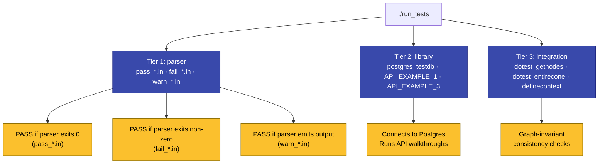

# Testing

SSTorytime ships a three-tier test harness driven by a single shell
script — [`tests/run_tests`](https://github.com/markburgess/SSTorytime/blob/main/tests/run_tests).
It exercises the N4L parser against a corpus of expected-pass/expected-fail
inputs, runs the database-backed library against the canonical example
data, and checks a handful of graph-invariant integration scenarios. This
page explains what each tier does, how to run the whole thing, how to add
a new test, and which limits you should know about.

!!! warning "The harness is not wired to CI yet"
    At the time of writing there is no GitHub Actions workflow that runs
    `tests/run_tests` on every PR. Phase 8 of the
    [documentation upleveling plan](plans/2026-04-20-documentation-upleveling.md)
    adds a build-validation workflow; automated test-running is a
    follow-up after that.

## The three tiers



### Tier 1 — Parser tests

The simplest tier. Each `.in` file under
[`tests/`](https://github.com/markburgess/SSTorytime/tree/main/tests) is an
N4L source file; the parser is expected to behave a specific way based on
the filename prefix:

| Prefix | Invocation | Passing condition |
|---|---|---|
| `pass_*.in` | `N4L -adj=all <file>` | Exit code **0**. |
| `fail_*.in` | `N4L <file>` | Exit code **non-zero**. |
| `warn_*.in` | `N4L <file>` | Stdout is **non-empty** (i.e. the parser emits at least one warning). |

See
[`tests/run_tests:28–61`](https://github.com/markburgess/SSTorytime/blob/main/tests/run_tests#L28-L61)
for the exact loops.

The standalone parser does not need a database — it runs against the
filesystem only.

### Tier 2 — Library tests

These exercise the PostgreSQL-backed library, so you need a running
database (see [Prerequisites](#prerequisites) below).

| Program | What it checks |
|---|---|
| [`postgres_testdb`](https://github.com/markburgess/SSTorytime/tree/main/src/demo_pocs/postgres_testdb) | Basic connectivity + table creation. |
| [`API_EXAMPLE_1`](https://github.com/markburgess/SSTorytime/tree/main/src/API_EXAMPLE_1) | End-to-end node/link round-trip through the high-level API. |
| [`API_EXAMPLE_3`](https://github.com/markburgess/SSTorytime/tree/main/src/API_EXAMPLE_3) | Search and path operations against a populated database. |

The script runs them one at a time and colour-codes each as green
(`ok`) or red (`NOT ok`). See
[`tests/run_tests:72–99`](https://github.com/markburgess/SSTorytime/blob/main/tests/run_tests#L72-L99).

### Tier 3 — Integration tests

Graph-shape invariants — things that must hold regardless of which
example data is loaded.

| Program | What it checks |
|---|---|
| [`dotest_getnodes`](https://github.com/markburgess/SSTorytime/tree/main/src/demo_pocs/dotest_getnodes) | Link-mode round-trip consistency: a node's outgoing arrows reconstruct the same adjacency when queried. |
| [`dotest_entirecone`](https://github.com/markburgess/SSTorytime/tree/main/src/demo_pocs/dotest_entirecone) | Causal-cone transitive closure correctness. |
| [`definecontext`](https://github.com/markburgess/SSTorytime/tree/main/src/demo_pocs/definecontext) | Context-cache synchronisation between the in-memory and Postgres views. |

See
[`tests/run_tests:101–127`](https://github.com/markburgess/SSTorytime/blob/main/tests/run_tests#L101-L127).

## Prerequisites

1. Binaries built — `make all` from the repo root populates
   `src/bin/` and `src/demo_pocs/bin/`.
2. A running PostgreSQL on `localhost:5432` with the default credentials
   in
   [`SSTconfig`](https://github.com/markburgess/SSTorytime/blob/main/SSTconfig).
   The fastest path is `make ramdb` from the repo root.
3. Example data loaded:
   ```bash
   cd examples
   make
   ```
   Without this, the library and integration tiers will all fail with
   "database functions NOT ok" messages.

## How to run

From the repo root:

```bash
cd tests
./run_tests
```

!!! info "Run from the `tests/` directory"
    The script uses relative paths like `../src/bin/N4L` and
    `../src/demo_pocs/bin/postgres_testdb` — it won't work invoked from
    anywhere else.

## Expected output

The script uses ANSI colour for readability:

```text
Testing standalone version

testing pass_1.in  ok
testing pass_2.in  ok
...
testing fail_1.in  ok
...
-----------------------------------------
 library tests
-----------------------------------------
1.  database ok
2.  basic database functions ok
3.  database API ok
4.  link mode consistency ok
5.  link causal cone consistency
5.  Context cache synchronisation
```

Green `ok` = pass; red `NOT ok` = fail. If any library-tier check fails
with "DATABASE NOT CONFIGURED", re-run the example data load first.

## How to add a new test case

### A new parser test

1. Decide which prefix you need: `pass_` (parser must accept),
   `fail_` (parser must reject), or `warn_` (parser must emit warnings).
2. Pick the next free number (`ls pass_*.in | sort -V | tail`).
3. Create `tests/pass_NN.in` (or `fail_NN.in` / `warn_NN.in`) with a
   minimal N4L snippet that exercises exactly the behaviour you want to
   lock in. Add a comment at the top explaining what the test proves.
4. Run `./run_tests` — the script auto-discovers any file matching the
   prefix patterns. No script edits required.
5. Commit with `test(parser): cover <thing>`.

### A new library or integration test

1. Add a new Go program under `src/demo_pocs/my_new_test/` with a
   `main.go` + `Makefile` (copy the pattern from an existing
   `dotest_*/`).
2. Add the binary to
   [`src/Makefile`](https://github.com/markburgess/SSTorytime/blob/main/src/Makefile)'s
   `OBJ` list so `make all` builds it.
3. Add an invocation block to `tests/run_tests` that runs the binary and
   checks its exit code, matching the existing green/red pattern.
4. Commit with `test(library): cover <invariant>`.

!!! tip "Keep tests deterministic"
    The integration tier depends on the exact example data shipped in
    [`examples/`](https://github.com/markburgess/SSTorytime/tree/main/examples).
    Don't write a test that depends on data the user would have to
    supply separately — it'll fail for every new contributor.

## Known limitations

- **No CI wiring.** Tests must be run by hand today.
- **No coverage reporting.** The harness runs binaries, not `go test`,
  so there's no `-cover` output. Adding `go test` packages under
  `pkg/SSTorytime/` is a welcome contribution.
- **Localhost-only.** Connection parameters are hard-coded to
  `localhost:5432`. Remote-DB testing requires editing `SSTconfig`.
- **Exit-code-only checks.** The parser tests don't diff against a
  golden output file — they only check the exit code. Subtle regressions
  in parser output can slip through.
- **No isolation.** Tests share the same database and can interfere with
  each other if a previous run left state behind. `make ramdb` wipes the
  RAM-backed cluster, which is the easiest reset.

!!! code-ref "See in code"
    The test script is short and readable — start here:
    [`tests/run_tests`](https://github.com/markburgess/SSTorytime/blob/main/tests/run_tests).
