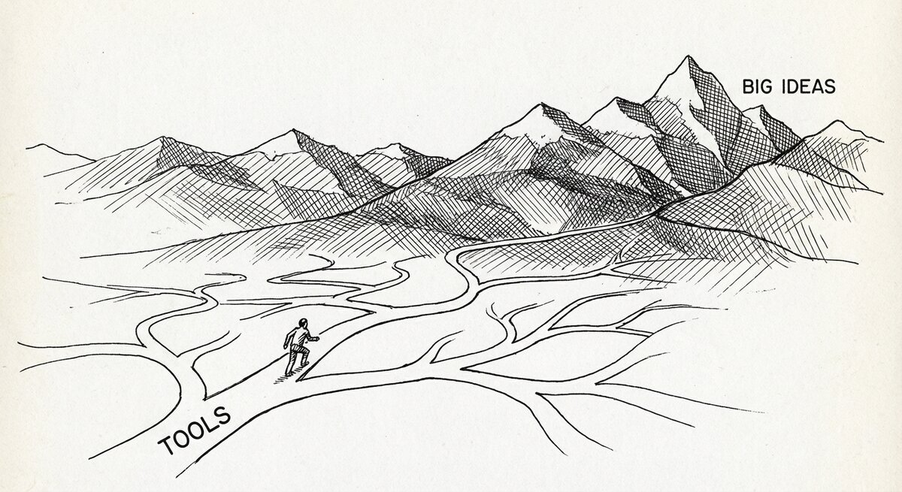

# Frequently Asked Questions

{ align=center }

## General

### What does it do?

SSTorytime turns notes — things you jot down, edit, and come back to —
into a graph you can ask questions of. You write in plain text (a notation
called N4L), saying what points at what: *this book is about that topic*,
*this decision came before that one*, *this person said this*. The graph
falls out of the writing. You can then ask questions — *what connects
these two papers? what have I read about decision making?* — that a
search box cannot answer because they are about *connections*, not about
keyword matches.

It is not magic: it does not *know* the material for you. What it does
is let you see your own thinking in the mirror, and come back to it
without re-reading from scratch.

### What would I use it for?

- A personal reading list or research trail that grows as you read more.
- A decision log where "what led to what" matters as much as the decisions.
- Meeting notes, interview transcripts, or a course's worth of lecture
  notes, where you want to ask *what came up about X*.
- A family tree, a cast of characters for a novel, a set of connected
  places.
- Team topologies, service directories, or dependency maps where the
  connections are the point.

If your data is strictly tabular and you really just want SQL with joins,
SSTorytime is not for you. If a standards body requires OWL or SPARQL,
it is not for you either. For almost anything else you intend to *learn
from* rather than just look up, it fits.

### What is the process?

Mark's five-step programme:

- **Jot it down when you think of it.**
- **Type it into N4L as soon as you can.**
- **Organise and tidy your N4L notes every day.**
- **Upload and browse them online.**
- **Remember — it isn't knowledge if you don't actually know it.**

Look at your thinking in the mirror.

### What are the don'ts of graph modelling?

Graphs are fragile structures, and there are a few patterns that will
bite you later.

- **Do not link everything to one or two hub nodes.** If you classify
  your whole music library as `mp3`, `flac`, or `m4a`, you get three
  nodes each with thousands of radial links — unwieldy to store, useless
  to query (the answer to "what is an mp3?" is *everything*), and rough
  on the database. If something belongs to a small number of categories,
  use [context](howdoescontextwork.md) instead, then ask
  `fred* context mp3`.
- **Do not try to invent the perfect arrow at first write.** Drop in
  `(blah)` or `(tbd)` and refine later. The whole point of N4L is that
  editing the text is easy; ontology-first modelling is where projects
  go to die.

## Writing N4L

### Can I make up new arrow types?

You compose the *name* — `is-the-capital-of`, `was-painted-by`,
`bib-cite` — and SSTorytime is happy. But every arrow has to be
**pre-declared** in the project's `SSTconfig/` files, against one of
the four spacetime meta-types (NEAR, LEADSTO, CONTAINS, EXPRESSES),
before N4L will accept it. You cannot invent an arrow mid-file. See
[Thinking in arrows](arrows.md) for the declared vocabulary and how to
add your own.

### Can I use URLs in N4L?

Yes — but enclose them in quotes. URLs contain `//`, which is also N4L's
comment marker, so a bare URL gets truncated at the first slash-pair.

### Why are there relationships I didn't intend when I browse the data?

Usually because an annotation marker (`+`, `-`, `=`) sneaked into your
text without surrounding spaces. Run N4L in verbose mode to see what
the parser is reading.

### Why do I see chapters that don't seem relevant in my search results?

SSTorytime does some lateral thinking on purpose. If you do not
restrict to a chapter, it will pull matches from anywhere in the
graph — some words and phrases sit in several chapters, and the
bridges between chapters are often where insight lives. If you want a
tight answer, scope the query: `"decision making" in chapter "reading list"`.

## Searching and paths

### What's the difference between searchN4L and pathsolve?

They answer different shapes of question.

- **`searchN4L`** asks *what is near this?* It returns the orbit of a
  node — everything it is about, who wrote it, what it cites, the
  notes hanging off it, plus one hop further out. Use it when you
  want the full neighbourhood of a topic or a book.
- **`pathsolve`** asks *how do I get from here to there?* It traces
  `leadsto`-type arrows (the causal / sequence family) between two
  nodes you name, and hands you back the chain of steps. Use it when
  you want the route between two points, not the fog around each one.

See [Finding things](searchN4L.md) and [Finding paths](pathsolve.md).

### Why doesn't pathsolve understand my query on the command line?

Shell characters. You usually need single quotes to prevent expansion:

```
./pathsolve -begin '!a1!' -end s1
./searchN4L \\from '!a1!'
```

### Why doesn't a path solution work?

Path-finding is potentially exponential — without constraints, the
search can take a very long time or return nothing within its limit.
Two fixes help. **Pin the ends precisely:** `from !a1! to !b6!`
matches *a1* exactly, rather than any substring. **Narrow the arrow
family:** narrative chains are nearly always LEADSTO, so restricting
to that family shortens the search. A [context](howdoescontextwork.md)
clause helps too: `from a1 to b4 context connection`.

### Why does a path search take so long?

Path searches grow exponentially with distance, so long chains slow
down fast. If you know what kind of arrow the path travels on —
LEADSTO, CONTAINS, NEAR, or EXPRESSES — say so, and the search
prunes the space aggressively. Always give pairs of arrow and
inverse, since FROM and TO match opposite directions along the same
path.

### Why are the results different each time?

A database does not guarantee return order on unconstrained lookups,
and the default result limit is small (ten items). If the graph has
many possible matches, the ten it returns may rotate. Tighten your
query (more specific text, chapter restriction, context scope) and
the answer stabilises. You can also raise the limit: `mysearch limit
20`.

## Upload and build

### Why does uploading take so long?

Uploading to a database runs more work per row than querying does —
there are deduplication checks, arrow-consistency checks, context
registration, index maintenance. Normally you do not notice, because
you add one thing at a time; a bulk upload makes the overhead
visible. Big files can take hours. Searching is much faster. While
the database is still building indices after an upload, early
searches may be slow; give it a minute and times settle.

### Why do I get "Warning: Redefinition of arrow ..." when I upload without wiping?

If you are adding to a graph that already has data, every arrow name
you use has to mean the same thing as it did last time. If you once
declared `(friend)` as a NEAR-type relation and now you are trying to
use it as EXPRESSES, the parser complains. The fix is to pick one
meaning and stick with it — or to wipe the database and re-ingest
everything under the new meaning. The warning is noise during syntax
checking; it only bites when you actually try to merge.
