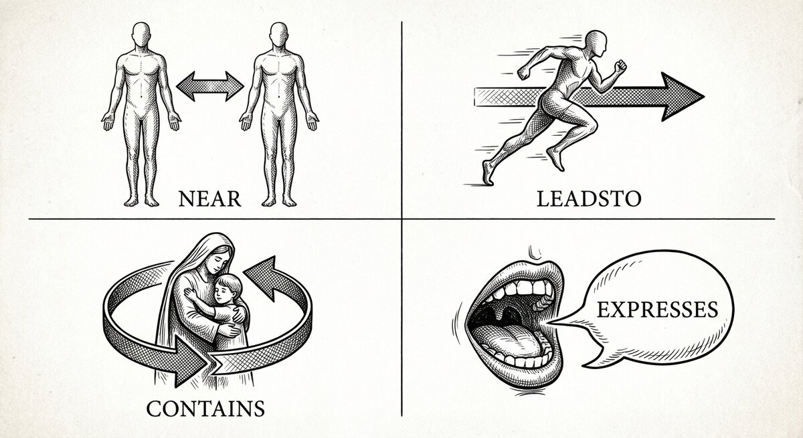

# Writing N4L by hand

{ align=center }

> **N4L is the plain-text notation you write notes in. This page walks the
> bits you'll use every day — chapters, ditto marks, arrows, contexts,
> sequences, annotations — against the reading list from the tutorial.**

The tutorial showed you enough N4L to write a handful of books and
ask questions of them. This page fills in the rest. It's laid out by
the thing you want to do ("I want to group notes into sections",
"I want to avoid retyping the same title"), not by grammar.

If you want the grammar half — parser internals, exit codes, edge
cases — it's kept in the repo at
[`developers/N4L-grammar.md`](developers/N4L-grammar.md), not on this
site.

---

## The shape of a line

Almost every line in an N4L file is one of three things:

- **An item.** Any text that doesn't contain parentheses.
  `Thinking Fast and Slow` is an item. `Daniel Kahneman` is an item.
- **A relationship.** Item, arrow-in-parens, item. `Thinking Fast
  and Slow (by) Daniel Kahneman`.
- **A marker.** Lines starting with `-`, `:`, `@`, `#`, or `//`
  control structure or leave comments. They don't create graph nodes
  by themselves.

Everything else is a variation on those three. The rest of this
page is what you do with them.

---

## Chapters

A chapter is the file's subject heading. Everything in the file
belongs to it, unless another chapter line appears later. You write
one with a leading hyphen:

```n4l
- reading list
```

Chapters matter when you ask questions later. A search can be
scoped to a single chapter (`\chapter "reading list"`), which is
how you tell *"what's in this file?"* from *"what's in this file
that's also about X?"*.

**When to start a new chapter.** Start a new one when you'd want to
search inside just that subset. One chapter per file is a sensible
default. Split a file in two if you find yourself always wanting to
look at half of it without the other.

---

## Items and ditto marks

An item is bare text. Write a line that doesn't contain `(` and
you've made an item:

```n4l
 Thinking Fast and Slow
 Daniel Kahneman
 decision making
```

Each of those becomes a node in the graph.

When you connect one item to several others — which you will, a
lot — the ditto mark `"` saves retyping the item on every line:

```n4l
 Thinking Fast and Slow   (about)    decision making
        "                 (about)    dual-process cognition
        "                 (by)       Daniel Kahneman
        "                 (note)     two systems, one of them lazy, both of them you
```

Four arrows leave the same book, written on four lines. Without
the ditto mark you'd type the title four times.

Two small rules for ditto:

- A ditto on a line by itself does nothing. It needs an arrow and
  a target to its right.
- Ditto refers to the *first* item of the previous line, not to
  whatever else is on the line.

---

## Arrows

Arrows go in parentheses between two items:

```n4l
 Superforecasting   (bib-cite)  Thinking Fast and Slow
```

That line says: *Superforecasting has a bibtex citation for Thinking
Fast and Slow.* The arrow short-name `(bib-cite)` is one of several
dozen that ship with the project. [Thinking in
arrows](arrows.md) teaches the four shapes they come in and where
the catalogue lives.

Two things worth noting:

**Chain multiple arrows on one line.** N4L lets you string arrows
together when every link departs from the previous item on the
line:

```n4l
 meat   (eh)  肉   (hp)  Ròu
```

That's two arrows on one line: *meat, english-to-hanzi, 肉,
hanzi-to-pinyin, Ròu*. Each short name (`eh`, `hp`) is defined in
the config.

**Quote items that contain special characters.** If an item contains
`(` or `)` or a newline, wrap it in double quotes:

```n4l
 Smith (1999) (cites) "Jones (1998)"
```

---

## Contexts

A context is a set of tags that frames a block of notes. You'll
usually write one near the top of a chapter to say what the block
is about:

```n4l
- reading list

 :: books, topics, authors ::

 Thinking Fast and Slow   (about)    decision making
        "                 (by)       Daniel Kahneman
```

`:: books, topics, authors ::` tags every relationship written
underneath it with those three keywords. Later, at query time, you
can scope a search to notes written under specific tags — useful
when the same text could mean different things in different places
(think *"bank"* in a finance chapter vs. a river-geography
chapter).

You can extend or shrink the context set part-way through:

```n4l
 :: books, authors ::

 ... some notes ...

 +:: reviews ::    // now also tagged "reviews"

 ... more notes ...

 -:: reviews ::    // stop tagging as "reviews"
```

You don't have to use contexts. A small chapter works fine without
them. Reach for contexts when you start wanting to scope searches
finer than chapter-level.

---

## Sequences

Sometimes you want a series of items linked by "then this came
next, then this, then this" — a story, a process, a set of steps.
Writing `(then)` on every line is tedious. N4L gives you a
shortcut:

```n4l
 +:: _sequence_ , morning routine ::

 wake up
 shower
 coffee
 leave the house

 -:: _sequence_ ::
```

Inside a `_sequence_` context, consecutive items are auto-linked
with the `(then)` arrow. That's four items and three implicit
`(then)` arrows, with no `(then)` typed.

Two rules worth internalising:

- Only the first item on a line is linked into the sequence.
- Ditto marks (`"`) don't anchor a new sequence step — the line
  stays tied to whatever the ditto points at.

Cancel the sequence with `-:: _sequence_ ::` when you want a gap.

---

## Aliases: naming a line you want to refer to later

Sometimes you want to refer back to an item later without retyping
it. Mark the line with `@name` and later lines can refer to
`$name.1` (the first item), `$name.2` (the second), and so on:

```n4l
@kahneman_2011  Thinking Fast and Slow   (about)    decision making
                       "                 (by)       Daniel Kahneman

 ... (rest of the file) ...

 $kahneman_2011.1  (related to)   $tetlock_2015.1
```

Aliases are handy for long titles, for items whose text might
change as you edit, and for cross-references between distant parts
of a file.

---

## Annotations: marking words inside a larger body of text

Sometimes you want to write a paragraph and flag a few words
*within* it as worth linking. N4L supports a small set of
annotation characters that sit in front of a word and implicitly
link it to the containing text.

```n4l
 "The company's =legibility problem is that what the centre
  can >>measure is not what the edge actually does."
```

`=legibility` links the word `legibility` to the paragraph via
`(involves)`. `>>measure` links `measure` to the paragraph via
`(is an example of)`. The character-to-arrow bindings live in
`SSTconfig/annotations.sst` and can be customised.

You won't need annotations on day one. They're useful when you have
long-form prose — meeting notes, essay drafts, transcripts — and
want to mark landmarks in it without breaking the prose up into
separate items.

---

## Comments

Two kinds:

```n4l
 # everything after the hash is a comment
 // everything after the slashes is a comment
```

Use them liberally. N4L files are meant to be read by humans — you,
in six months, trying to remember what this was about.

---

## Putting it together

Here is the full running reading-list corpus from the tutorial.
Every feature on this page is in it except for sequences and
annotations:

```n4l
- reading list

 :: books, topics, authors ::

 Thinking Fast and Slow     (about)    decision making
        "                   (about)    dual-process cognition
        "                   (about)    heuristics
        "                   (by)       Daniel Kahneman
        "                   (bib-cite) Judgment under Uncertainty
        "                   (note)     two systems, one of them lazy, both of them you

 Judgment under Uncertainty (about)    heuristics
        "                   (about)    cognitive bias
        "                   (by)       Daniel Kahneman
        "                   (by)       Amos Tversky

 Superforecasting           (about)    decision making
        "                   (by)       Philip Tetlock
        "                   (bib-cite) Thinking Fast and Slow
```

Load with `N4L -u my-reading.n4l`, query with `searchN4L`, edit in
your editor of choice. The file on disk is the source of truth; the
database is a cache.

---

## A few habits worth picking up

**Write quickly, refine later.** Don't stop to pick the perfect
arrow on the first pass. `(note)` and `(tbd)` are both
catalogue-shipped arrows you can use as placeholders; come back
when you know what you meant.

**Put the thing-you-care-about first.** When you write `meat
(eh) 肉 (hp) Ròu`, your eye reads the leftmost item first. For
notes you're learning from, put what you're *trying to learn* on
the left:

```n4l
 ròu     (ph)  肉   (he)  meat
 niúròu  (ph)  牛肉  (he)  beef
```

Now the Pinyin you're drilling is on the left, where your eye
lands, and the answer on the right requires a small effort — which
is the point.

**Re-use arrows.** If you use `(about)` for topics of books, use
`(about)` for topics of papers, meetings, anything. A query on the
topic pulls all of them together automatically.

**Keep the file in version control.** It's plain text; it fits git
perfectly; and the graph rebuilds from the file in seconds. Your
N4L files are your knowledge. The database is disposable.

---

## Where to go next

<div class="grid cards" markdown>

-   :material-shape:{ .lg .middle } **Pick the right arrow**

    ---

    The four shapes and what each is for. Short page; worth
    reading if you haven't.

    [:octicons-arrow-right-24: Thinking in arrows](arrows.md)

-   :material-file-document-multiple:{ .lg .middle } **Bring in a big document**

    ---

    When the source is a long piece of prose rather than a blank
    editor. Half-automatic; still needs your judgement.

    [:octicons-arrow-right-24: Turning documents into stories](text2N4L.md)

-   :material-magnify:{ .lg .middle } **Ask questions**

    ---

    Finding things, finding paths, scoping with context.

    [:octicons-arrow-right-24: Finding things](searchN4L.md)

</div>
