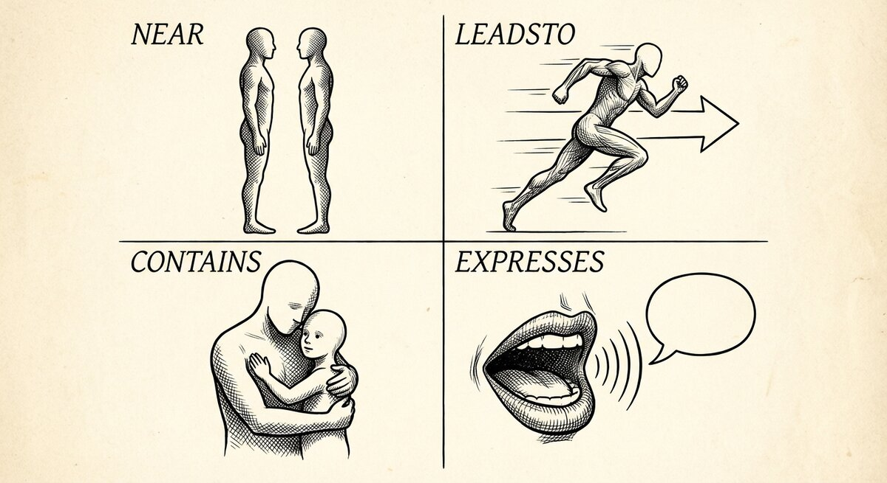

# Thinking in arrows

{ align=center }

> **The shape of the connection is half of what you know. N4L asks you to pick the
> shape — from a small catalogue — every time you write a relationship down.**

Most notes apps let you write arbitrary text between things and call that
a link. SSTorytime asks for a little more: when you connect two things,
say what *kind* of connection it is. That choice — same target, same
source, four flavours — is what lets the graph walk sensibly across
your notes later, instead of tripping over every string it sees.

There are only four flavours. The rest of this page is one short
section on each, then a note about where they come from (you don't
invent them; the project ships a catalogue and you pick).

---

## Four kinds of arrow

Everything you write in N4L falls into one of four shapes. When you
find yourself reaching for a new arrow, ask which shape it is and
you will usually already know which short-name to pick.

### Near — "these belong beside each other"

Two things that are alike, adjacent, or easily confused. Not one
leading to the other, not one containing the other — just side by
side. Aliases, synonyms, things-you-often-see-together, two names for
the same thing.

```n4l
 hokey cokey (see also) hokey pokey
 sense-making (same as) sense making
 Bīngxiāng   (sl)       Wéibōlú   // sounds like
```

Reach for `near` when you want to say *"if you're thinking about one,
think about the other."* In the reading list, two books about
`decision making` don't need a direct `near` arrow — they're already
connected through the shared topic. But if you had two slightly
different names for the same book, `(=)` or `(also called)` would be
the right arrow.

### Leads to — "first this, then that"

One thing follows from another. Sequence. Cause and effect. What
happened next. Who replied to whom.

```n4l
 first draft   (then)    peer review
 peer review   (leads to) revision
 revision      (then)    publication
```

`leads to` is how you write down stories, processes, decision trails.
If you find yourself narrating events in order — *first X, then Y,
then Z* — every arrow between them is a `leads to` arrow. N4L has a
shortcut for long chains of these: put them inside a `_sequence_`
context and consecutive lines auto-link with `(then)`.

### Contains — "this is part of that"

Whole-and-part. Membership. One thing sits inside another. The book
contains the chapter; the chapter contains the paragraph; the
paragraph contains the quote. Or: the team contains the person; the
team is part of the company.

```n4l
 human brain (consists of) forebrain
    "        (consists of) midbrain
    "        (consists of) hindbrain

 neocortex   (has-pt)   modular repeating columns in 6 layers
 column      (pt-of)    neocortex
```

Reach for `contains` when the question *"is X inside Y?"* has a
sensible answer. Chapters contain notes. Topics contain subtopics.
Courses contain lectures. Anything you'd draw as boxes-inside-boxes
is a `contains` arrow.

### Expresses — "this has that property"

Attributes. Descriptions. What something is called, what it's about,
who made it, what note you stuck on it. The most common arrow type
by a wide margin, because most of what you write about things are
properties *of* things.

```n4l
 Thinking Fast and Slow   (about)    decision making
        "                 (by)       Daniel Kahneman
        "                 (bib-cite) Judgment under Uncertainty
        "                 (note)     two systems, one of them lazy, both of them you
```

Reach for `expresses` when you're describing a thing rather than
connecting it to another thing. `(about)`, `(by)`, `(note)`,
`(e.g.)`, `(i.e.)`, `(NB)`, `(description)`, `(has title)` — all
`expresses`. The family is large because *properties* is where
notes spend most of their time.

---

## Where arrows come from

The four shapes are fixed. The individual short-names — `(about)`,
`(by)`, `(bib-cite)`, `(then)`, `(consists of)` and so on — are
**declared** in a set of files that ships with the project. You
don't invent arrow names at write time; you pick from the
catalogue.

This matters because of what happens when you type `(frobulates)`
into an N4L file that doesn't know about it: the ingest refuses the
arrow, because it doesn't know which of the four shapes you meant.
Better to look at the catalogue and find one that fits — usually one
does.

The catalogue lives under `SSTconfig/`:

```
SSTconfig/arrows-NR-0.sst   # near / similarity arrows
SSTconfig/arrows-LT-1.sst   # leads to / causal arrows
SSTconfig/arrows-CN-2.sst   # contains / membership arrows
SSTconfig/arrows-EP-3.sst   # expresses / property arrows
```

Open any of them in a text editor. You'll find entries like:

```
 + has author (by) - is the author of (author-of)
 + is about topic/them (about) - is the topic/theme of (theme-of)
 + has bibtex citation (bib-cite) - is a bibtex citation label for (bibtex-for)
```

The short name in parentheses is what you type in N4L. The long
form on each side is how the graph reads it back to you — first
forward (what you wrote), then backward (what the other node
sees). So when you write `Thinking Fast and Slow (about) decision
making`, a query on `decision making` reports *"is the topic/theme
of Thinking Fast and Slow."* Same fact, other direction.

!!! tip "Fifty-plus arrows ship by default"
    You rarely need to add new ones. Skim the catalogue once and
    you'll recognise the right arrow for almost anything you want to
    say. The reading list in the tutorial uses four — `(about)`,
    `(by)`, `(bib-cite)`, `(note)` — and those four carry most of
    what you'd want to note about a book.

---

## Adding a new arrow

If the catalogue really is missing a concept you need, add it. Pick
the file for the shape your new arrow belongs to, add one line, and
it becomes available to every N4L file.

For example, to add `has ISBN` as an `expresses` arrow, open
`SSTconfig/arrows-EP-3.sst` and add a line in the right section:

```
 + has ISBN  (isbn)  - is the ISBN of  (isbn-of)
```

Now `book (isbn) "978-0-374-27563-1"` parses without complaint, and
a query on the ISBN string reports *"is the ISBN of book."*

Two small habits that pay off later:

1. **Keep tense consistent.** Use present tense on both sides.
   *"has author"* / *"is the author of"*, not *"had an author"* /
   *"is the author of"*.
2. **Pick short names you'll remember.** `(by)` reads well; `(ap5)`
   doesn't. The short name is what you'll type a hundred times.

---

## A few habits worth picking up

**Start rough.** When you don't know the right arrow, write `(tbd)`
or `(note)` and come back later. Getting the note down matters more
than finding the perfect label.

**Pick the shape, then pick the name.** If you can answer *"is this
a near / leads to / contains / expresses kind of thing?"* the
catalogue's four files narrow themselves down immediately.

**Re-use arrows across files.** If you already write `(about)` for
topics of books, use the same arrow for topics of papers, topics of
meetings, topics of anything. A query on the topic then pulls all
of them together.

---

## Where to go next

<div class="grid cards" markdown>

-   :material-pencil:{ .lg .middle } **Write more**

    ---

    Chapters, contexts, sequences, ditto marks — the rest of what
    N4L gives you for shaping notes.

    [:octicons-arrow-right-24: Writing N4L by hand](N4L.md)

-   :material-magnify:{ .lg .middle } **Ask questions**

    ---

    Now that you've got arrows, how do you query across them?

    [:octicons-arrow-right-24: Finding things](searchN4L.md)

-   :material-lightbulb-on:{ .lg .middle } **Understand why**

    ---

    Why four, why these four, and what they buy you over a free-form
    graph.

    [:octicons-arrow-right-24: Semantic spacetime in plain English](concepts/why-semantic-spacetime.md)

</div>
