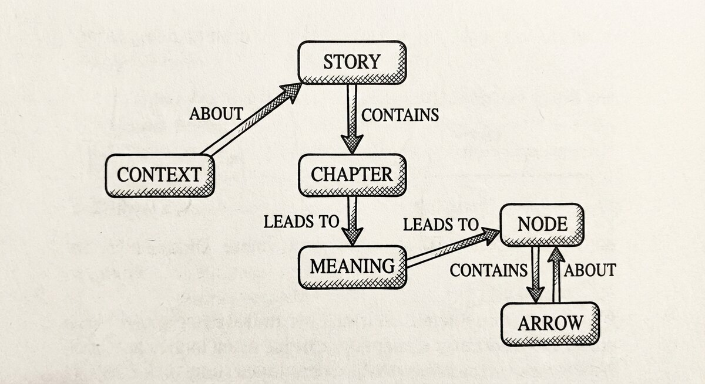

# Concepts

{ align=center }

> **The "why" behind SSTorytime — short enough to read before you install, deep enough to come back to when a query surprises you.**

Most knowledge tools ask you to decide what your data *is* before you can
write any of it down. A schema, an ontology, a folder hierarchy — you pick
the shape up front, and the material has to fit. That works when you
already know the material; it fails on exactly the thing you wanted help
with in the first place, which is learning the shape as you go.

SSTorytime takes the other route. You write down what you know, a line at
a time, saying what points at what. The shape falls out of the writing.
The only vocabulary you have to agree on is a small palette of *how*
things relate — similarity, sequence, containment, property — and every
arrow you ever draw is a flavour of one of those four. That is the
semantic spacetime idea, and the pages below unpack it.

You do not have to read this tab to use the tool. The
[reading list tutorial](../Tutorial.md) teaches by doing. Come here
for the picture behind it.

-   :material-lightbulb-on:{ .lg .middle } **Why semantic spacetime?**

    ---

    The argument. What RDF and OWL got wrong, what "four arrows" buys
    you, and when the model is the right tool versus when it is not.

    [:octicons-arrow-right-24: Plain-English version](why-semantic-spacetime.md)

-   :material-book-open-variant:{ .lg .middle } **Glossary**

    ---

    Arrow, chapter, context, cone, orbit, story, wave-front — a pocket
    dictionary of the words this project throws at you, each entry
    leading with what you *do* with the concept.

    [:octicons-arrow-right-24: Pocket dictionary](glossary.md)

-   :material-arrow-decision:{ .lg .middle } **Thinking in arrows**

    ---

    The four arrow types in detail, with examples of how the same
    English phrase can map to different arrows and why the choice
    matters when you come back to query.

    [:octicons-arrow-right-24: The four arrows](../arrows.md)

-   :material-map-marker-radius:{ .lg .middle } **How context works**

    ---

    Context is the hard problem of knowledge management. How
    SSTorytime splits it — what was in the scene versus what you are
    looking for — and why the split is load-bearing.

    [:octicons-arrow-right-24: Ambient and intentional](../howdoescontextwork.md)

The longer essays — [Storytelling](../Storytelling.md) and
[Knowledge and learning](../KnowledgeAndLearning.md) — are Mark's
original writing on why this tool exists at all. Read them when you
want the voice rather than the reference.
