# N4L Grammar Reference

> This is the deep-reference half of `N4L.md`. The user-facing page lives at
> [`../N4L.md`](../N4L.md) and teaches N4L as a writer's tool. This page is
> for contributors, tool authors, and anyone debugging an unusual ingest.

## Compile pipeline

```mermaid
flowchart LR
    INPUT[/"N4L source<br/>(.n4l files)"/]
    TOKEN["Tokenize<br/>src/N4L/N4L.go:1463"]
    CLASSIFY["Classify roles<br/>(header · context · item ·<br/>relation · continuation)<br/>src/N4L/N4L.go:1500"]
    ALIAS["Resolve aliases<br/>@name · $name.N<br/>src/N4L/N4L.go:644"]
    CONTEXT["Apply context stack<br/>::, +::, -::<br/>src/N4L/N4L.go:2441"]
    EMIT["Emit nodes &amp; links<br/>N4L_parsing.go"]
    GTDB["GraphToDB<br/>walk NODE_DIRECTORY<br/>db_upload.go:19"]
    UNLOGGED["UNLOGGED writes<br/>(fast bulk load; no WAL)<br/>postgres_types_functions.go:32"]
    GIN["CREATE INDEX … GIN<br/>tsvector, GIN on S/NPtr/Ctx<br/>db_upload.go:114-118"]
    LOGGED["ALTER TABLE … SET LOGGED<br/>(promote to durable)<br/>db_upload.go:119-120"]

    INPUT --> TOKEN --> CLASSIFY --> ALIAS --> CONTEXT --> EMIT --> GTDB
    GTDB --> UNLOGGED --> GIN --> LOGGED

    classDef upload fill:#3949AB,stroke:#1a237e,color:#fff;
    class GTDB,UNLOGGED,GIN,LOGGED upload;
```



The upload pipeline is deliberately staged: tables start as
[`CREATE UNLOGGED TABLE`](https://github.com/markburgess/SSTorytime/blob/main/pkg/SSTorytime/postgres_types_functions.go#L32)
so that bulk inserts skip the write-ahead log, GIN indexes
([`db_upload.go:114-118`](https://github.com/markburgess/SSTorytime/blob/main/pkg/SSTorytime/db_upload.go#L114-L118))
are built *after* the bulk load rather than maintained incrementally, and
only then is the table promoted with
[`ALTER TABLE … SET LOGGED`](https://github.com/markburgess/SSTorytime/blob/main/pkg/SSTorytime/db_upload.go#L119-L120).
On power loss before the final `SET LOGGED`, the graph is discarded — which
is fine because the N4L source is the origin of truth.

## Command line

```
usage: N4L [-v] [-d] [-s] [-u] [-force] [-wipe] [-adj "list"] file.n4l [...]
  -adj string
        a quoted, comma-separated list of short link names to include in
        summary/adjacency output (default "none")
  -d    diagnostic mode
  -s    summary (nodes, links...)
  -u    upload parsed notes to the database
  -v    verbose
  -force
        skip confirmation prompts on upload conflicts
  -wipe
        drop and recreate all database state before loading. Combine with
        -u for an atomic re-upload: N4L -wipe -u *.n4l
```

The atomic re-upload pattern `N4L -wipe -u *.n4l` is the cleanest way to
update a large, interlinked note set — it avoids the fragmentation that
accumulates when you delete and re-add chapters individually.

## Full language syntax

```
#  a comment for the rest of the line
// also a comment for the rest of the line

-section/chapter                 # declare section/chapter as the subject

: list, context, words :         # context (persistent) set
::  list, context, words ::      # any number of :: is ok

+:: extend-list, context, words :: # extend the existing context set
-:: delete, words :                # prune the existing context set

A                                # Item
Any text not including a "("     # Item
"A..."                           # Quoted item
'also "quoted" item'             # Useful if item contains double quotes
A (relation) B                   # Relationship
A (relation) B (relation) C      # Chain relationship
" (relation) D                   # Continuation of chain from previous single item
$1 (relation) D                  # Continuation of chain from previous first item
$2 (relation) E                  # Continuation from second previous

@myalias                         # alias this line for easy reference
$myalias.1                       # a reference to the aliased line for easy reference

NOTE TO SELF ALLCAPS             # picked up as a "to do" item, not actual knowledge

"paragraph =specialword paragraph paragraph paragraph paragraph
 paragraph paragraph paragraph paragraph paragraph
  paragraph paragraph =specialword *paragraph paragraph paragraph
paragraph paragraph paragraph paragraphparagraph"

where [=,*,..]A                        # implicit relation marker
```

`A,B,C,D,E` stand for unicode strings. Reserved symbols: `(), +, -, @, $, #`.
Literal parentheses can be quoted. There should be no whitespace after the
initial quote of a quoted string.

## Sequence mode internals

`_sequence_` is a reserved context name. Entering it with `+:: _sequence_ ::`
causes the parser to auto-link successive list items with the reserved
`(then)` arrow until the mode is cancelled with `-:: _sequence_ ::`.

Internally:

- Matched at [`CheckSequenceMode`](https://github.com/markburgess/SSTorytime/blob/main/src/N4L/N4L.go#L2154-L2172)
- Applied at [`LinkUpStorySequence`](https://github.com/markburgess/SSTorytime/blob/main/src/N4L/N4L.go#L2176-L2206)

Only the first item on a line is linked into the sequence. Ditto marks (`"`)
and variable references (`$alias.N`) do **not** create new sequence anchors
— they refer to the prior item.

## Reserved relation names

For automated sequence capture and multimedia rendering:

```
   leadsto:
      + then (then) - prior

   properties::
      + has url   (url) - is a URL for (isurl)
      + has image (img) - is an image for (isimg)
```

## Annotation characters

Annotations are single characters that mark up substrings of a larger text
item. A marked word is linked to the surrounding text via the relationship
declared for that character in `SSTconfig/annotations.sst`.

The shipped defaults:

```
 - annotations

 // for marking up a text body: body (relation) annotation
 // hyphen is illegal, as it's common in text and ambiguous to section grammar

 *** (ref)
 = (involves)
 ** (is a special case of)
 >> (is an example of)
 %> (has actor/subject role)
 %< (has affected object role)
```

Reserved symbols in the grammar (`+`, `-`, `#`, `(`, `)`) cannot be used as
annotation characters. Long matches come first in the file — they are
tried before shorter prefixes, to avoid ambiguous capture.

## Exit codes

- **Exit `0`** — success.
- **Exit `-1`** — generic error: parse failure, missing required arguments,
  database errors (see `os.Exit(-1)` calls throughout
  [`src/N4L/N4L.go`](https://github.com/markburgess/SSTorytime/blob/main/src/N4L/N4L.go)).
- **Exit `1`** — missing input files or an unrecoverable parse error
  (e.g. an undefined alias reference). Triggered at
  [`src/N4L/N4L.go:242-245`](https://github.com/markburgess/SSTorytime/blob/main/src/N4L/N4L.go#L242-L245)
  when no input files are given, and at
  [`src/N4L/N4L.go:650`](https://github.com/markburgess/SSTorytime/blob/main/src/N4L/N4L.go#L650)
  when `LookupAlias` cannot resolve a referenced alias.

## Environment variables

- **`POSTGRESQL_URI`** — overrides the hardcoded DSN in
  [`pkg/SSTorytime/session.go:41`](https://github.com/markburgess/SSTorytime/blob/main/pkg/SSTorytime/session.go#L41).
  Use this to point `N4L` at a non-default PostgreSQL instance.
- **`SST_CONFIG_PATH`** — where `N4L` looks for the `SSTconfig/` arrow
  definitions. If unset, the parser searches `./`, `../`, etc.

`N4L -u` will fail and exit with `-1` if it cannot connect to PostgreSQL.
Parse-only modes (no `-u`) work without a database. Verify the DSN by
setting `POSTGRESQL_URI` or by testing with `psql` first.

## SSTconfig file layout

Arrows are defined in one file per STtype:

```
SSTconfig/arrows-LT-1.sst    # leadsto
SSTconfig/arrows-NR-0.sst    # near / similarity
SSTconfig/arrows-CN-2.sst    # contains
SSTconfig/arrows-EP-3.sst    # expresses / properties
SSTconfig/annotations.sst    # annotation character bindings
SSTconfig/closures.sst       # transitive closure rules
```

Directory is searched in `./`, `../`, etc., or set explicitly via
`SST_CONFIG_PATH`.

Syntax for the three directed types (`leadsto`, `contains`, `properties`):

```
- [leadsto | contains | properties]

    + forward reading (forward alias) - reverse reading (backward alias)
    ...
```

The `near` / similarity file uses a single-direction form because the arrow
reads the same way in both directions:

```
- similarity

 forward reading  (alias)
```

### Closures

Small cliques of arrows can be completed automatically by declaring
closure rules in `SSTconfig/closures.sst`:

```
- closures

 (ph) + (he) => (ep)
 (eh) + (hp) => (pe)
 (he) + (ep) => (ph)
 (pe) + (eh) => (hp)
```

This tells the compiler that if A is linked to B by `(ph)` and B is linked
to C by `(he)`, then A should also be linked to C by `(ep)` — saving the
author from writing the closure arrow manually.

`near` arrows (whose short name does not start with `!`) are closed
transitively without a rule: if A is near B and B is near C, then A is
near C.

## Adjacency extraction

`N4L -v -s -adj="<relations>"` extracts a sub-graph restricted to the
listed relations and emits a summary with an adjacency matrix. Useful for
debugging sparse graphs and for manual PageRank-style inspection.

```
$ N4L -v -s -adj="pe,he" chinese.in
```

Output includes a directed and undirected adjacency sub-matrix and an
eigenvector centrality score per node. The higher the score, the more
interconnected or "important" the node is — analogous to PageRank.

## Alias and reference semantics

- `@name` — define an alias for the current line's first item.
- `$name.N` — reference the N-th item of the aliased line. `$name.1` is
  the first item, `$name.2` the second, etc.
- `" ` (ditto) — continuation from the previous line's first item. Does
  not create a sequence anchor.
- `$1`, `$2` — positional shorthands for the first/second items of the
  previous *chain* (not the previous line).

Alias scope is global within a single invocation of `N4L`; an alias
defined in an early-loaded file is available to later files loaded in the
same command.

Undefined alias references exit with code `1` at
[`src/N4L/N4L.go:650`](https://github.com/markburgess/SSTorytime/blob/main/src/N4L/N4L.go#L650).
