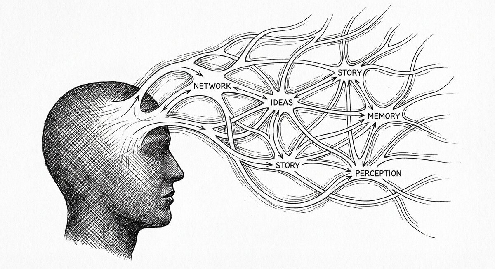

# SSTorytime

{ align=center }

> **Keep notes that remember how they are connected — and ask them questions later.**
> An [NLnet-sponsored](https://nlnet.nl/project/SmartSemanticDataLookup/) project by
> [Mark Burgess](https://markburgess.org) / ChiTek-i.

Most notes go flat. You jot something down, and a week later you can't find it
because the thing you typed then is not the thing you are searching for now.
SSTorytime lets you write the *connections* alongside the content — what a
book is about, what it cites, what came before, who said what — and then asks
the graph, not a search box, when you want an answer.

---

## What you can do with it

- **Capture what you know, with the connections.** Write notes in N4L, a plain
  text notation for statements like "this book is about that topic", "this
  decision came before that one", "this person said this". The graph comes
  out of the text you wrote — no schema to design up front.
- **Ask questions that follow the connections.** *What connects these two
  papers? What have I read that is about decision-making? What did this
  meeting lead to?* Questions that would be painful in SQL or a note-taking
  app are one line here.
- **Keep the shape of your thinking.** Your N4L files in version control are
  the source of truth; the database is a cache that makes queries fast. Your
  graph is yours, local, and visible.

---

## Is this for you?

<div class="grid cards" markdown>

-   :material-pencil:{ .lg .middle } **You want to capture something**

    ---

    A research trail, a decision log, a reading list, a family tree, a set of
    meeting notes. You have the material in your head; you want it in a shape
    you can ask questions of.

    [:octicons-arrow-right-24: Your first story](Tutorial.md)

-   :material-magnify:{ .lg .middle } **You have a corpus already**

    ---

    Notes, papers, transcripts. You want to explore the relationships, find
    paths between things, pull out what is near a given idea.

    [:octicons-arrow-right-24: Finding things](searchN4L.md)

-   :material-lightbulb-on:{ .lg .middle } **You want the "why" first**

    ---

    Semantic spacetime, context as a first-class citizen, and what this
    approach buys you over the alternatives.

    [:octicons-arrow-right-24: Semantic spacetime in plain English](concepts/why-semantic-spacetime.md)

</div>

---

## One concrete example

Here is a small reading list written in N4L:

```n4l
- reading list

 :: books, topics, reading history ::

 "Thinking Fast and Slow"   (is about) decision making
       "                    (cites)    "Judgment under Uncertainty"
       "                    (read on)  2024-03-15

 "Superforecasting"         (is about) decision making
       "                    (cites)    "Thinking Fast and Slow"
       "                    (read on)  2024-05-20

 "Thinking in Systems"      (is about) decision making
       "                    (read on)  2024-09-14
```

Load it, then ask: **What connects "Thinking Fast and Slow" and "Superforecasting"?**

```
"Thinking Fast and Slow"  ← is cited by ←  "Superforecasting"
"Thinking Fast and Slow"  → is about → decision making ← is about ←  "Superforecasting"
```

Two answers. One direct — Superforecasting cites the earlier book. One
through a shared topic. You did not write either path; they are consequences
of the connections you *did* write.

The full version of this reading list is at
[`examples/reading-list.n4l`](https://github.com/markburgess/SSTorytime/blob/main/examples/reading-list.n4l)
and is the running example in [Your first story](Tutorial.md).

---

## Install

About five minutes from a fresh checkout: [Install in 5 minutes](GettingStarted.md).

---

## Background reading

A book on the conceptual background (*Smart Spacetime*, Mark Burgess) is available.
It is conceptual background, not a tutorial.

Medium essays for deeper context:

- [Getting To Know Knowledge — How Can Semantic Graphs Actually Help Us?](https://medium.com/@mark-burgess-oslo-mb/getting-to-know-knowledge-how-can-semantic-graphs-actually-help-us-e3afb53fc6af)
- [What is semantic search?](https://medium.com/@mark-burgess-oslo-mb/what-is-semantic-search-4ed4d306ab07)
- [Why Semantic Spacetime (SST) is the answer to rescue property graphs](https://medium.com/@mark-burgess-oslo-mb/why-semantic-spacetime-sst-is-the-answer-to-rescue-property-graphs-2c004fe705b2)
- [From cognition to understanding](https://medium.com/@mark-burgess-oslo-mb/from-cognition-to-understanding-677e3b7485de)
- [Searching in Graphs, Artificial Reasoning, and Quantum Loop Corrections with Semantic Spacetime](https://medium.com/@mark-burgess-oslo-mb/searching-in-graphs-artificial-reasoning-and-quantum-loop-corrections-with-semantics-spacetime-ea8df54ba1c5)
- [The Shape of Knowledge — part 1](https://medium.com/@mark-burgess-oslo-mb/semantic-spacetime-1-the-shape-of-knowledge-86daced424a5) ·
  [part 2](https://medium.com/@mark-burgess-oslo-mb/semantic-spacetime-2-why-you-still-cant-find-what-you-re-looking-for-922d113177e7)
- [Why are we so bad at knowledge graphs?](https://medium.com/@mark-burgess-oslo-mb/why-are-we-so-bad-at-knowledge-graphs-55be5aba6df5)
- [Designing Nodes and Arrows in Knowledge Graphs with Semantic Spacetime](https://medium.com/@mark-burgess-oslo-mb/designing-nodes-and-arrows-in-knowledge-graphs-with-semantic-spacetime-0992b9cae595)
- [Avoiding the Ontology Trap](https://medium.com/@mark-burgess-oslo-mb/avoiding-the-ontology-trap-how-biotech-shows-us-how-to-link-knowledge-spaces-654bcbb9122a)
- [Using Knowledge Maps for Learning Comprehension](https://mark-burgess-oslo-mb.medium.com/using-knowledge-maps-for-learning-comprehension-15e162a251cd)
- [Unifying Data Structures and Knowledge Graphs](https://medium.com/@mark-burgess-oslo-mb/unifying-data-structures-and-knowledge-graphs-5c9fa32e74ea)
- [Using Knowledge Graphs For Inferential Reasoning](https://medium.com/@mark-burgess-oslo-mb/using-knowledge-graphs-for-inferential-reasoning-8a06e583b4d4)

Discussion: [SSTorytime LinkedIn Group](https://www.linkedin.com/groups/15875004/).
