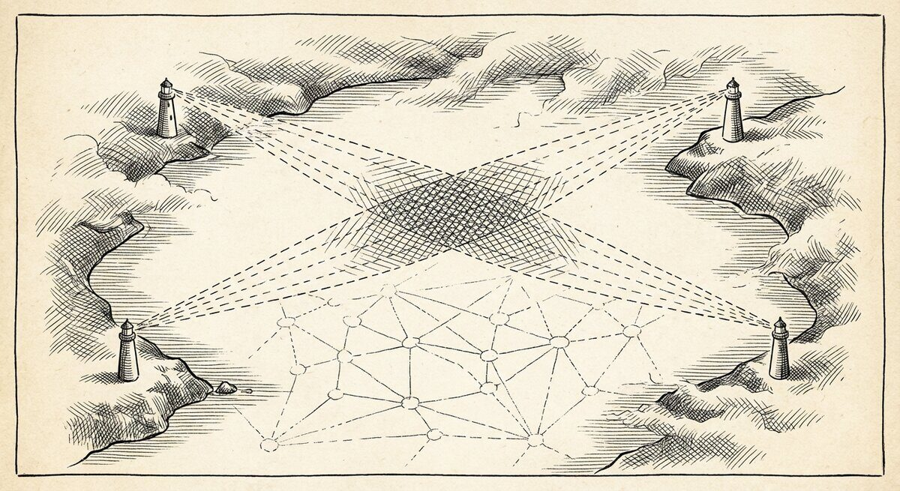

# Finding paths

{ align=center }

> **When you want to know not just that two things are connected, but
> how — the specific chain of arrows that runs between them — that is
> what `pathsolve` is for.**

A regular search gives you a neighbourhood: the thing you named and a
step or two outward from it. A path is different. You name a start and
an end, and the tool returns every chain of arrows that leads from one
to the other — the specific route, hop by hop.

This is most useful when your notes record sequence. A decision that
led to another decision. An event that triggered the next event. A step
in a recipe that must follow another step. If your notes have that
shape, `pathsolve` will trace it.

---

## What pathsolve follows

`pathsolve` walks only one kind of arrow — the **leads-to** kind.
Arrows like `(then)`, `(leads to)`, `(next)`, `(=>)`, `(prec)` — the
ones that record *this happened, and then that happened*. Arrows that
express other relationships — `(about)`, `(by)`, `(bib-cite)`, `(note)`
— are ignored by the path search, even though they are perfectly
happy in an ordinary `searchN4L` query.

That is a deliberate choice, not a bug. A path along mixed arrow types
rarely means anything. "Kahneman wrote a book that is about decision
making that is the topic of another book" is three arrows in a row, but
they don't compose into a story. `pathsolve` is the tool for when you
want a story — a chain where each step actually leads to the next.

The upshot for your corpus: if your notes track causality, sequence, or
process (meeting notes, decision logs, recipes, routes, branching
stories), `pathsolve` will trace it. If they mostly record topic and
authorship (a reading list, a glossary), the tool will return "no paths
available" and you should reach for `searchN4L` instead.

---

## A worked example

The repo ships an example corpus built specifically to have paths. Open
[`examples/branches.n4l`](https://github.com/markburgess/SSTorytime/blob/main/examples/branches.n4l)
and you will see nodes like *once upon*, *a time*, *there lay*,
*a princess*, strung together with `(then)` and `(=>)` arrows. A small
branching story with several routes through it.

Load it and ask for a path:

```
N4L -u examples/branches.n4l
pathsolve -begin "once upon" -end "a little prince"
```

You get back the chain the tool walked — every hop, in order, with the
arrow that took each step:

```
 Paths < end_set= {a little prince, } | {once upon, } = start set>

     - story path: 1 * once upon  -(then)->  a time  -(then)->  there was
      -(=>)->  a princess  -(=>)->  mischief!  -(=>)->  a little prince

    Linkage process: -(+leads to)->  -(+leads to)->  -(+leads to)->  -(+leads to)->  -(+leads to)-> .
```

Six hops from start to end, through the branch that actually reaches
*a little prince*. `(then)` and `(=>)` are both leads-to arrows — the
tool treats them as the same kind of step and reports the underlying
family at the bottom (`+leads to`).

### The reverse direction

If your question is the other way round — *what leads to this end
state, and from where* — flip it:

```
pathsolve -begin "a little prince" -end "once upon" -bwd
```

`-bwd` runs the search along reverse arrows. Same paths, asked from the
other end.

### Scoping to one chapter

When your graph has several chapters and you want paths that live inside
one of them:

```
pathsolve -begin "once upon" -end "a little prince" -chapter "branching test"
```

The chapter scope restricts both the start/end lookup and the walk. It
stops the tool from finding cross-chapter routes you didn't mean to ask
about.

---

## What comes after the path

`pathsolve` also prints two summaries below the paths themselves — for
when there is more than one route and you want to know their shape.

**Supernodes.** When several paths run through equivalent nodes — two
parallel branches that land you in the same place — the tool groups
those nodes as a *supernode*. The members are interchangeable from the
path's point of view: any of them gets you through. Useful when you
want to see where your graph offers real alternatives versus where
every path passes through the same choke point.

**Flow importance.** A ranking of nodes by how many of the paths pass
through them. The nodes at the top are the choke points — the things
every route visits. The nodes at the bottom appear on only one or two
routes. When you want to understand the *shape* of the path space, not
just one path in particular, this is the view.

Both appear at the bottom of the `pathsolve` output whenever there is
more than one path. On a single-path result they are uninformative and
you can ignore them.

---

## When pathsolve returns nothing

- **"No paths available."** Most common cause: the corpus has no
  `(then)`/`(leads to)`/`(=>)`-style arrows between your start and end.
  A reading list is all `(about)` and `(by)` — those are not paths.
  Write some leads-to arrows, or switch to `searchN4L` and ask about
  orbits instead.
- **Start or end string matches nothing.** Check the spelling; the
  tool is matching your string as a substring of node names. `-v`
  prints the boundary sets it found, which is the fastest way to see
  whether your start and end actually resolved.
- **The start and end are the same node.** A substring can match the
  same node at both ends; the tool requires a path of at least two
  hops to avoid the trivial "you're already there" answer. Use more
  specific strings for start and end.
- **The path is longer than twenty hops.** The default search depth
  is bounded. If you suspect a real but long path, narrow the corpus
  with `-chapter` and try again.

---

## One notation quirk worth knowing

`pathsolve` accepts a shorthand borrowed from physics — *Dirac
notation* — where you write start and end together in one string:

```
pathsolve "<a little prince|once upon>"
```

The **end** comes first (inside `<...|`), the **start** comes second
(inside `|...>`). This reads as "the amplitude to arrive at *a little
prince* given we start from *once upon*." If you think in those terms,
it's a compact notation. If you don't, `-begin` and `-end` are clearer.

---

## Where to go next

<div class="grid cards" markdown>

-   :material-magnify:{ .lg .middle } **Orbits, not paths**

    ---

    For neighbourhoods and topic queries — the shape of a single
    question rather than a chain.

    [:octicons-arrow-right-24: Finding things](searchN4L.md)

-   :material-tag-outline:{ .lg .middle } **Context**

    ---

    When the same word means different things in different parts
    of your graph.

    [:octicons-arrow-right-24: Context](howdoescontextwork.md)

-   :material-format-list-bulleted:{ .lg .middle } **Search recipes**

    ---

    Ten query shapes, copy-pasteable, with the reading-list corpus
    as the running example.

    [:octicons-arrow-right-24: Search recipes](cookbooks/search-recipes.md)

</div>
